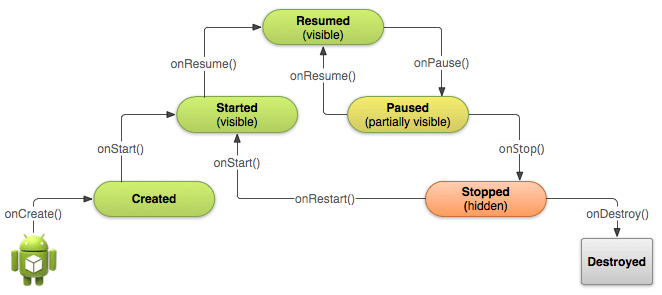

# ***Android***

## **1. 기초 사항**

### **# 모바일 운영체제**

**안드로이드(Android)** 는 구글에 의하여 개발되고 배포되는 운영체제이다.
리눅스 커널을 사용하고, 리눅스 커널 위에는 자바 코드를 해석해주는 가상 머신이 탑재되어 있다.
이 가상 머신 위에서 거의 모든 자바 라이브러리들이 지원된다.
이 자바 라이브러리들을 이용하여서 개발자들은 애플리케이션을 작성하게 된다.

**iOS** 는 애플의 스마트폰인 아이폰과 아이팟 터치, 아이패드에 내장되어 있는 운영체제이다.

Window 10 Mobile 은 마이크로소프트의 스마트폰을 위한 운영체제이다.
Window 10은 데스크탑, 노트북, 태블릿, 스마트폰에 통합된 플랫폼을 제공하기 위해 설계되었다.

### **# 안드로이드의 특징**

- **애플리케이션 프레임워크(Application Framework)** : 안드로이드는 컴포넌트의 재사용을 가능케 하는 애플리케이션의 프레임워크를 가진다.
애플리케이션은 여러 개의 컴포넌트로 이루어진다.
하나의 애플리케이션은 다른 애플리케이션이 컴포넌트를 사용할 수 있다.
모바일 장치에서 컴포넌트의 재사용이 중요한 이유는 프로세서의 처리 속도나 메모리 용량이 충분하지 않기 때문이다.

- **자바 언어 사용** : 안드로이드 개발자들은 자바의 SE버전 중에서 AWT와 스윙을 제외한 거의 모든 패키지를 사용할 수 있다.
자바의 표준 JVM을 사용하지 않는 이유는 스마트폰이 데스크탑에 비해 처리 속도와 메모리 측면에서 한참 뒤쳐지기 때문이다.
자체적인 자바 가상 머신을 **ART 가상 머신** 이라고 부른다.
일반적인 자바의 클래스 파일에 들어있는 바이트 코드는 직접 실행이 불가능하기 때문에 반드시 바이트 코드를 .dex 형식으로 변환하여야 실행이 가능하다.

- **최적화된 그래픽(Optimized graphics)** : 2D 그래픽은 자체 2D 라이브러리에 의하여 제공되고 3D 그래픽은 OpenGL ES 2.0 규격에 기반을 두고 있다.

- **SQLite 데이터베이스 지원**
- **각종 오디오, 비디오 규격 지원**
- **블루투스, EDGE, 3G, WiFi 지원**
- **카메라, GPS, 나침반, 가속도계 지원**

### **# 안드로이드의 구조**

안드로이드는 운영체제, 미들웨어, 핵심 애플리케이션을 모두 포함하는 모바일 플랫폼이라 할 수 있다.
구글에서는 안드로이드를 **소프트웨어 스택(Software Stack)** 이라고 부른다.


#### Java 8 버전 지원

- 디폴트 및 정적 인터페이스 메소드
- 람다식 (API 레벨 23 이하에서도 사용 가능)
- 메소드 참조 (API 레벨 23 이하에서도 사용 가능)

### **# 애플리케이션의 기초 개념**

#### 애플리케이션 컴포넌트

안드로이드 애플리케이션은 컴포넌트들로 구성된다.
컴포넌트는 애플리케이션을 만드는 빌딩블록이며, 4가지 타입의 컴포넌트가 있다.

- 액티비티
- 서비스
- 방송 수신자
- 콘텐트 제공자

#### 액티비티

액티비티는 사용자 인터페이스 화면을 가지고 하나의 작업을 담당하는 컴포넌트이다.
하나의 애플리케이션은 여러 개의 액티비티를 가질 수 있다.
모든 액티비티는 Activity라는 클래스를 상속받아서 작성된다.
즉, 액티비티는 하나의 화면을 가지고 사용자와 상호작용하는 컴포넌트이다.

#### 서비스

서비스는 백그라운드에서 실행되는 컴포넌트로 오랫동안 실행되는 작업이나 원격 프로세스를 위한 작업을 할 때 사용된다.
서비스는 사용자 인터페이스 화면을 가지지 않는다.
모든 서비스는 Service라는 클래스를 상속받아서 작성된다.

#### 방송 수신자

방송 수신자는 방송을 받고 반응하는 컴포넌트이다.
방송 수신자는 BroadcastReceiver 클래스를 상속받아서 작성된다.
방송 수신자는 일반적으로 사용자 인터페이스를 가지지 않는다.

#### 콘텐트 제공자

콘텐트 제공자는 데이터를 관리하고 다른 애플리케이션에 데이터를 제공하는 컴포넌트이다.
콘텐트 제공자는 ContentProvider 클래스를 상속받아서 작성된다.

#### 다른 애플리케이션의 컴포넌트를 실행할 수 있다!

인텐트를 통하여 다른 애플리케이션의 컴포넌트를 활성화시킬 수 있다.
애플리케이션의 의도를 적어서 안드로이드에 전달하면 안드로이드가 가장 적절한 컴포넌트를 찾아서 활성화하고 실행한다.

## **2. 애플리케이션 기본 구조**

### **# 앱 작성 절차**

## **3. 사용자 인터페이스 기초**

## **4. 이벤트 처리**

### **# 이벤트를 처리하는 방법**

이벤트 구동 방식에는 애플리케이션이 다른 작업을 하고 있다가 사용자의 입력이 발생하면 이벤트가 발생하고 애플리케이션은 이 이벤트를 처리하면 된다.

- XML 파일에 이벤트 처리 메소드를 등록하는 방법
- 이벤트를 처리하는 객체를 생성하여 이벤트를 처리하는 방법
- 뷰 클래스의 이벤트 처리 메소드를 재정의하는 방법

### **# 이벤트 처리 객체를 이용하여 이벤트 처리하기**

이벤트를 처리하는 메소드들이 정의된 인터페이스를 이벤트 리스너(event listener)라고 한다.
이벤트 리스너를 구현하는 클래스를 정의하고 이 클래스의 객체를 생성하여 위젯에 등록한다.

```
class MyClass
{
	// 리스너 인터페이스를 구현한 클래스 정의
	class Listener implements View.OnClickListener {
		public void onClick(View v) {
			...
		}
	}
	...
	Listener lis = new Listener();	// 이벤트 리스너 객체 생성
	button.setOnClickListener(lis);	// 버튼에 이벤트 리스너 객체를 등록
	...
}
```

### **# 리스너 객체를 생성하는 방법**

- 리스너 클래스를 내부 클래스로 정의한다.
- 리스너 클래스를 무명 클래스로 정의한다.
- 리스너 인터페이스를 액티비티 클래스에 구현한다.
- 람다식을 이용한다.

### **# 내부 클래스로 처리하는 방법**

```
public class MainActivity extends AppCompatActivity {

	class MyListenerClass implements View.OnClickListener {
		public void onClick(View v) {
			Toast.makeText(getApplicationContext(), "버튼이 눌려졌습니다", Toast.LENGTH_SHORT).show();
		}
	};

	@Override
	public void onCreate(Bundle savedInstanceState) {
		super.onCreate(savedInstanceState);
		setContentView(R.layout.activity_main);

		Button button = (Button) findViewById(R.id.button);

		MyListenerClass buttonListener = new MyListenerClass();
		button.setOnClickListener(buttonListener);
	}
}
```

### **# 무명 클래스로 처리하는 방법**

```
Button button = (Button) findViewById(R.id.button);

button.setOnClickListener(new View.OnClickListener() {
	public void onClick(View v) {
		Toast.makeText(getApplicationContext(), "버튼이 눌려졌습니다", Toast.LENGTH_SHORT).show();
	}
});
```

- 람다식

```
button.setOnClickListener((v) -> {
	Toast.makeText(getApplicationContext(), "버튼이 눌려졌습니다", Toast.LENGTH_SHORT).show();
});
```

### **# 액티비티에 인터페이스를 구현하는 방법**

```
public class MainActivity extends AppCompatActivity implements View.OnClickListener {

	@Override
	public void onCreate(Bundle savedInstanceState) {
		super.onCreate(savedInstanceState);
		setContentView(R.layout.activity_main);

		Button button = (Button) findViewById(R.id.button);
		button.setOnClickListener(this);
	}

	public void onClick(View v) {
		Toast.makeText(getApplicationContext(), "버튼이 눌려졌습니다", Toast.LENGTH_SHORT).show();
	}
}
```

## **5. 메뉴와 대화상자**

## **6. 그래픽**

## **7. 고급 위젯과 프래그먼트**

## **8. 액티비티와 인텐트**

## **9. 리소스와 보안**

## **10. 서비스와 방송 수신자**

## **11. 스레드**

## **12. 데이터베이스**

## **13. 네트워크**

## **14. 위치 기반 앱**

## **15. 멀티미디어**

## **16. 센서**

## **17. NFC**

## **18. 간단한 게임 만들기**


## **4. 사용자 인터페이스 기초**
- 사용자 인터페이스(UI : User Interface)
	- 뷰 : 사용자 인터페이스를 구성하는 기초적인 빌딩 블록
		- View 클래스를 상속받아서 작성된다.
		- **컨트롤** 또는 **위젯**이라고 불린다.
	- 뷰그룹 : 다른 뷰들을 담는 컨테이너 기능을 한다.
		- ViewGroup 클래스에서 상속받아 작성된다.
		- 흔히 **레이아웃**이라고 불린다.
	- UI를 작성하는 방법 : 뷰그룹을 먼저 생성하고 필요한 뷰들을 추가하면 된다.

- 사용자 인터페이스 작성 방법
	- XML로 작성
		- 코드와 화면 디자인을 분리할 수 있다. 코드는 프로그래머가, 화면 디자인은 디자이너가 담당할 수 있다.
		- 사용자 인터페이스가 코드의 외부에서 정의된다. 따라서 소스 코드를 변경하거나 재컴파일할 필요 없이 사용자 인터페이스를 변경할 수 있다.
		- 사용자 인터페이스는 언제든지 교체할 수 있어 빠르게 현지화할 수 있다.
		- 비주얼 도구를 이용하여서 사용자 인터페이스를 빠르게 작성할 수 있다.
		- 예제실습
		```
		
		```
	- 코드로 작성
		- 예제실습
		```

		```
		- 코드와 디자인이 분리되어 있지 않다.
		* 레이아웃 안에 다른 레이아웃을 넣을 수 있다. 즉, 컨테이너 안에 다른 컨테이너도 넣을 수 있다.

	- XML과 코드를 동시에 사용
		- 레이아웃을 처음에는 XML로 정의하고 실행 시간에 레이아웃에 포함된 뷰를 참조하여서 그 속성을 변경하는 방법
		- 예제실습

		```
        sadf
        ```

        `"@+id/button1"`
		
        - @는 리소스에서 참조한다는 의미
		- +는 새로 생성한다는 의미
		- id는 식별자를 나타내는 패키지 이름
		- button1이 식별자가 된다.

- 비주얼 도구를 이용하여 사용자 인터페이스 만들기
	- app\res\layout\main.xml 에서 design탭에서 원하는 컨트롤들을 화면에 드래그하여 배치
	- Component Tree 윈도우에는 뷰들의 계층 구조가 그려져있다.
	- Properties 창에서 속성을 변경할 수 있다.

- 뷰
	- View 클래스는 모든 뷰들의 부모 클래스이다.
	- id : 모든 뷰는 정수로 된 id를 가진다.

	    `android:id="@+id/my_button"`
	- 뷰의 위치와 크기
		- match_parent : 부모의 크기를 꽉 채운다(=fill_parent)
		- wrap_content : 뷰가 나타내는 내용물의 크기에 맞춘다.
		- 숫자 : 크기를 정확히 지정
		- 뷰의 실제 위치는 getLeft()와 getTop()으로 얻을 수 있고, 실제 너비와 높이는 getWidth()와 getHeight()로 얻을 수 있다.
	- 색상
	- 그리기
	- 마진과 패딩
		- 패딩 : 뷰와 콘텐츠와의 간격	ex) 버튼의 문자열과 버튼의 테두리와의 간격
			- paddingLeft, paddingRight, paddingTop, paddingBottom
			- setPadding(int, int, int, int) 메소드 사용
		- 마진 : 컨테이너와 뷰와의 간격
			- layout_marginLeft, layout_marginRight, layout_marginTop, layout_marginBottom
		- 예제
		```

		```

- 기초적인 뷰들
	- 텍스트 뷰

	- 에디트 텍스트

	- 이미지 뷰

	- 버튼

- LAB) 계산기 앱 작성
	- 

---
## **5. 레이아웃**
- 레이아웃
	- 레이아웃 클래스는 뷰들의 위치와 크기를 결정합니다.
	- ViewGroup 클래스로부터 상속 받는다.
	- LinearLayout
	- TableLayout
	- GridLayout
	- RelativeLayout
	- TabLayout
	- AbsoluteLayout
	- FrameLayout

- 선형 레이아웃(LinearLayout)
	- 수평 배치

	    `android:orientation="horizontal"`
	- 수직 배치

	    `android:orientation="vertical"`
	- Gravity 속성

	    `android:gravity="center"`

	- 베이스라인 정렬

        `android:baselineAligned="true"`

	- 가중치

	    `android:layout_weight="1"`

- 프레임 레이아웃(FrameLayout)
	- 여러 개의 뷰가 겹쳐져서 표시된다.
	- 프레임 레이아웃에서는 자식뷰들이 추가된 순서대로 쌓이게 된다.
	- 뷰의 가시성 제어

	    `android:visibility="visible"`

	    `android:visibility="invisible"`

- 테이블 레이아웃(TableLayout)
	- 자식 뷰들을 테이블 형태로 배치
	- 하나의 테이블은 여러 개의 TableRow 객체로 이루어지고, 하나의 TableRow 안에는 여러 개의 셀들이 들어간다.
	- 하나의 셀 안에는 하나의 뷰 객체가 들어간다.
	- 셀들의 경계선을 그리지 않는다.
	
- 상대적 레이아웃(RelativeLayout)
	- 말 그대로 상대적으로 배치됨

- 절대적 레이아웃(AbsoluteLayout)
	- 절대적인 좌표값을 주어서 뷰들을 배치하는 방법이다.
	- 사용하기 매우 쉬운 방법이지만 장치들의 화면 크기가 제각각이기 때문에 많이 사용되지는 않는다.

- 코드로 레이아웃 변경하기
	- XML로 생성하고 코드로 속성 변경하기
	- 예제실습
	```

	```
	- findViewById() 메소드는 ID에 해당하는 뷰를 찾아서 반환한다.

- 코드로 레이아웃 객체 생성하기
	- 예제실습
	```

	```
	- 사용자 인터페이스가 변경되려면 반드시 코드를 변경해야 하는 단점이 있다.
	- 따라서 특수한 경우에만 사용...

- LAB) 계산기 앱 작성


---
## **6. 입력 위젯과 이벤트 처리**
- 입력 위젯
	- 위젯 - 그래픽 사용자 인터페이스를 이루는 부품??

- 버튼
	- 텍스트 버튼
		- Button 클래스를 이용

		`android:text="@string/button_text"`

	- 이미지 버튼
		- ImageButton 클래스를 이용
		
		`android:src="@drawable/button_icon"` <- 이미지 파일 이름

	- 텍스트와 이미지를 동시에 가지는 버튼
		
		`android:text="@string/button_text"`
		`android:drawableLeft="@drawable/button_icon"`

	- 버튼의 이벤트 처리
		- 클릭 이벤트가 발생하면 레이아웃에 등록된 메소드가 자동으로 호출된다.
		- onClick 속성을 추가

		`android:onClick="onClick"`	<- 이벤트를 처리하는 메소드 이름
		
		`public void onClick(View view){ ··· }` <- XML 파일에 적었던 메소드를 구현

	- 예제 : 이미지 버튼 만들기
	```

	```

	- 예제 : 커스텀 버튼
	```

	```
	
- 이벤트를 처리하는 방법
	- XML 파일에 이벤트 처리 메소드를 등록하는 방법
		- 클릭 이벤트만을 처리할 수 있는 방법
		- 버튼과 같은 위젯의 경우, 가장 간단하게 이벤트를 처리할 수 있다.
	- 이벤트를 처리하는 객체를 생성하여 이벤트를 처리하는 방법
		- 이벤트를 처리하는 객체를 별도로 생성하여 위젯에 등록
		- 이벤트를 처리하는 가장 일반적인 방법
	- 뷰 클래스의 이벤트 처리 메소드를 재정의하는 방법
		- 커스텀 뷰를 작성하는 경우에만 사용할 수 있는 방법

- 이벤트 처리 객체를 이용하여 이벤트 처리하기
	- 이벤트를 처리하는 메소드들이 정의된 인터페이스를 **이벤트 리스너**라고 부른다.
	```
	class MyClass{
		// 리스너 인터페이스를 구현한 클래스 정의
		class Listener implements OnClickListener{
			public void onClick(View v){
				...
			}
		}

		Listener lis = new Listener();	// 이벤트 리스너 객체 생성
		button.setOnClickListener(lis);	// 버튼에 이벤트 리스너 객체를 등록
	}
	```
	- 무명 클래스를 사용하여서 이벤트를 처리하는 방법
	```
	Button button = (Button) findViewById(R.id.button_send);
	button.setOnClickListener(new View.OnClickListener() {
		public void onClick(View v) {
			// 버튼이 클릭되면 여기서 어떤 작업을 한다.
		}
	});
	```

	- 리스너 객체를 생성하는 방법
		- 리스너 클래스를 **내부 클래스**로 정의한다.
		- 리스너 클래스를 **무명 클래스**로 정의한다.
		- 리스너 인터페이스를 **액티비티 클래스**에 구현한다.

	- 내부 클래스로 처리하는 방법
		- 내부 클래스는 자신이 속해있는 클래스의 멤버들에 자유롭게 접근하여 사용할 수 있다는 큰 장점이 있다.

	```
	- Toast 기능
	Toast는 뷰의 일종으로 화면에 잠깐 나타나는 메시지를 표시할 때 사용된다.
	사용자에게 방해가 되지 않으면서 어떤 정보를 표시할 목적으로 작성되었다.
	일반적으로 정적 메소드인 makeText()를 호출하여 토스트 객체를 생성하고
	show() 메소드를 호출하여서 메시지를 표시한다.
	```
	
	- 무명 클래스로 처리하는 방법

	- 액티비티에 인터페이스를 구현하는 방법

- 텍스트 필드
	- 텍스트 필드를 사용하면 사용자가 앱에 텍스트를 타이핑하여 입력할 수 있다.

- 체크 박스
	- 체크 박스는 사용자가 하나의 그룹 안에서 여러 개를 동시에 선택할 때 사용하는 위젯이다.
	```

	```

- 라디오 버튼
	- 라디오 버튼은 하나의 그룹 안에서는 한 개의 버튼만 선택할 수 있다.
	```

	```

- 토글 버튼
	- 두 가지의 상태 중의 하나로 토글되도록 만들어진 버튼
	```

	```
	
- 레이팅 바
	- 레이팅 바는 별 모양을 이용하여서 점수를 주는 경우에 사용되는 위젯
	```

	```
	
- 커스텀 컴포넌트
	- 개발자가 직접 View 클래스를 상속받아서 필요한 위젯을 개발할 수 있다.
	```

	```


---
## **5. 메뉴와 대화상자**
- 사용자 인터페이스 개요
	- 네비게이션 바
	- 액션바
	- 다중 패널 레이아웃
	- 앱의 외관 커스텀화
	- 터치 피드백
	- 제스처
		- 터치
		- 오래 누르기
		- 드래그, 스와이프
		- 더블터치
		- 오래 누르면서 드래그
		- 더블 터치 드래그
		- 핀치 열기, 닫기

- 메뉴
	- 옵션 메뉴 : MENU 버튼을 누르면 나타는 메뉴
	- 컨텍스트 메뉴 : 요소를 길게 누르면 나타는 메뉴
	- 팝업 메뉴 : 특정한 뷰에 붙어서 나타나는 수직방향의 리스트
	
- XML로 메뉴 정의하기
	- 메뉴 구조를 쉽게 시각화할 수 있다.
	- 코드와 메뉴가 분리되어서 차후에 쉽게 변경할 수 있다.
	- 플랫폼 버전이나 화면 크기에 따라서 서로 다른 메뉴 구성을 가질 수 있다.
	```

	```

- 옵션 메뉴 생성하기
	- 옵션 메뉴는 현재 액티비티와 관련된 여러 가지 동작이나 선택사항을 설정하는 메뉴이다.
	```
	@Override
	// 액티비티의 메소드 onCreateOptionMenu()를 재정의한다.
	public boolean onCreateOptionMenu(Menu menu){
		MenuInflater inflater = getMenuInflater();
		inflater.inflate(R.menu.mymenu, menu);		// 메뉴 리소스 팽창
		return true;
	}
	```
	- 메뉴 팽창(inflate)
		- 메뉴 리소스를 팽창하면 실제 메뉴가 생성된다.
		- 팽창한다는 의미는 프로그래밍 객체로 변환한다는 뜻이다.

	- 클릭 이벤트 처리
	```

	```

	- 코드로 옵션 메뉴 생성하기

- 컨텍스트 메뉴
	- 플로팅 컨텍스트 메뉴 : 항목 위에 오래누르기를 하면 메뉴가 표시됨
	- 컨텍스트 액션 메뉴 : 선택된 항목에 관련된 메뉴가 액션바에 표시됨

- 팝업 메뉴
	- 특정한 뷰에 붙어있는 메뉴

- 대화 상자
	- 사용자에게 메시지를 출력하고 사용자로부터 입력을 받아들이는 사용자 인터페이스
	- AlertDialog

- DatePickerDialog


- 커스텀 대화 상자

- 알림기능
	- 알림을 만드는 절차
		1. 알림 빌더를 생성한다.
		```
		NotificationCompat.Builder builder = new NotificationCompat.Builder(this);
		```
		2. 알림 속성을 설정한다.
		```
		builder.setSmallIcon(R.drawable.notification_icon);
		builder.setContentTitle("알려드립니다.");
		builder.setContentText("이것은 시험적인 알림입니다.");
		```
		3. 액션을 첨부한다.
		```
		Intent intent = new Intent(Intent.ACTION_VIEW, Uri.parse("http://www.google.com/"));
		PendingIntent pendingIntent = PendingIntent.getActivity(this, 0, intent, 0);
		builder.setContentIntent(pendingIntent);
		```
		4. 알림 생성
		```
		NotificationManager notificationManager = (NotificationManager)getSystemService(NOTIFICATION_SERVICE);
		notificationManager.notify(NOTIFICATION_ID, builder.build());
		```


---
## **6. 그래픽**
- 그래픽
	- 2차원 그래픽을 사용하는 방법
		1. 캔버스에 코드로 직접 그린다. onDraw() 메소드 안에 draw...()와 같은 메소드 호출
			- UI 액티비티와 같은 스레드 안에서 커스텀 뷰를 생성하고 invalidate()를 호출하여 화면을 그린다. invalidate()는 onDraw()를 호출한다.
			- 별도의 화면과 스레드를 생성하여서, UI 스레드와는 독립적으로 그래픽을 그린다.
		2. 레이아웃 파일 안에서 그래픽이나 애니메이션을 정의

- 커스텀 뷰를 사용하여 그리기
	```
	class MyView extends View {
		...
		protected void onDraw(Canvas canvas) {
			Paint paint = new Paint();
			// 여기에 그림을 그리는 코드 작성
		}
	}

	public class MainActivity extends AppCompatActivity {
		public void onCreate(Bundle is) {
			...
			MyView w = new MyView(this);
			setContentView(w);
			// MyView를 생성하고 이것을 Activity의 컨텐트 뷰로 설정
		}
	}
	```

	- Canvas 클래스
		- 그림을 그리는 캔버스에 해당되는 것으로 Bitmap 객체를 가지고 있다.
		- onDraw()에서는 캔버스가 주어지지만 우리가 새로운 캔버스를 생성할 수도 있는데 이 때는 비트맵도 함께 생성하여야 한다.
		```
		Bitmap b = Bitmap.createBitmap(100, 100, Bitmap.Config.ARGB_8888);
		Canvas c = new Canvas(b);
		```

	* 그림이 그려지는 화포가 Canvas, 붓이나 물감이 Paint

	- Paint 클래스
		- Canvas의 메소드는 항상 Paint 객체를 마지막 매개변수로 하여 호출되어야 한다.

	- 커스텀 뷰를 XML 파일에서 참조하는 방법
	```
	
	```

- 그리기 속성
	- 색상
		- 색상은 색의 3원색인 Red, Green, Blue 성분을 8비트로 표시하여 나타낸다.
		- 따라서 24비트이면 하나의 색상을 표현할 수 있고, 24비트를 16진수로 표시하는 것이 일반적

		`paint.setColor(0xFF0000); // Red`

		`paint.setColor(Color.RED);`

	- 앤티 에일리어싱 : 도형의 경계부분을 더 매끄럽게 그려지도록 하는 기술

	- 폰트 변경
		- Typeface 클래스의 객체로 표현
		- 폰트 생성 Typeface.create()
		- 폰트 변경 setTypeface()
		- 설정된 폰트를 이용하여 화면에 그리려면 Paint 클래스의 drawText()
	```

	```

- 패스 그리기
	- 패스는 복잡한 기하학적인 경로를 표시한다.

- 이미지 표시하기
	- ImageView를 사용하는 방법
	
	- 이미지를 직접 그려주는 방법
	```
	Bitmap b = BitmapFactory.decodeResource(getResource(), R.drawable.android);
	( 이미지 데이터를 포함하는 애플리케이션 리소스 객체, 이미지의 리소스 식별자 )
	```
	- decodeResource()는 첫 번째 인수인 리소스 객체에서 두 번째 인수인 식별자에 해당하는 리소스를 찾고 디코딩하여 비트맵으로 변환한다.

	
	```
	void drawBitmap(Bitmap bitmap, float left, float top, Paint paint);
	(화면에 그릴 비트맵, 이미지가 그려지는 위치, 변환 행렬이 들어 있는 Paint 객체)
	* 여기서 이미지를 변환할 필요가 없다면 paint는 null로 주어도 된다.
	```

	- 비트맵의 확대 및 축소
	```
	Bitmap b = BitmapFactory.decodeResource(getResource(), R.drawable.android);
	Bitmap sb = Bitmap.createScaledBitmap(b, 60, 80, false);
	60*80 크기의 새로운 비트맵 생성
	```
	
	- 비트맵의 변환
		- 상하가 뒤집힌 비트맵 생성
		```
		Matrix m = new Matrix();	// 변환 행렬을 생성
		m.preScale(1, -1);	// x값에 1을 곱하고 y값에 -1을 곱하는 변환행렬을 만든다.		
		Bitmap b = BitmapFactory.decodeResource(getResource(), R.drawable.android);
		Bitmap mb = Bitmap.createBitmap(b, 0, 0, b.getWidth(), b.getHeight(), m, false);
		// 변환 행렬 m이 적용된 새로운 비트맵을 생성한다.
		```

- 도형 객체 이용하기
	- android.graphics.drawable 패키지에는 2차원 도형을 정의하는 클래스들이 포함되어 있다.
	- 버튼의 이미지를 제작하거나 배경 이미지를 만들 때 사용하면 편리하다.

	- XML로 도형 정의하기
	```
	<?xml version="1.0" encoding="utf-8"?>
	<shape
		xmlns:android="http://schemas.android.com/apk/res/android"
		android:shape=["rectangle" | "oval" | "line" | "ring"] >
		
		...

	</shape>
	```

- Transition API 애니메이션
	- 버튼과 텍스트에 간단한 애니메이션 효과를 주는 용도로 많이 사용


- 드로워블 애니메이션
	- 영화 필름처럼 여러 개의 이미지가 순서대로 재생되어서 생성되는 전통적인 애니메이션이다.
	- AnimationDrawable 클래스가 프레임 애니메이션의 기초 클래스

- 서피스 뷰
	- 그리기 전용의 화면을 제공하는 뷰
	```
	class MyView extends SurfaceView implements SurfaceHolder.Callback{
		public void surfaceCreated(SurfaceHolder holder){
			// 서피스가 준비되었으므로 스레드를 시작한다.
		}

		public void surfaceDestroyed(SurfaceHolder holder){
			// 서피스가 소멸되었으므로 스레드를 종류한다.
		}

		public void surfaceChanged(SurfaceHolder holder, int format, int width, int height){
			// 서피스가 변경
		}
	}

	class MyThread extends Thread {
		SurfaceHolder holder;
		...
		public void run(){
			canvas = holder.lockCanvas();
			// 캔버스에 그림을 그린다.
			...
			...
			holder.unlockCanvasAndPost(canvas);
		}
	}
	```

---
## **7. 고급 위젯과 프래그먼트**

1. 어댑터 뷰(AdapterView) 클래스
	- 화면에서 동적으로 변경되는 콘텐츠를 채울 때 사용
	- 배열, 파일, 데이터베이스에서 저장된 데이터를 읽어서 화면에 표시할 때 유용한 뷰
		- 리스트 뷰(ListView)
		- 갤러리(Gallery)
		- 그리드 뷰(GridView)

	- 어댑터 뷰에 데이터를 공급하는 클래스가 **어댑터(Adapter)** 이다.
	- 어댑터는 데이터 소스와 어댑터 뷰 중간에 위치하여서 데이터 소스에서 데이터를 읽어서 어댑터 뷰에 공급한다.
		- ArrayAdapter : 배열에서 데이터를 가져옴
		- SimpleCursorAdapter : 데이터베이스에서 데이터를 가져옴
	
		`데이터 -> Adapter -> AdapterView`
	
2. 리스트 뷰(ListView)
	- 리스트 뷰는 항목들을 수직으로 보여주는 어댑터 뷰로 상하로 스크롤이 가능
	- 스마트폰에서 사용하기 쉽기 때문에 아주 많이 사용
	- ListActivity 클래스 사용

	`ArrayAdapter(Context context, int textViewResourceId, T[] object)`

	`현재 애플리케이션 컨텍스트, 레이아웃 아이디, 배열`

	- 두 번째 매개변수인 레이아웃 아이디는 사용자가 직접 지정할 수도 있지만, 통상적으로 안드로이드가 제공하는 표준적인 레이아웃을 사용할 수도 있다.
	
	```
	R.layout 클래스 파일 안에 정의되어있다.
	- simple_list_item_1			:	한 개의 텍스트 뷰 사용
	- simple_list_item_2			:	두 개의 텍스트 뷰 사용
	- simple_list_item_checked		:	항목당 체크 표시
	- simple_list_item_single_choice	:	한 개의 항목만 선택
	- simple_list_item_mutiple_choice	:	여러 개의 항목 선택 가능
	```
	
	- ListActivity 클래스는 ListView를 화면으로 사용하는 액티비티이다.
	- setListAdapter()를 호출하여서 리스트뷰와 어댑터를 연결
	- onListItemClick()은 리스트의 항목이 클릭되면 호출
	
	```
	ArrayAdaptor 클래스는 제네릭 클래스로 정의되어 있다.
	제네릭 클래스란 타입 매개변수를 사용하여서 클래스 안에서 사용되는 데이터 타입을 마음대로 변경할 수 있는 클래스이다.
	제네릭 클래스에서 타입 매개변수는 객체 생성 시에 프로그래머에 의해 결정된다.
	<...> 를 사용하여서 사용하고 싶은 타입을 지정하면 된다.
	
	new ArrayAdapter<String>(...)

	ArrayAdapter 클래스
	T 타입 참조 변수
	T = Integer		->	Integer 객체 '10'
	T = String		->	String 객체 "Hello World!"
	```

3. 그리드 뷰(GridView)
	- 2차원 그리드에 항목들을 표시하는 뷰그룹이다.

4. 스피너(Spinner)
	- 항목을 선택하기 위한 드롭 다운 리스트와 유사하다.
	- 기본적인 상태에서는 현재 선택된 값을 보여준다.

5. 프로그레스 바(ProgressBar)
	- 작업의 진행 정도를 표시하는 위젯이다.

	- 시크 바(SeekBar)
		- 프로그레스 바의 확장판이다. 사용자가 드래그할 수 있는 썸(thumb)이 추가

6. 레이팅 바(RatingBar)
	- 시크 바와 프로그레스 바의 확장판이다.
	- 별을 사용하여 점수를 표시한다.
	- ratingBarStyleSmall : 작은 크기
	- ratingBarStyleIndicator : 표시만 되고 사용자 상호작용 지원XX
	- 사용자 상호작용 지원하는 레이팅 바를 사용할 때는 왼쪽이나 오른쪽에 위젯을 두지 말아야 한다.
	- 별들의 개수는 setNumStars(int) 나 XML레이아웃(너비가 wrap_content)으로 설정


7. 프래그먼트(Fragment)
	- 액티비티의 사용자 인터페이스를 여러 개의 조각으로 나눌 수 있고, 이 조각을 프래그먼트라고 한다.
	- 서브 액티비티(sub-activity)

8. 다중 창 지원
	- Android N에서는 둘 이상의 앱을 동시에 표시할 수 있다.
	- PIP 모드

---
## **8. 액티비티와 인텐트**

1. 애플리케이션, 액티비티, 액티비티 스택, 태스크
	- 안드로이드와 같은 모바일 플랫폼은 일반적인 컴퓨터의 실행 환경과는 약간 차이가 있다.
	- 일반적인 컴퓨터에서는 애플리케이션 단위로 실행되지만, 안드로이드에서는 액티비티 단위로 실행된다.
	
	- 애플리케이션
		- 애플리케이션은 여러 개의 액티비티들로 구성된다.
		- 안드로이드 안에는 많은 애플리케이션들이 내장되어 있다.
	
	- 액티비티
		- 사용자가 어떤 작업(전화를 거는 작업, 사진을 찍는 작업, ...)을 할 수 있는 화면을 가지고 있는 애플리케이션 구성 요소이다.
		- 각 액티비티는 사용자 인터페이스가 그려지는 윈도우를 가지고 있다.
		- 안드로이드에서 실행 단위는 액티비티이다.
		- 하나의 액티비티에서 다른 액티비티를 시작하려면 startActivity()를 호출한다.
		- 다른 애플리케이션의 액티비티도 실행 가능
		- 안드로이드는 두 개의 액티비티를 같은 태스크 안에서 유지한다.
		- 태스크는 어떤 작업을 수행하기 위하여 사용자가 상호작용하는 액티비티들의 그룹이다.
	
	- 태스크와 백 스택
		- 사용자가 BACK 버튼을 터치하면 현재 액티비티가 종료되고 이전 액티비티로 되돌아간다.
		- 따라서 사용자가 방문한 액티비티들은 어딘가에 기억되어 있어야 한다.
		- 이런 용도로 사용되는 것이 백 스택 또는 액티비티 스택이라고도 한다.
		- 장치의 홈 화면은 대부분의 태스크가 시작되는 곳이다.
		- 사용자가 아이콘을 터치하면 애플리케이션의 태스크를 찾는다.
		- 만약 최근에 실행되지 않아서 애플리케이션을 위한 태스크가 없다면 새로운 태스크가 생성되고 애플리케이션의 메인 액티비티가 스택의 바닥에 추가된다(이것을 루트 액티비티라고 한다).

			| 액티비티3 | ← 현재 실행되는 액티비티
			| 액티비티2 |
			| 액티비티1 |
			------------
			액티비티 스택

		- 현재 액티비티가 다른 액티비티를 시작하면 이 액티비티가 스택의 맨 위에 삽입된다(push).
		- 스택의 맨 위에 있는 액티비티는 현재 실행되고 있는 액티비티이다.
		- 사용자가 BACK 키를 누르면 현재 액티비티는 스택에서 제거된다(pop).
		- 스택에 있는 액티비티들은 절대로 위치가 변경되지 않기 때문에 스택에 동일한 액티비티가 이미 존재하더라도 다시 스택의 윗부분에 추가될 수 있다.

			| 액티비티3 |
			| 액티비티1 |
			| 액티비티2 |
			| 액티비티1 |
			------------

2. 인텐트
	- 하나의 액티비티에서 다른 액티비티를 시작하려면 액티비티의 실행에 필요한 여러 가지 정보들을 보내주어야 한다. 이때 사용하는 메시지가 인텐트이다.
	- 액티비티와 같은 컴포넌트들은 인텐트라고 불리는 메시지를 통해서 활성화된다.
	
	- 명시적 인텐트(explicit intent)
		- 명시적 인텐트에서 타깃 컴포넌트의 이름을 지정한다.
		- 즉, "애플리케이션 A의 컴포넌트 B를 구동시켜라"와 같이 명확하게 지정하는 것이다.
		- 동일한 애플리케이션 내에 있는 다른 액티비티를 실행하는 데 사용된다.

	- 암시적 인텐트(implicit intent)
		- 암시적 인텐트에서는 타깃 컴포넌트의 이름을 지정하지 않는다.
		- 예를 들면, "지도를 보여줄 수 있는 컴포넌트이면 어떤 것이라도 좋다"와 같다.
		- 다른 애플리케이션의 컴포넌트를 구동하는데 사용된다.
	
3. 명시적 인텐트
	```
	현재의 액티비티에서 다른 액티비티로 넘어갈 수 있다.
	Intent intent = new Intent(this, NextActivity.class);
	startActivity(intent);
	```
4. 여러 페이지로 구성된 애플리케이션 작성
	```

	```
5. 액티비티로부터 결과받기
	- 서브 액티비티로부터 결과를 받아야 하는 경우 startActivity()가 아닌 startActivityForResult()를 호출하여서 서브 액티비티를 시작하여야 한다.
	- 서브 액티비티가 결과를 보내면 메인 액티비티의 onActivityResult() 콜백 메소드가 호출됨.
	```
	...
	public class MainActivity extends AppCompatActivity {
		...
		// 서브 액티비티를 시작한다.
		Intent in = new Intent(MainActivity.this, SubActivity.class);
		startActivityForResult(in, COMMAND);

		@Override
		protected void onActivityResult(int requestCode, int resultCode, Intent data){
			...	/// 여기서 값을 전달받는다.
		}
	}
	```
6. 암시적 인텐트
	- 만약 어떤 작업을 하기를 원하지만 그 작업을 담당하는 컴포넌트의 이름을 명확하게 모르는 경우에 사용
	- 암시적 인텐트에는 자신이 원하는 작업만을 기술한다.
	- 매니페스트 파일의 인텐트 필터와 암시적 인텐틀르 비교하여서 가장 일치하는 컴포넌트를 찾는다.
	```
	Intent intent = new Intent(Intent.ACTION_SEND);		 // 이메일 전송을 의미하는 인텐트 생성
	intent.putExtra(Intent.EXTRA_EMAIL, recipientArray); // 이메일의 송신자를 엑스트라 필드에 기술한다.
	startActivity(intent);
	```

	- 인텐트 객체
		- 상당한 정보의 묶음이다.
		- 컴포넌트 이름 - 인텐트를 처리하는 타깃 컴포넌트의 이름이다.
			타깃 컴포넌트의 완전한 이름과 패키지 이름을 적어주면 된다.
			만약 컴포넌트의 이름이 없으면 암시적 인텐트가 되어서 안드로이드가 최적의 타깃 컴포넌트를 찾아준다.
			setComponent(), setClass(), setClassName()으로 설정, getComponent()로 읽을 수 있다.

		- 액션 - 수행되어야 하는 작업

		```
		ACTION_VIEW	- 데이터를 사용자에게 표시
		ACTION_EDIT - 사용자가 편집할 수 있는 데이터를 표시
		ACTION_MAIN - 태스크의 초기 액티비티로 설정
		ACTION_CALL - 전화 통화 시작
		ACTION_SYNC - 모바일 장치의 데이터를 서버 상의 데이터와 일치시킨다.
		ACTION_DIAL - 전화번호를 누르는 화면 표시
		```
		
		- 데이터 - 작업에 필요한 데이터
			ACTION_VIEW이면 무엇을 사용자에게 표시할 것인지를 주어야 한다.
			데이터는 URI 형식을 사용한다.
			setData()와 getData()를 사용하여서 인텐트 객체에 데이터를 설정하고 접근할 수 있다.

			```
			ex)
			ACTION_VIEW		content://contacts/people/1	- 1번 연락처 정보를 표시
			ACTION_DIAL		content://contacts/people/1 - 1번 연락처로 전화걸기 화면을 표시
			ACTION_DIAL		tel:0101234567 - 0101234567번 전화번호로 전화걸기 화면을 표시
			ACTION_EDIT		content://contacts/people/1	- 1번 연락처 정보를 편집
			ACTION_VIEW		content://contacts/people/	- 연락처 리스트를 표시
			```

			```
			...
			Intent intent = new Intent(Intent.ACTION_CALL);	// 액션이 ACTION_CALL인 인텐트 생성
			intent.setData(Uri.parse("tel:01012341234"));	// 01012341234번 전화번호를 데이터로 설정
			startActivity(intent);	// 인텐트 시작
			...
			```

		- 카테고리 - 액션에 대하여 추가적인 정보를 제공
		
		- 엑스트라 - 타깃 컴포넌트로 전달되어야 하는 추가적인 정보를 가지고 있다.
			put...() 메소드를 이용하여서 엑스트라 데이터 추가
			get...() 메소드를 이용하여서 엑스트라 데이터 읽음

7. 멀티태스킹
	```
	배경           전경
	|          |  | 액티비티Z |
	| 액티비티2 |  | 액티비티Y |
	| 액티비티1 |  | 액티비티X |
	------------   -----------
	   태스크 A       태스크 B
	```

	- 안드로이드에서는 동시에 여러 태스크를 실행할 수 있으며 태스크 간에 스위칭이 가능하다.
	- 태스크 안의 모든 액티비티는 하나의 단위로 이동한다.
	- 안드로이드에서 멀티태스킹을 시작하는 가장 일반적인 방법은 HOME키를 누르는 것이다.
	- HOME 키를 누르면 현재의 태스크는 중단되지만 종료되지는 않은 상태에서 배경으로 이동한다.

	```
	사용자동작 / 전경태스크 / 배경태스크
	=================================
	HOME 버튼 /  배경화면
	▼▼▼▼▼▼▼▼▼▼▼▼▼▼▼▼▼▼▼▼▼▼▼▼▼▼▼▼▼▼
	계산기시작 /  계산기    / 배경화면			
	▼▼▼▼▼▼▼▼▼▼▼▼▼▼▼▼▼▼▼▼▼▼▼▼▼▼▼▼▼▼
	HOME 버튼 /  배경화면   / 계산기
	▼▼▼▼▼▼▼▼▼▼▼▼▼▼▼▼▼▼▼▼▼▼▼▼▼▼▼▼▼▼
	캘린더시작 /  캘린더    / 배경화면
	                       / 계산기	
	```

	- HOME 버튼을 누르면 태스크 A가 배경으로 간다.
	```
	전경태스크          배경태스크
	| 액티비티A3 |
	| 액티비티A2 |
	| 액티비티A1 |
	-------------
	   태스크A
	```

	- 태스크 B를 선택하여 실행한다.
	```
	전경태스크           배경태스크
	                   | 액티비티A3 |
	| 액티비티B2 |      | 액티비티A2 |
	| 액티비티B1 |      | 액티비티A1 |
	-------------	    ------------
	   태스크B              태스크A
	```

	- HOME 버튼을 누르고 태스크 A를 다시 선택하면 태스크 A가 전경으로 온다.
	```
	전경태스크           배경태스크
	| 액티비티A3 |
	| 액티비티A2 |      | 액티비티B2 |
	| 액티비티A1 |      | 액티비티B1 |
	-------------	    ------------
	   태스크A             태스크B
	```

	- 오버뷰 화면(overview screen) - 최근에 사용된 액티비티들과 태스크들을 보여준다.

8. 태스크 관리하기
	- 안드로이드가 태스크를 관리하는 기본적인 방법은 실행되는 액티비티들을 차례대로 스택에 넣고 **후입선출(Last-In First-Out)** 원칙을 적용하는 것이다.
	- 매니페스트 파일의 activity 요소 속성을 변경하는 것, startActivity()에 전달하는 인텐트의 플래그를 우리가 원하는 값으로 설정하는 것, 두가지 방법을 사용할 수 있다.

	- 액티비티 구동 모드
		- activity 요소의 launchMode 속성을 이용
		
		- standrad(디폴트 모드)
			- 시스템은 액티비티가 시작된 태스크에 액티비티 인스턴스를 생성하고 인텐트를 전달한다.
			  액티비티는 여러 번 인스턴스화될 수 있으며 각 인스턴스는 서로 다른 태스크에 속할 수 있다.
			  하나의 태스크는 여러 개의 인스턴스를 가질 수 있다.

		- singleTop
			- 액티비티의 인스턴스가 스택의 맨 위에 있다면 새로운 인스턴스를 생성하지 않고 인텐트를 기존의 인스턴스에 전달한다.
			- 이 때, onNewIntent() 메소드가 호출된다.
			- 하나의 태스크는 여러 개의 인스턴스를 가질 수 있지만, 스택의 맨 위에는 동일한 액티비티의 인스턴스가 있는 경우에는 예외이다.

			```
			* Standard

			|          |                      |          |                      | 액티비티B |
			|          |                      | 액티비티B |                      | 액티비티B |
			| 액티비티A | -> 액티비티 B 시작 -> | 액티비티A | -> 액티비티 B 시작 -> | 액티비티A |
			
			* SingleTop

			|          |                      |          |                      |          |
			|          |                      | 액티비티B |                      | 액티비티B |
			| 액티비티A | -> 액티비티 B 시작 -> | 액티비티A | -> 액티비티 B 시작 -> | 액티비티A |
			```
		
		- singleTask
			- 액티비티가 생성될 때, 새로운 태스크가 생성되고 액티비티는 새로운 태스크의 루트가 된다.
			- 그러나 액티비티가 이미 별도의 태스크로 수행되고 있다면, 새로운 액티비티는 생성되지 않고 기존의 액티비티로 onNewIntent()를 통하여 인텐트가 전달된다.
			- 액티비티는 하나만 존재할 수 있다.

			```
			* SingleTask

			|          |                      |          |  |          |
			| 액티비티B |                      | 액티비티B |  |          |
			| 액티비티A | -> 액티비티 C 시작 -> | 액티비티A |  | 액티비티C |
			```
		- singleInstance
			- "singleTask" 와 동일하지만 태스크에 다른 액티비티들을 구동하지 않는다.
			- 액티비티는 하나만 존재할 수 있으며 이것이 태스크의 유일한 멤버가 된다.
			- 이 액티비티가 시작하는 다른 액티비티들은 모두 별도의 태스크에서 시작된다.

	- 인텐트 플래그 사용하기
		- startActivity()를 사용하여 액티비티를 시작할 때, 인텐트의 플래그를 사용하여서 액티비티와 태스크의 관계를 변경할 수 있다.

		- FLAG_ACTIVITY_NEW_TASK
			- 액티비티를 새로운 태스크 안에서 시작한다.
			- 만약 우리가 시작하려고 하는 액티비티를 다른 태스크가 이미 실행하고 있다면 그 태스크가 전경으로 이동한다.
			- onNewIntent()가 새로운 인텐트를 받는다.
			- "singleTask" 구동모드와 동일하게 동작

		- FLAG_ACTIVITY_SINGLE_TOP
			- 시작된 액티비티가 이미 스택의 맨 위에 있다면, 새로운 액티비티가 생성되지 않고, 기존의 액티비티가 onNewIntent()를 통하여 인텐트를 전달받는다.
			- "singleTop" 구동모드와 동일하게 동작

		- FLAG_ACTIVITY_CLEAR_TOP
			- 시작된 액티비티가 이미 현재 태스크에서 실행되고 있으며, 새로운 액티비티가 만들어지는 것이 아니라 기존의 액티비티가 다시 실행되며, 스택에서 기존의 액티비티 위에 있던 액티비티들은 모두 파괴된다.
			- onNewIntent()를 통하여 인텐트를 전달받는다.
			- FLAG_ACTIVITY_CLEAR_TOP은 흔히 FLAG_ACTIVITY_NEW_TASK와 같이 사용된다.

			```
			| 액티비티D |                      |          |
			| 액티비티C |  -> 액티비티B 시작 -> |          |
			| 액티비티B |                      | 액티비티B |
			| 액티비티A |                      | 액티비티A |
			```

9. 인텐트 필터
	- 컴포넌트가 처리할 수 있는 인텐트를 적어놓은 것이다.
	- 암시적 인텐트에 국한된다.
	- 명시적 인텐트는 무엇을 포함하고 있는지 상관없이 항상 타깃 컴포넌트로 전달된다.
	- 암시적 인텐트는 필터를 통과해야만 컴포넌트로 전달된다.

	- 인텐트와 인텐트 필터 비교
		1. 액션 비교
			```
			<intent-filter ...>
				<action android:name="com.example.project.SHOW_CURRENT" />
				<action android:name="com.example.project.SHOW_RECENT" />
				<action android:name="com.example.project.SHOW_PENDING" />
				...
			</intent-filter>
			```

			- 인텐트의 액션은 필터에 나열된 액선 중의 하나와 반드시 일치하여야 한다.
			- 만약 필터가 어떤 액션도 나열하지 않았다면 어떤 인텐트도 필터를 통과할 수 없다.
			- 만약 인텐트 객체가 어떤 액션도 지정하지 않았다면 자동적으로 필터를 통과한다.

		2. 카테고리 비교
			```
			<intent-filter ...>
				<category android:name="android.intent.category.DEFAULT" />
				<category android:name="android.intent.category.BROWSABLE" />
				...
			</intent-filter>
			```

			- 인텐트 객체 안의 모든 카테고리가 필터의 카테고리와 일치되어야 한다.
			- 카테고리를 가지지 않은 인텐트 객체는 항상 카테고리 테스트를 통과한다.

		3. 데이터 비교
			```
			<intent-filter>
				<data
					android:mimeType="video/*"
					android:scheme="http" />
				...
			</intent-filter>
			```

			- 데이터 타입이나 URI를 지정하지 않은 인텐트는 필터가 아무런 URI나 데이터 타입을 지정하지 않은 경우에만 테스트를 통과한다.
			- 데이터 타입이나 URI 중에서 하나만 지정한 인텐트는 필터도 똑같이 하나만 지정한 경우에 테스트를 통과한다.
			- 데이터 타입과 URI를 모두 지정한 인텐트는 데이터 타입과 URI가 모두 필터와 일치하여야 한다.

			- 노트패드 예제
			```
			AndroidManifest.xml
			<manifest xmlns:android="http://schemas.android.com/apk/res/android"
						package="com.example.android.notepad" >
				<application android:icon="@drawable/app_notes"
								android:label="@string/app_name" >
				...
					<activity android:name="NotesList" android:label="@string/title_notes_list" >
						<!-- 이 필터는 이 액티비티가 노트 패드 애플리케이션의 진입임을 표시한다. 즉, 액션이 MAIN이면 진입점을 표시하고 LAUNCHER 카테고리는 이 액티비티가 애플리케이션 런처에 나열되어야 함을 의미한다. -->
						<intent-filter>
							<action android:name="android.intent.action.MAIN" />
							<category android:name="android.intent.category.LAUNCHER" />
						</intent-filter>
						<!-- 이 필터는 액티비티가 노트들의 디렉터리에 대하여 할 수 있는 것들을 선언한다. 사용자로 하여금 디렉터리를 보거나(VIEW) 편집(EDIT)할 수 있도록 허용하고 또 디렉터리에서 특정한 노트를 선택(PICK)할 수 있도록 한다.
						<data>에서 mimeType은 이들 액션이 적용되는 데이터의 종류를 지정한다. 만약 이런 종류의 데이터 타입을 지정하는 인텐트 객체가 전달되면 이 액티비티가 구동될 것이다.
						DEFAULT 카테고리가 포함된 이유는 startActivity() 메소드가 모든 인텐트가 DEFAULT 카테고리를 포함하고 있다고 가정하기 때문이다. 따라서 DEFAULT 카테고리는 모든 필터에서 반드시 필요하다. -->
						<intent-filter>
							<action android:name="android.intent.action.VIEW" />
							<action android:name="android.intent.action.EDIT" />
							<action android:name="android.intent.action.PICK" />
							<category android:name="android.intent.category.DEFAULT" />
							<data android:mimeType="vnd.android.cursor.dir/vnd.google.note" />
						</intent-filter>
						<!-- 이 필터는 사용자가 선택한 노트를 반환하기 위하여 필요하다. GET_CONTENT 액션은 PICK 액션과 유사하다. 이들은 모두 사용자가 선택한 노트의 Uri를 반환한다. 실제로 이들은 startActivityForResult()를 호출한 액티비티로 반환된다. -->
						<intent-filter>
							<action android:name="android.intent.action.GET_CONTENT" />
							<category android:name="android.intent.category.DEFAULT" />
							<data android:mimeType="vnd.android.cursor.item/vnd.google.note" />
						</intent-filter>
					</activity>

					<activity android:name="NoteEditor">
								android:theme="@android:style/Theme.Light"
								android:label="@string/title_note" >
					...
					</activity>

					<activity android:name="TitleEditor" 
								android:label="@string/title_edit_title"
								android:theme="@android:style/Theme.Dialog" >
						...
					</activity>
				</application>
			</manifest>
			```

10. 액티비티 생애주기
	- 실행 상태 : 액티비티가 전경에 위치하고 있으며 사용자의 포커스를 가지고 있다.
	- 일시멈춤 상태 : 다른 액티비티가 전경에 있으며 포커스를 가지고 있지만 현재 액티비티의 일부가 아직도 화면에서 보이고 있는 상태이다.
	일시멈춤 상태에 있는 액티비티도 살아있다고 할 수 있다.
	즉 모든 상태를 유지하고 있으며 정보를 기억하고 있고 윈도우 관리자에 연결되어 있다.
	그러나 시스템이 낮은 메모리 상태가 되면 제거될 수도 있다.
	- 정지 상태 : 액티비티가 화면에서 전혀 보이지 않는 상태이다.
	액티비티는 배경에 위치한다.
	아직까지는 상태와 멤버 정보를 가지고 있다.
	하지만 시스템이 메모리가 필요하면 언제든지 종료시킬 수 있다.
	
	

	- 액티비티 객체 생성 단계
		안드로이드 시스템은 액티비티의 onCreate()를 호출하여서 액티비티 객체를 생성한다.
		따라서 onCreate()에는 딱 한번 실행되는 초기화 코드가 포함되어야 한다.
		전형적으로 사용자 인터페이스 정의와 클래스 수준의 변수들이 생성되고 초기화된다.
		onCreate()가 실행을 완료하면 바로 이어서 onStart()와 onResume()이 호출된다.
		onResume()이 호출된 후에는 애플리케이션은 실행 상태에 머무르며, 전화가 오거나 사용자가 다른 액티비티로 이동하기 전까지 그 상태를 유지한다.

	- 일시멈춤 상태
		만약 전경 액티비티가 대화 상자에 의하여 가려지면 액티비티는 일시멈춤 상태에 들어간다.
		액티비티가 일시멈춤 상태에 진입하면 onPause()가 호출된다.
		따라서 onPause()를 재정의하여서 일시 멈춤 상태에 해당되는 동작을 수행할 수 있다.
		예를 들어서 비디오 재생 애플리케이션이라면 비디오를 중지시키는 동작을 수행할 수 있다.
		또 사용자가 액티비티를 떠날 것을 대비하여서 어떤 정보를 저장하는 것도 onPause()에서 해야하는 작업이다.
		만약 사용자가 일시멈춤 상태에서 실행 상태로 되돌아오면 onResume()이 호출된다.

	- 정지되었다가 다시 실행하는 경우
		만약 사용자가 현재의 액티비티에서 새로운 액티비티를 실행하게 되면 현재의 액티비티는 정지된 상태가 된다.
		이때 onStop()이 호출된다.
		반대로 정지되었던 액티비티가 다시 실행되면 onRestart()가 호출된다.
		정지된 상태에서는 사용자 인터페이스는 더 이상 사용자에게 보여지지 않으며 사용자의 포커스는 다른 액티비티에 있다.
		따라서 onStop()에서는 현재 사용중인 대부분의 리소스를 반납하여야 한다.
		리소스를 반납하지 않으면 메모리 누수가 발생할 수도 있다.
		왜냐하면 안드로이드 시스템이 메모리가 부족해지면 사전 경고없이 액티비티를 제거할 수 있기 때문이다.
		반대로 onRestart()에서는 onStop()에서 반납하였던 리소스들을 다시 생성하여야 한다.
		onStop()과 onRestart()는 서로 반대되는 동작을 수행하는 것이 좋다.
		
	- 콜백 메소드
		콜백 메소드 중에서 가장 중요한 2가지
		- onCreate() : 반드시 구현해야 하는 메소드로서 액티비티가 생성되면서 호출된다.
		이 메소드에서 액티비티의 중요한 구성요소들을 초기화하여야 한다.
		가장 중요한 작업은 액티비티의 화면을 setContentView()를 호출하여서 화면을 설정하는 것이다.
		- onPause() : 사용자가 액티비티를 떠나고 있을 때, 이 메소드가 호출된다.
		액티비티가 완전히 소멸되는 것은 아니지만 사용자가 돌아오지 않을 수도 있기 때문에, 여기서는 그동안 이루어졌던 변경사항을 저장하여야 한다.

		`액티비티 생애 주기 관련 콜백 메소드에서는 반드시 슈퍼클래스의 메소드를 호출하여야 한다.`
		
		하나의 액티비티가 다른 액티비티를 시작하는 경우에 콜백 메소드가 호출되는 순서는 다음과 같다.
		1. 액티비티 A의 onPause() 메소드가 호출된다.
		2. 액티비티 B의 onCreate(), onStart(), onResume()이 순서대로 호출된다.
		3. 만약 액티비티 A가 더 이상 화면에서 보이지 않으면 액티비티 A의 onStop() 메소드가 호출된다.

		첫 번째 액티비티에서 데이터베이스에 데이터를 기록하고 두 번째 액티비티가 이것을 읽는다면 반드시 첫 번째 액티비티의 onPause()에서 데이터를 기록해야 한다.
		onStop()에서 기록하면 두 번째 액티비티가 데이터를 읽을 수 없다.

11. 액티비티 상태 저장
	액티비티가 일시적으로 멈추거나 정지될 때에도 액티비티의 상태는 보존된다.
	왜냐하면 액티비티 객체는 아직 메모리에 존재하고 있기 때문이다.
	따라서 이들 액티비티 안에서 사용자가 변경한 내용들은 메모리에 보존되어 있다.
	하지만 시스템이 메모리를 확보하기 위하여 강제로 액티비티를 종료하는 경우에는 액티비티 객체가 파괴되므로 사용자가 변경한 부분은 없어진다.
	이런 경우에도 사용자는 아마 이전 상태가 그대로 보존되어 있다고 생각하고 되돌아올 수 있다.
	따라서 이런 경우를 대비하여서 액티비티의 현재 상태를 저장하는 것이 필요하다.

	액티비티가 제거되기 전의 상태를 저장하려면 onSaveInstanceState() 메소드를 구현하면 된다.
	시스템은 onPause()를 호출하기 전에 onSaveInstanceState()를 호출한다.
	매개변수인 Bundle 객체에 "이름-값(name-value)"의 형식으로 액티비티의 동적인 상태를 기록할 수 있다.
	액티비티가 다시 시작되면 Bundle 객체는 onCreate()와 onRestoreInstanceState()에 전달된다.
	onRestoreInstanceState()는 onStart()에 이어서 호출되는 메소드이다.
	여기서 저장된 메소드를 다시 복원할 수 있다.
	
	그러나 만약 개발자가 onSaveInstanceState()를 전혀 구현하지 않는다고 하더라고 액티비티의 일부 정보는 Activity 클래스의 onSaveInstanceState()에 의하여 저장된다.
	특히 Activity 클래스의 onSaveInstanceState()는 각 뷰에 대하여 onSaveInstanceState()를 호출하게 되는데 이때 각 뷰들은 자신의 정보를 저장한다.
	안드로이드의 모든 위젯들은 이 메소드를 충실하게 구현하고 있다.
	즉 사용자 인터페이스에 가해진 변경은 자동적으로 저장되고 복구된다.
	예를 들어서 EditText 위젯은 사용자가 입력한 텍스트를 저장하고 CheckBox 위젯은 사용자가 체크한 상태를 저장한다.
	개발자는 각 위젯에 대하여 유일한 ID(android:id 어트리뷰트)만 제공하면 된다.
	만약 위젯이 ID를 가지고 있지 않으면 상태를 저장할 수 없다.
	onSaveInstanceState()의 디폴트 구현이 사용자 인터페이스의 상태를 저장하는 데 큰 도움을 주기 때문에 이 메소드를 재정의할 떄는 반드시 부모클래스의 onSaveInstanceState()을 먼저 호출하여야 한다.

	- Bundle 클래스
	Bundle 클래스는 일종의 Map 자료구조를 구현한 클래스이다.
	키와 값을 받아서 객체 안에 저장한다.
	키는 문자열로 되어 있다.
	안드로이드에서는 액티비티 간에 데이터를 주고받을 때, 바로 Bundle 객체가 사용된다.
	또 액티비티의 상태를 저장하였다가 복원하는 데도 Bundle 객체가 사용된다.
	안드로이드 레퍼런스 문서를 보면 getBoolean(String key), getInt(String key), getDouble(String key), ... 등의 접근자 메소드와, putBoolean(String key, boolean value), putInt(String key, int value), putDouble(String key, double value)등의 설정자 메소드를 제공한다.

		putInt(String key, int value) -> bundle 객체 -> getInt(String key)
	
	자세한 설명은 http://developer.android.com/reference/android/os/Bundle.html을 참고

	```
	- 장치 구성(configuration) 변경을 처리하는 방법
	장치 구성은 실행 도중에도 변경될 수 있다.
	예를 들면 화면의 방향이나 키보드 구성, 언어를 사용자가 액티비티 실행 도중에 변경할 수 있다.
	이러한 변경이 일어나면 안드로이드는 실행 중인 액티비티들을 일단 강제 종료하였다가 다시 시작한다.
	즉, onDestroy()가 호출되고 이어서 onCreate()가 호출된다.
	다시 시작할 때는 자동적으로 적절한 리소스를 가지고 애플리케이션을 다시 적재하게 된다.
	개발자는 이러한 구성 변경을 적절하게 처리하여야 한다.
	가장 좋은 방법은 애플리케이션 상태를 onSaveInstanceState()를 이용하여서 저장하였다가 onRestoreInstanceState()에서 복원하는 것이다.
	```

---
## **9. 리소스와 보안**

1. 리소스
	- 리소스란 이미지, 문자열, 레이아웃, 동영상 파일 등을 의미한다.
	리소스는 특별하게 이름 지어진 리소스 디렉터리에 모여 있어야 한다.
	애플리케이션이 실행될 때에 현재 장치에 가장 적절한 리소스를 자동으로 찾아서 사용하게 된다.
	예를 들어서 화면 크기에 가작 적절한 이미지를 읽어 들어거나 현재 설정된 언어에 가장 적절한 문자열을 사용하게 된다.
	모든 리소스들은 프로젝트의 res 디렉터리에 저장된다.

	```
	- res
		- drawable	: 이미지 리소스
		- layout	: 사용자 인터페이스 레이아웃을 정의하는 XML파일
		- mipmap	: 각기 다른 런처 아이콘 밀도에 대한 드로어블 파일
		- values	: 문자열, 점수 및 색과 같은 단순 값이 들어있는 XML파일
	```

	```
	리소스를 외부에 저장하는 이유
	- 리소스가 코드와 분리되어 있어야 장치의 특성에 따라 리소스들을 쉽게 교체할 수 있기 때문
	```

2. 기본 리소스와 대체 리소스
	- 기본 리소스
	장치 구성과 상관없이 기본적으로 사용되는 리소스이다.

	- 대체 리소스
	특정한 장치 구성을 위하여 설계된 리소스이다.
	안드로이드는 자동으로 장치의 현재 구성과 리소스 디렉터리 이름을 매치하여서 적절한 리소스를 적용한다.

	- 대체 리소스의 제공 절차
		1. 먼저 res\ 디렉터리 안에 <resources_name>-<config_qualifier>의 형식의 새로운 디렉터리를 생성한다.
			- <resources_name>은 기본 리소스의 디렉터리 이름이다.
			- <qualifier>는 특정한 구성을 나타내는 수식자이다.

		2. 이 새로운 디렉터리 안에 대체 리소스를 저장한다.
		리소스 파일의 이름은 기본 리소스와 같아야 한다.

		```
		ex)
		res\
			drawable\
				icon.png
				background.png
			drawable-hdpi\
				icon.png
				background.png
		```

		이런 식으로 안드로이드는 현재 장치에 가장 알맞은 리소스를 선택한다.
		즉 현재 장치가 고해상도 화면을 가지고 있다면 자동적으로 res/drawable-hdpi 디렉터리에서 이미지를 읽어온다.
		
3. 리소스 참조
	우리는 리소스 아이디를 통하여 리소스를 참조할 수 있다.
	모든 리소스 아이디는 R.java 파일에서 정의된다.
	R.java파일에는 R클래스가 들어 있으며, aapt도구가 자동적으로 R클래스를 생성한다.
	R클래스 안에는 res 디렉터리에 저장된 리소스에 대한 리소스 아이디가 정의되어 있다.
	자세히 살펴보면 각각의 리소스 타입에 대하여 별도의 내부클래스가 정의되어 있는 것을 알 수 있다.
	예를 들어서, 모든 drawable 리소스에 대해서는 R.drawable클래스가 정의된다.
	내부 클래스 안에는 정적 상수들이 정의되어 있고 중복되지 않는 값으로 초기화되어 있다.
	예를 들어서 R.drawable.icon이라는 정적 상수가 정의되어 있다.
	이 정적 상수가 바로 리소스를 참조할 때 사용하는 리소스 아이디이다.
	리소스 아이디는 리소스 타입과 리소스 이름을 합쳐서 만든다.
	리소스 타입은 string, layout, drawable과 같이 리소스의 종류를 나타낸다.
	리소스 이름은 일반적으로 확장자를 제외한 파일 이름이다.
	
	- 코드에서 리소스 참조
	코드에서 리소스를 참조하려면 R 클래스 안에 정의된 정적 상수를 사용한다.
	예를 들어서 다음과 같다.

	`R.string.hello`

	여기서 string은 리소스 타입이고 hello는 리소스 이름이다.
	예를 들어서 /res/drawable 폴더에 있는 image.png를 이미지 뷰에 나타내려면 다음과 같은 문장을 사용한다.
	
	```
	imageView.setImageResource(R.drawable.image);
	setContentView(R.layout.activity_main);
	```

	- XML에서 리소스를 참조하는 방법
	XML에서는 리소스를 참조하려면 다음과 같은 문법을 사용한다.
	
	`@string/hello`

	여기서도 string은 리소스 타입, hello는 리소스 이름을 나타낸다.
	예를 들어서 버튼의 텍스트를 문자열 리소스로 설정하면 다음과 같다.

	```
	<Button
		android:layout_width="match_parent"
		android:layout_height="wrap_content"
		android:text="@string/submit" /> ☜ 문자열 타입의 리소스 submit 
	```

	버튼의 텍스트를 정의할 때 실제 문자열을 사용하는 것보다 문자열 리소스를 사용하는 것이 바람직하다.
	이번에는 별도의 XML파일에서 색상 리소스와 문자열 리소스를 다음과 같이 정의하였다고 가정하자.

	```
	<?xml  version="1.0" encoding="utf-8"?>
	<resources>
		<color name="opaque_red">#f00</color> ☜ 이름이 opaque_red인 색상 리소스
		<string name="hello">Hello!</string> ☜ 이름이 hello인 문자열 리소스
	</resources>
	```

	이들 리소스들은 다음과 같은 레이아웃 파일에서 텍스트 컬러와 텍스트 문자열을 설정하기 위하여 사용될 수 있다.

	```
	<?xml  version="1.0" encoding="utf-8"?>
	<EditText xmlns:android="http://schemas.android.com/apk/res/android"
		android:layout_width="match_parent"
		android:layout_height="match_parent"
		android:text="@string/hello"
		android:textColor="@color/opaque_red" />
	```

	```
	만약 리소스가 정의된 패키지가 다르면 다음과 같이 리소스 아이디 앞에 패키지를 적어준다.
	- 코드에서는 다음과 같은 형식을 사용한다.
	[<package_name>.]R.<resource_type>.<resource_name>
	- XML에서는 다음과 같은 형식을 사용한다.
	@<package_name>:]<resource_type>/<resource_name>
	```

	- 스타일 속성을 참조하는 방법
	스타일 속성 리소스는 현재 설정된 테마의 리소스를 사용하는 것이다.
	스타일 속성을 사용하면 사용자 인터페이스 요소들의 외관을 일관성 있게 변경할 수 있다.
	스타일 속성을 사용하는 것은 **"현재 테마에서 이 속성에 의하여 정의된 스타일을 사용하라"**고 말하는 것과 같다.
	스타일 속성을 참조하려면 다음과 같은 형식을 사용한다.

	`?[<package_name>:][<resource_type>/]<resource_name>`

	스타일 속성 리소스는 @대신에 ?를 붙이면 된다.
	예를 들어서 텍스트 색상을 시스템 테마의 기본 색상으로 변경하려면 다음과 같이 적어준다.

	```
	<EditText id="text"
		android:layout_width="match_parent"
		android:layout_height="wrap_content"
		android:textColor="?android:textColorSecondary" ☜ 스타일 속성
		android:text="@string/hello_world" />
	```

	여기서는 android:textColor 값으로 안드로이드 시스템 테마의 android:textColorSecondary 속성이 제공하는 값을 사용한다.

	- 플랫폼 제공 리소스 사용
	안드로이드는 스타일이나 테마, 레이아웃 같은 몇 개의 표준 리소스들을 가지고 있다.
	이들 리소스를 사용하려면 리소스 참조자 앞에 패키지 이름 android를 붙여서 지정하면 된다.
	예를 들어서, 안드로이드는 ListAdapter의 항목을 위해서 표준 레이아웃 리소스를 제공한다.

	```
	setListAdapter(new ArrayAdapter<String>(this, android.R.layout.simple_list_item_1, myarray));
	```

	이 예제에서는 simple_list_item_1이 레이아웃 리소스로 플랫폼에 의하여 정의된다.
	리스트 항목에 대하여 스스로 레이아웃을 작성하여도 되지만 간단히 이 표준 리소스를 사용하여도 된다.

4. 다양한 화면 지원하기
	안드로이드에서는 화면의 크기와 해상도를 이용하여서 장치 화면을 구분한다.
	개발자들은 자신의 앱이 다양한 크기와 해상도를 가지는 장치에 아무런 문제없이 설치되기를 바랄 것이다.
	그러려면 다양한 크기와 해상도를 가지는 화면을 위하여 적절한 자원을 포함시켜야 한다.

	- 화면의 크기에 따른 분류 : small, normal, large, xlarge
	- 화면의 해상도에 따른 분류 : low(ldpi), medium(mdpi), high(hdpi), extra high(xhdpi)

	화면에 적절한 레이아웃과 비트맵을 선언하려면 독립적인 디렉터리에 대체 리소스를 저장하여야 한다.
	또, 화면 방향(수평이나 수직)도 화면 크기의 일종으로 취급된다.
	따라서 많은 앱이 수평 방향의 레이아웃을 다르게 제공하고 있다.

	- 다양한 레이아웃 생성
	다양한 화면 크기에서의 사용자 경험을 최적화하려면, 각 화면 크기마다 별도의 레이아웃 파일을 생성하여야 한다.
	각 레이아웃 파일은 적절한 디렉터리에 저장된다.
	-<screen_size> 접미사가 디렉터리 이름에 붙는다.
	예를 들어서 "xlarge" 화면을 위한 레이아웃은 res/layout-large/ 디렉터리 아래에 저장되어야 한다.
	예를 들어서 기본 레이아웃과 "xlarge" 카테고리 화면을 위한 레이아웃은 다음과 같이 구성될 수 있다.

	```
	MyProject/
		res/
			layout/
				activity_main.xml
			layout-xlarge/
				activity_main.xml
	```

	파일 이름은 동일하지만 레이아웃 파일의 내용은 다르다.
	코드에서는 단순히 레이아웃 파일을 다음과 같이 참조하면 된다.

	```
	@Override
		protected void onCreate(Bundle savedInstanceState) {
			super.onCreate(savedInstanceState);
			setContentView(R.layout.activity_main);
		}
	```

	시스템은 개발자의 앱이 실행되는 장치 화면 크기에 따라서 가장 적절한 레이아웃 디렉터리를 선택한다.

	```
	MyProject/
		res/
			layout/				# default (portrait)
				activity_main.xml
			layout-land/		# landscape
				activity_main.xml
			layout-large/		# large (potrait)
				activity_main.xml
			layout-large-land/	# large landscape
				activity_main.xml
	```

	화면 방향이 수직 방향이면 layout/activity_main.xml 이 선택된다.

	```
	참고 : 안드로이드는 자동적으로 화면의 크기에 맞추기 위하여 레이아웃을 확대하거나 축소한다.
	따라서 레이아웃을 작성할 때 UI 요소의 절대적인 크기는 중요치 않다.
	레이아웃의 구조가 중요하다.
	예를 들어서 뷰들의 상대적인 크기에 신경 써야 한다.
	```

	- 비트맵의 생성
	개발자들은 비트맵들도 해상도에 맞추어서 준비할 필요가 있다.
	이들 이미지들은 생성하려면 벡타 형식의 원 이미지로부터 다음과 같은 크기로 이미지들을 생성하는 것이 좋다.

	   - xhdpi : 2.0
	   - hdpi : 1.5
	   - mdpi : 1.0(baseline)
	   - ldpi : 0.75
	
	만약 xhdpi 장치에 200x200 이미지를 생성한다면 hdpi에는 150x150, mdpi에는 100x100, ldpi 장치에는 75x75 이미지를 생성하면 된다.

	```
	MyProject/
		res/
			drawable-xhdpi/
				awesomeimage.png
			drawable-hdpi/
				awesomeimage.png
			drawable-mdpi/
				awesomeimage.png
			drawable-ldpi/
				awesomeimage.png
	```

	`ldpi 자원은 반드시 필요하지 않다. 시스템이 hdpi 자원으로부터 1/2로 줄여서 생성할 수 있기 때문이다.`

	- 다양한 언어 지원
	UI에 사용되는 문자열들을 코드에서 분리하여 외부 파일에 저장하는 것을 좋은 생각이다.
	안드로이드에서는 자원 디렉터리가 있어서 이것을 쉽게 할 수 있다.
	많은 언어를 지원하기 위해서는 res 안에 values 디렉터리를 생성하면 된다.
	디렉터리 뒤에는 ISO 언어 코드를 붙인다.
	예를 들어서 value-es는 언어 코드가 "es"인 자원을 포함하고 있는 디렉터리이다.

	```
	MyProject/
		res/
			values/
				strings.xml
			values-es/
				strings.xml
			values-fr/
				strings.xml
	```

	실행 시간에 안드로이드는 사용자의 장치에 설정된 로캘값을 가지고 적절한 문자열을 찾게 된다.
	예를 들어서 영어로 된 문자열은 /values/strings.xml에 다음과 같이 저장된다.

	```
	<?xml version="1.0" encoding="utf-8"?>
	<resources>
		<string name="title">My Application</string>
		<string name="hello_world">Hello World!</string>
	</resources>
	```

	```
	참고 : 우리가 장치를 사용하다보면 실행 시간 중에 장치의 구성이 변경되는 경우가 있다.
	예를 들어서 화면 방향이 변경된다든지, 키보드나 언어가 변경될 수 있다.
	이러한 변경이 일어나는 경우, 안드로이드는 실행 중인 액티비티를 다시 시작한다.
	즉 액티비티의 onDestroy()가 호출되고, 그 다음에 onCreate()가 다시 호출된다.
	이러한 재시작 동작은 우리가 제공한 대체 리소스로 애플리케이션을 자동으로 다시 적재함으로써 새로운 장치의 구성에 애플리케이션이 적응하도록 한다.
	예를 들어서 화면의 방향이 변경되면 다른 레이아웃을 적용한다.
	이러한 액티비티 재시작을 올바르게 처리하려면 정상적인 액티비티 생명 주기를 통해 이전 상태를 복원하는 것이 중요하다.
	안드로이드는 onSaveInstanceState()를 호출한 다음에 액티비티를 소멸시켜 애플리케이션 상태에 대한 데이터를 저장할 수 있다.
	이후에 액티비티가 재시작되면 onCreate()나 onRestoreInstanceState() 메소드를 통하여 이전 상태를 복원할 수 있다.
	```

5. 지역화
	지역화라고 하는 것은 문자열이나 통화, 이미지 같은 여러가지 리소스들을 사용자가 있는 지역에 따라 변경하는 것이다.
	안드로이드는 다양한 지역에서 사용되기 때문에 지역에 따라서 애플리케이션 안에 내장된 텍스트, 오디오 파일, 숫자 표시 방법, 통화, 그래픽 등을 변경하는 것이 바람짐하다.
	예를 들어서 한국에서는 "안녕하세요"라는 텍스트를 사용하고 북미권에서는 "Hello"라는 텍스트를 사용하는 것이 사용자에게 보다 친근할 것이다.
	����역화를 쉽게 하려면 모든 리소스와 코드를 분리하여서 정의하여야 한다.
	다음과 같은 원칙을 지키도록 하자.
	   - 애플리케이션의 사용자 인터페이스의 모든 콘텐츠는 코드와 분리시켜서 리소스 파일에 둔다.
	   - 사용자 인터페이스의 동작은 자바 코드에 의해서 이루어지게 한다.
		예를 들어서 사용자가 지역에 따라 다른 방법으로 입력을 해야 한다면 이것은 자바 코드를 이용하여서 처리한다.
	
	- 안드로이드에서의 리소스 스위칭
	앞에서 설명한 대로 리소스는 텍스트, 레이아웃, 사운드, 그래픽 등을 의미한다.
	애플리케이션은 다양한 장치 구성에 대응되는 여러 개의 리소스 집합을 가질 수 있다.
	사용자가 애플리케이션을 실행하면, 안드로이드는 자동으로 장치에 가장 잘 맞는 리소스를 선택하고 적재한다.
	
	```
	- 애플리케이션을 작성할 때:
	기본 리소스를 먼저 정의하고 또 다양한 지역에서 사용되는 대체 리소스를 생성한다.
	            ↓
	- 애플리케이션을 실행할 때:
	안드로이드 시스템은 장치의 지역에 따라 어떤 리소스를 적재할 것인지를 선택한다.
	```

	- 기본 리소스가 중요한 이유
	개발자가 리소스를 제공하지 않은 언어권에서 애플리케이션이 실행되면, 안드로이드는 무조건 기본 리소스를 res/values/strings.xml에서 적재한다.
	만약 이 기본 리소스가 생략되면 애플리케이션은 실행될 수 없다.
	간단한 예를 들어 설명하여 보자.
	애플리케이션의 자바 코드에서 text_a와 text_b라는 2개의 문자열을 사용한다.
	이 애플리케이션은 text_a와 text_b를 영어로 정의하는 지역화된 리소스 파일(res/values-en/strings.xml)을 포함하고 있다.
	또 기본 리소스 파일(res/values-en/strings.xml)도 가지고 있는데 여기서 text_a는 정의되어 있지만 text_b는 정의되어 있지 않다고 가정하자.
	이 애플리케이션을 컴파일할 때는 아무런 문제가 발생하지 않는다.
	또 애플리케이션이 지역이 English로 설정된 장치에서 실행될 때도 역시 문제가 발생하지 않는다.
	하지만 English가 아닌 다른 지역으로 설정된 장치에서는 애플리케이션이 전혀 실행되지 않는다.
	이러한 상태를 예방하기 위하여 res/values/strings.xml 파일 안에 필요한 모든 리소스들을 먼저 정의하여야 한다.

	- 지역화의 예
	예를 들어 애플리케이션의 기본 언어가 영어라고 하자.
	하지만 프랑스어와 한국어로도 애플리케이션을 출시하려고 한다.
	프랑스어로는 모든 것을 번역하고 한국어로는 애플리케이션의 제목을 제외한 모든 것을 번역하기를 원한다.
	이런 경우에는 다음과 같이 리소스 폴더를 생성하면 된다.
	
	```
	폴더/내용
	res/values/strings.xml		애플리케이션이 사용하는 모든 문자열의 영어 버전이 들어 있다.
	res/values-fr/strings.xml	애플리케이션이 사용하는 모든 문자열의 프랑스어 버전이 들어 있다.
	res/values-ko/strings.xml	애플리케이션이 사용하는 모든 문자열 중에서 제목만을 제외하고 나머지 문자열의 한국어 버전이 들어 있다.
	```
	
	만약 자바 코드에서 애플리케이션의 제목을 R.string.title과 같이 참조를 한다면 실행 시간에 다음과 같이 리소스를 가져온다.
	   - 만약 장치의 언어가 프랑스어가 아니면 res/values/strings.xml 파일에서 애플리케이션의 제목을 가져온다.
	   - 만약 장치의 언어가 프랑스어로 설정되어 있으면 res/values-fr/strings.xml 파일에서 애플리케이션의 제목을 가져온다.
	   - 만약 장치의 언어가 한국어로 설정되어 있으면 res/values-ko/strings.xml 파일을 찾을 것이다.
	   하지만 이 파일 안에 제목이 포함되어 있지 않으므로 안드로이드는 기본 리소스 파일로 되돌아가고 결국 res/values/strings.xml 파일에서 영어로 된 제목을 적재하게 된다.

	- 우선순위
	만약 많은 리소스 파일들이 장치의 구성과 일치된다면 안드로이드는 미리 정해진 우선순위를 따라서 어떤 파일을 사용할 것인지를 결정한다.
	리소스 디렉터리의 많은 이름 중에서 제일 먼저 지역(locale)부터 선택한다.
	이것은 앞에서 나왔던 우선순위 표와 동일하다.
	예를 들어서 설명하여 보자.
	애플리케이션이 기본 리소스를 가지고 있고 장치의 설정에 따라서 최적화된 두 개의 대체 리소스를 추가로 제공한다.
	
	```
	- res/drawable/	☜ 디폴트 그래픽 파일들이 포함되어 있다.
	- res/drawable-small-land-stylus/ ☜ 스타일러스를 사용하고 QVGA 저밀도 화면을 가로 방향으로 사용하는 장치를 위한 그래픽 파일들을 포함하고 있다.
	- res/drawable-ko/ ☜ 한국어에 최적화된 그래픽 파일들을 포함하고 있다.
	```

	만약 애플리케이션이 언어를 한국어로 설정된 장치에서 실행된다면, 안드로이드는 그래픽 파일들을 res/drawabe-ko/에서 적재한다.
	이것은 장치가 스타일러스와 QVGA 저밀도 가로 방향 화면을 가지고 있어도 마찬가지이다.
	
6. 보안
	어떤 시스템에서도 보안은 중요하다.
	안드로이드에서도 애플리케이션이 마음대로 시스템이나 다른 애플리케이션을 건드릴 수 있다면 그것은 심각한 위협이 될 것이다.
	안드로이드는 어떤 보안 정책을 사용할까?
	가장 기본적인 보안은 애플리케이션에 할당되는 사용자 아이디와 그룹 아이다와 같은 표준 리눅스 장치들이다.
	안드로이드에서 각 애플리케이션은 자신의 프로세스 안에서 실행된다.
	즉 하나의 애플리케이션은 리눅스의 하나의 사용자로 간주되고 리눅스에서 사용자는 운영체제 시스템이나 다른 사용자의 파일에 접근할 수 없다.
	안드로이드에서 추가적인 세밀한 보안은 권한(permission) 메커니즘을 통하여 제공된다.
	권한은 특정 프로세스가 수행할 수 있는 동작을 제약한다.
	또 URI마다 권한을 줄 수 있고 이 권한을 통하여 데이터의 특정한 부분에 대한 접근을 제어할 수 있다.

	- 보안 구조
	안드로이드 보안 구조의 핵심적인 설계 포인트는 어떠한 애플리케이션도 다른 애플리케이션에 해를 가할 수 있는 동작을 수행할 수 없도록 되어 있다는 점이다.
	즉 다른 애플리케이션의 사적인 데이터를 읽고 쓰는 것, 다른 애플리케이션의 파일이나 네트워크에 접근하는 것도 금지되어 있다.
	이렇게 리눅스 커널이 애플리케이션들을 샌드박스화하여서 서로 고립시키기 때문에 애플리케이션이 어떤 리소스와 자료를 공유하려면 이것을 명백하게 선언하여야 한다.
	**샌드박스**란 실행되는 프로그램들을 서로 분리하기 위한 보안 메커니즘이다.
	안드로이드에서 애플리케이션이 필요한 리소스와 자료에 접근하려면 반드시 권한을 선언하여야 한다.
	애플리케이션은 필요한 권한을 정적으로 선언하고 안드로이드는 애플리케이션이 설치될 때에 사용자에게 이것을 알리고 동의를 받는다.
	반면에 안드로이드는 실행 시간에 동적으로 권한을 승인하는 메커니즘을 가지고 있지 않다.

	- 애플리케이션 서명
	모든 안드로이드 애플리케이션(.apk 파일)은 인증서로 서명된다.
	이때 개인키는 개발자가 보관한다.
	이 인증서는 애플리케이션의 작성자가 식별한다.
	인증서는 다른 인증기관에 의하여 서명될 필요는 없다.
	셀프-서명된 인증서를 사용하는 것도 허용된다.
	인증서는 오직 애플리케이션 간의 신뢰 있는 관계를 구축하기 위하여 사용된다.
	인증서는 애플리케이션이 인증서 기반의 권한에 접근할 때 시스템이 이를 승인하거나 거부할 때 사용된다.

	```
	참고사항 : 샌드박스란 외부로부터 들어온 프로그램이 보호된 영역에서 동작해 시스템이 부정하게 조작되는 것을 막는 보안 형태이다.
	기본적으로 프로그램을 보호된 영역 안에 가둔 뒤 작동시키는 방법으로 프로그램이 폭주하거나 악성 바이러스의 침투를 막는다.
	기술적으로 디스크와 메모리에 스크래치 공간과 같은 엄격하게 제어되는 공간을 제공하여 프로그램이 여기에서만 실행되도록 한다.
	네트워크 접근이나 호스트 시스템을 검사할 수 있는 기능은 제한된다.
	```

	```
	참고사항 : 애플리케이션을 다른 애플리케이션과 분리하는 책임은 전적으로 리눅스 커널이 담당한다.
	달빅 가상 머신 안에서는 보안 정책이 없다.
	따라서 어떤 애플리케이션도 Android NDK를 통하여 네이티브 코드를 실행할 수 있기 때문이다.
	```

	- 사용자 아이디와 파일 접근
	설치 시에 안드로이드는 각 안드로이드 패키지에 유일한 리눅스 사용자 아이디를 부여한다.
	이 아이디는 패키지가 장치에 설치되어 있는 동안에 변경되지 않는다.
	같은 패키지라고 하여도 장치가 다르면 사용자 아이디는 달라진다.
	동일한 장치에서도 각각의 패키지는 유일한 사용자 아이디를 갖는다.
	프로세스 수준에서 각 애플리케이션이 분리되기 때문에, 애플리케이션이 다르면 같은 프로세스 안에서 실행될 수 없다.
	즉 각각의 애플리케이션은 다른 리눅스 사용자로 실행된다.
	하지만 각 패키지의 매니페스트 파일 안에서 sharedUserID 어트리뷰트를 사용하면 같은 사용자 아이디를 공유할 수도 있다.
	이 기능을 사용하면 2개의 패키지가 동일한 애플리케이션처럼 취급된다.
	보안을 유지하기 위해서는 동일한 사용자 아이디를 공유하려면 동일한 인증서로 서명되어야 한다.
	애플리케이션이 생성한 파일은 그 애플리케이션의 사용자 아이디가 부여되기 때문에 일반적으로는 다른 패키지가 접근할 수 없다.
	다른 패키지가 접근하는 것을 허용하려면 getSharedPreferences(), openFileOutput(), openOrCreateDatabase() 등을 이용하여서 새로운 파일을 생성하고 MODE_WORLD_READABLE 또는 MODE_WORLD_WRITEABLE 플래그를 사용하여서 다른 패키지가 그 파일을 읽고 쓸 수 있도록 하여야 한다.

7. 권한 요청하기
	기본적으로 안드로이드 애플리케이션은 어떠한 권한을 가지지 않는다.
	즉 고의적으로 다른 사용자나 장치의 데이터에 어떠한 동작도 할 수 없다.
	만약 애플리케이션이 보호된 기능이나 장치 안의 데이터에 접근하려면 AndroidManifest.xml 파일에 필요한 권한을 나타내는 태그 <uses-permission>을 명시적으로 포함시켜야 한다.
	예를 들어서 문자 메시지를 받고 싶은 애플리케이션은 다음과 같이 권한을 표시할 수 있다.
	
	```
	AndroidManifest.xml
	
	<?xml version="1.0" encoding="utf-8"?>
	<manifest xmlns:android="http://schemas.android.com/apk/res/android"
		package="kr.co.company.PermissionTest"
		android:versionCode="1"
		android:versionName="1.0" >
	...
	<uses-permission android:name="android.permission.RECEIVE_SMS></uses-permission> ☜ 문자 메시지를 받을 수 있는 권한을 요청한다.
	</manifest>
	```

	애플리케이션 설치 시에 애플리케이션이 요구된 권한이 패키지 설치자에 의하여 승인된다.
	패키지 설치자는 애플리케이션의 인증서를 살펴보거나 사용자에게 허락을 구한다.
	만약 권한이 승인되면 애플리케이션은 원하는 데이터들을 사용할 수 있다.
	안드로이드 이전 버전에서는 앱 설치시에만 권한을 승인할 수 있었으나 최신 버전에서는 앱의 실행 전에 권한을 다시 승인받도록 할 수 있다.
	그렇다면 우리가 요청할 수 있는 권한은 어떤 것들이 있는가?
	전체 권한 리스트는 다음의 웹페이지에 나열되어 있다.
	
	`http://developer.android.com/reference/android/Manifest.permission.html`

	중요한 것만을 추리면 다음 표와 같다.

	```
	권한			/	권한 이름		/	설명
	지리 정보 사용		/	ACCESS_FINE_LOCATION	GPS와 같은 정밀한 위치 정보 사용
	전화 걸기		/	CALL_PHONE		애플리케이션이 전화 걸기 기능 사용
	카메라			/	CAMERA			카메라 기능 사용
	일정 정보		/	READ_CALENDAR		일정 정보 읽기
				/	WRITE_CALENDAR		일정 정보 쓰기
	연락처 정보		/	READ_CONTACTS		연락처 읽기
				/	WRITE_CONTACTS		연락처 쓰기
	인터넷			/	INTERNET		인터넷 접속
	```

---
## **10. 서비스와 방송 수신자**

1. 서비스
	애플리케이션을 작성하다 보면 사용자 인터페이스 없이 백그라운드에서 실행되는 동작이 필요한 경우가 종종 있다.
	예를 들어서 배경 음악을 재생한다든지, 특정한 웹사이트에서 주기적으로 데이터를 읽어온다든지, 주기적으로 폰의 사용량을 계산한다든지, 애플리케이션의 업데이트를 주기적으로 검사할 수도 있다.
	이런 경우에 사용할 수 있는 기능이 서비스이다.

	서비스는 액티비티, 방송 수신자, 콘텐트 제공자와 함께 애플리케이션을 구성하는 컴포넌트 중의 하나이다.
	만약 여러분이 안드로이드 폰을 가지고 있다면 [설정] -> [기기] -> [앱] -> [실행 중] 메뉴를 선택하면 안드로이드 폰 안에서 현재 실행되고 있는 서비스들을 볼 수 있다.
	
	서비스는 액티비티와는 달리, 사용자 인터페이스를 가지지 않는다.
	서비스는 일반적으로 애플리케이션에 의하여 시작된다.
	한번 시작된 서비스는 사용자가 다른 애플리케이션으로 이동하더라도 계속하여서 배경(background)에서 실행된다.
	서비스를 이용하면 프로세스 간 통신(IPC:interprocess coummunication)기능도 구현할 수 있다.
	서비스는 네트워크 트랜잭션이나 음악 재생, 파일 입출력, 콘텐츠 제공자와의 통신을 위하여 주로 사용된다.

	- 서비스의 종류
	서비스는 일단 시작되면 무한정 실행될 수도 있고(unbounded), 아니면 서비스를 시작한 액티비티가 실행되고 있는 동안에만 실행될 수도 있다(bounded).

	   - 시작 타입 서비스(started service)
	   액티비티가 startService()를 호출하여서 서비스를 시작하면 시작 타입 서비스가 된다.
	   이러한 서비스는 한번 시작되면 백그라운드에서 무한정 실행될 수 있다.
	   서비스를 시작한 액티비티가 소멸되더라도 마찬가지이다.
	   하지만 보통은 처리를 완료하면 스스로 자신을 종료시킨다.
	   시작 타입 서비스는 호출자에게 결과를 반환할 수 없다.
	   예를 들어서 네트워크에서 파일을 다운로드하거나 업로드 하는 기능은 시작 타입 서비스로 구현된다.

		- 연결 타입 서비스(bound service)
		액티비티가 bindService()를 호출하여서 서비스를 시작하면 연결 타입 서비스가 된다.
		연결 타입 서비스는 클라이언트-서버와 같이 동작한다.
		액티비티는 서비스에 어떤 요청을 전송하고 결과를 받을 수 있다.
		또한 프로세스 간의 통신에도 사용이 가능하다.
		연결 타입 서비스는 액티비티와 연결되어 있는 동안에만 실행된다.
		만약 서비스에 연결된 액티비티가 사라지게 되면 서비스도 소멸된다.
		하나의 서비스에는 다수의 액티비티가 연결될 수 있다.
		
		```
		주의!

		서비스는 2가지 방법으로 동시에 작동될 수도 있다.
		즉 시작 타입 서비스이면서 연결 타입 서비스로도 동작할 수 있다.
		이런 식으로 동작하려면 몇 개의 콜백 메소드를 동시에 구현하면 된다.
		즉 컴포넌트가 시작하는 것을 허용하려면 onStartCommand()를 구현하고 연결을 허용하려면 onBind()를 구현하면 된다.
		```
		
		서비스도 액티비티와 마찬가지로 인텐트 객체를 이용하여서 시작한다.
		이것은 서비스가 시작 타입이건 연결 타입이건 마찬가지이다.
		그리고 서비스는 매니페스트 파일 안에 공용으로 선언되어야 사용이 가능하다.
		만일 매니페스트 파일에서 서비스를 전용으로 선언하면 다른 애플리케이션에서는 그 서비스에 접근할 수 없다.
		
		서비스는 서비스를 호출한 프로세스의 메인 스레드 안에서 실행된다.
		즉 서비스는 새로운 스레드로 실행되지 않는다.
		따라서 만약 CPU를 많이 사용하는 작업의 경우에는 서비스 안에서 새로운 스레드를 생성하는 것이 좋다.
		예를 들어서 MP3파일 재생이나 네트워킹과 같은 작업이 여기에 해당된다.
		별도의 스레드를 사용함으로써 ANR(Application Not Responding)과 같은 오류를 줄일 수 있고 메인 스레드는 사용자 상호작용에만 전념할 수 있다.

		```
		서비스를 사용할 것인가 아니면 스레드를 사용할 것인가?

		서비스는 사용자가 애플리케이션과 상호작용하고 있지 않더라도 백그라운드에서 실행되는 컴포넌트이다.
		따라서 만약 이것이 개발자가 원하는 것이면 당연히 서비스를 생성하여야 한다.
		만약 사용자가 애플리케이션과 상호작용하고 있는 동안에만 메인 스레드 외부에서 작업을 하는 것이 필요하면 새로운 스레드를 생성하는 것이 바람직하다.
		예를 들어서 액티비티가 실행되고 있는 동안에만 음악을 재생하는 것이 필요하면 onCreate()에서 스레드를 생성하고 onStart()에서 스레드를 시작하고 onStop()에서 중지하면 된다.
		```

2. 서비스 기초
	서비스는 Service란 클래스를 상속받아서 작성한다.
	Service 클래스 안의 몇 개의 메소드를 재정의해주면 된다.
	서비스가 시작되거나 서비스가 종료될 때에 이들 콜백 메소드들이 호출된다.
	또 컴포넌트가 서비스에 연결할 때도 호출된다.
	재정의 해야 할 몇 개의 중요한 메소드를 살펴보자.

	```
	public class MyService extends Service {
		@Override
		public int onStartCommand(Intent intent, int flags, int startId) {
			...
		}
		/* 다른 컴포넌트가 startService()를 호출하여서 서비스가 시작되면 이 메소드가 호출된다.
		 * 작업이 완료되었을 경우에 stopSelf()나 stopService()를 호출하여서 서비스를 종료하여야 한다.
		 * 그렇지 않으면 무한정 실행된다.
		 * 만약 연결 타입 서비스를 구현한다면 이 메소드는 재정의할 필요가 없다.
		 */
		
		@Override
		public IBinder onBind(Intent intent){
			...
		}
		/* 다른 컴포넌트가 bindService()을 호출하여서 서비스와 연결을 시도하면 이 메소드가 호출된다.
		 * 이 메소드 안에서 개발자는 IBinder을 반환해 통신하는 데 사용하는 인터페이스를 제공해야 한다.
		 * 만약 연결을 원치 않으면 null을 반환하면 된다.
		 */

		@Override
		public void onCreate(){
			...
		}
		/* 서비스가 처음으로 생성되면 호출된다.
		 * 이 메소드 안에서는 초기의 설정 작업들을 수행하면 된다.
		 * 서비스가 이미 실행되고 있는 경우에는 이 메소드는 호출되지 않는다.
		 */

		@Override
		public void onDestory(){
			...
		}
		/* 서비스가 소멸되는 도중에 이 메소드가 호출된다.
		 * 개발자는 반드시 이 메소드를 구현하여야 하는데 주로 스레드나 리스너, 수신자와 같은 자원들을 정리하는 데 사용하면 된다.
		 * 이 메소드 호출이 서비스 생애 주기에서 마지막 호출이 된다.
		 */
	}
	```
	
	먼저 음악을 연주하는 서비스를 작성하고 이어서 이 서비스를 사용하는 액티비티를 제작하여 본다.
	액티비티에서 서비스를 시작하려면 startService()를 호출하면 된다.
	이 서비스는 시작 타입의 서비스가 된다.

	- 서비스의 생애주기
	만약 startService()를 호출하여서 서비스를 시작하였다면 서비스는 stopSelf()를 호출하거나 다른 컴포넌트가 stopService()를 호출할 때까지 실행을 계속한다.

	

	만약 컴포넌트가 bindService()를 호출하여서 서비스를 시작하였다면 서비스는 컴포넌트가 서비스에 연결되어 있는 동안에만 실행된다.
	서비스에 연결된 모든 클라이언트들이 접속을 해제하면 해당 서비스는 소멸된다.

	- 서비스에서 사용자에게 통지하기
	서비스는 실행 중에 토스트나 상태바를 사용하여서 사용자에게 이벤트를 통지할 수 있다.
	토스트는 현재 윈도우 상태 메시지가 나타났다가 사라지는 형태이고, 상태바는 상태바에 메시지와 함께 아이콘이 생성되는 것이다.
	사용자는 아이콘을 눌러서 필요한 액티비티를 실행할 수 있다.
	일반적으로 상태바 통지 기법이 좋은 방법이다.
	예를 들어서 파일 다운로드가 완료되었을 경우에는 상태바를 이용하여서 통지하는 것이 좋다.
	사용자는 상태바를 통하여 반응할 수 있다.
	사용자가 상태바에서 통지를 선택하면 통지는 새로운 액티비티를 시작할 수 있다.
	예를 들어서 다운로드된 파일을 볼 수 있다.
	보다 자세한 내용은 상태바 통지를 참고하여야 한다.

	- 서비스를 전경에서 실행하기
	전경에서 실행되는 서비스는 사용자의 입장에서 상당히 중요한 것으로 여겨지는 서비스이다.
	따라서 시스템에 메모리가 부족하다고 해서 중단되서는 안된다.
	전경 서비스는 반드시 상태바에 "진행중"이라는 이름 아래에 통지를 제공하여야 한다.
	이것은 서비스가 중단되거나 전경에서 삭제되지 않는 한 통지는 반드시 있어야 한다는 의미이다.
	
	예를 들어서 음악을 재생하는 음악 재생기는 전경에서 실행되도록 설정되어야 한다.
	왜냐하면 사용자가 명시적으로 음악 재생기의 동작을 의식하고 있기 때문이다.
	상태바의 통지는 현재 노래의 제목을 표시할 수 있다.
	또 통지를 터치하면 사용자가 상호작용할 수 있는 액티비티를 실행할 수 있어야 한다.
	
	서비스가 전경에서 실행되게 하려면 startForeground()를 호출한다.
	이 메소드는 2개의 매개변수를 가진다.
	매개변수는 통지의 아이디와 상태바를 위한 Notification 객체이다.
	예를 들면 다음과 같다.

	```
	Notification notification = new Notification(R.drawable.icon, getText(R.string.ticker_text), System.currentTimeMillis());
	Intent notificationIntent = new Intent(this, ExampleActivity.class);
	PendingIntent pendingIntent = PendingIntent.getActivity(this, 0, notificationIntent, 0);
	notification.setLatestEventInfo(this, getText(R.string.notification_title), getText(R.string.notification_message), pendingIntent);

	startForeground(ONGOING_NOTIFICATION_ID, notification);
	```

	서비스를 전경으로부터 삭제하고 싶으면 stopForeground()를 호출한다.
	이 메소드는 부울값을 받는데, 상태바 통지를 삭제할 것인지를 나타낸다.
	이 메소드가 서비스를 중지하지 않는다.
	하지만 전경에서 실행되고 있는 동안에 개발자가 서비스를 중단하면 통지도 삭제된다.

3. IntentService 클래스
	앞 절에서는 Service 클래스를 상속받아서 서비스를 작성하였다.
	시작 타입의 서비스를 생성하기 위해서는 일반적으로 다음과 같은 두 가지 클래스를 상속받을 수 있다.

	- Service 클래스
		이 클래스는 모든 서비스의 부모클래스이다.
		이 클래스를 상속받아서 서비스를 작성할 때에는 주의할 점이 있다.
		만약 서비스에서 하는 작업이 상당히 시간을 요구한다면 서비스 안에서 새로운 스레드를 생성하는 것이 좋다.
		왜냐하면 그렇지 않으면 서비스가 애플리케이션의 메인 스레드를 사용하게 되고 따라서 애플리케이션이 실행되는 속도를 더디게 할 수 있기 때문이다.

	- IntentService 클래스
		이 클래스는 시작 요청이 들어올 때마다 이것을 처리하는 작업 스레드를 별도로 생성한다.
		이 클래스는 서비스가 다중 요청을 동시에 처리할 필요가 없다면 가장 좋은 선택이 된다.

		```
		IntentService 클래스의 장점

		IntentService 클래스에서는 콜백 메소드에 대하여 디폴트 구현을 제공한다.
		따라서 개발자가 별도로 콜백 메소드를 구현할 필요가 없다.
		개발자는 단지 결론적으로 개발자가 구현해야 할 메소드는 onHandleIntent()이고 여기에서 클라이언트가 요청한 작업을 하면 된다.
		또 요청이 처리되면 자동적으로 서비스를 중단한다.
		따라서 stopSelf()를 호출할 필요가 없다.
		```

4. 연결 타입 서비스
	연결 타입 서비스는 클라이언트-서버에서 서버의 역할을 할 수 있다.
	컴포넌트들은 서비스에 연결해서 요청을 보내고, 서비스는 요청에 대한 결과를 컴포넌트로 전송한다.
	연결 타입 서비스를 이용하면 프로세스 간 통신(interprocess communication)도 가능하다.
	연결 타입 서비스는 컴포넌트와 연결되어 있는 동안에만 존재한다.
	따라서 시작 타입 서비스와는 다르게 백그라운드에서 무한히 실행되지 않는다.
	연결 타입 서비스는 애플리케이션 안의 기능을 외부에 제공하는 경우에 많이 사용된다.

	- 연결 타입 서비스 생성하기
	만약 컴포넌트가 bindService()를 호출하여서 서비스에 연결하는 서비스를 연결된 타입의 서비스라고 한다.
	연결된 타입의 서비스를 생성하려면 콜백 메소드인 onBind()를 구현하여야 한다.
	onBind()는 IBinder를 반환하는데 이것이 서비스와 클라이언트 사이의 인터페이스를 정의한다.
	연결된 타입의 서비스를 이용하려면 어떻게 클라이언트들이 서비스와 통신할 것인지를 정의하는 인터페이스가 필요하다.
	클라이언트가 bindService()를 호출하면 클라이언트가 서비스에 연결되면서 IBinder가 반환된다.
	클라이언트가 IBinder를 받으면 이 인터페이스를 통하여 서비스와 상호작용을 시작할 수 있다.
	즉 서비스가 제공하는 다른 메소드들을 호출할 수 있다.
	여러 클라이언트들이 하나의 서비스에 동시에 접속할 수 있다.
	클라이언트가 서비스와 상호작용을 끝내면 unbindService()를 호출한다.
	만약 서비스에 연결된 클라이언트가 하나도 남아있지 않으면 안드로이드 시스템이 서비스를 소멸시킨다.


	- 서비스의 인터페이스를 정의하는 3가지 방법
		- Binder 클래스 확장하기
			만약 서비스가 애플리케이션 내에서만 사용된다면 서비스의 인터페이스를 Binder클래스를 확장하여서 정의하고 onBind()가 호출되었을 때, 그 클래스의 인스턴스를 반환할 수 있다.
			클라이언트는 Binder 객체를 통하여 서비스 안의 메소드를 직접 호출할 수 있다.
			이 방법은 주로 서비스가 애플리케이션 내에서 백그라운드 작업을 담당하는 경우에 선호된다.

		- Messenger 클래스 사용하기
			다른 프로세스들이 서비스를 사용한다면 Messenger를 사용하여서 인터페이스를 생성할 수 있다.
			서비스는 다양한 종류의 Message 객체에 응답하는 Handler를 정의한다.
			이 Handler가 Message의 기초가 된다.
			이 방법은 프로세스 간 통신을 구현하는 가장 간단한 방법이다.

		- Using AIDL
			AIDL(Android Interface Definition Language)은 객체를 운영체제가 이해할 수 있는 기초 단위로 분해하고 IPC를 수행하도록 이들을 프로세스 사이에서 주고받는 모든 작업을 한다.
			앞의 Messenger도 사실 AIDL에 기반을 두고 있다.
			AIDL을 직접 사용하려면 인터페이스를 정의하는 .aidl 파일을 생성하여야 한다.
			안드로이드 SDK 도구가 이 파일을 이용하여서 추상 클래스를 생성한다.

		예제 실습 해보자

5. 방송 수신자란?
	안드로이드 장치에서는 많은 이벤트들이 발생한다.
	배터리가 부족할 수도 있고 네트워크 연결이 끊어질 수도 있고 SD카드가 삽입되거나 제거될 수도 있다.
	이벤트에 따라서 애플리케이션이 반드시 알아야 하는 이벤트도 존재한다.
	예를 들어서 SD카드에 데이터를 저장하는 애플리케이션은 SD카드의 상태가 변경되면 이를 통지해 주기를 바랄 것이다.
	안드로이드에서는 이러한 이유 때문에 방송 수신자(Broadcast Receiver)라는 메커니즘을 제공한다.

	애플리케이션이 방송을 수신하기 위해서는 방송 수신자를 작성하면 된다.
	방송 수신자는 애플리케이션을 구성하는 4가지 컴포넌트 중의 하나이다.
	방송 수신자는 다음과 같이 BroadcastReceiver라는 클래스를 상속받아서 작성하면 된다.

	```
	public class MyBroadcastReceiver extends BroadcastReceiver
	{
		public void onReceive(Context context, Intent intent){
			...
			...
		}	
	}
	```

	이때 onReceive()라는 메소드를 재정의하게 되는데 방송이 수신되면 이 메소드가 호출된다.
	따라서 여기에 필요한 코드를 넣으면 된다.
	onReceive()의 매개변수인 context는 방송 수신자가 실행되는 컨텍스트이고, 매개변수 intent를 통하여 방송에 대한 자세한 내용이 전달된다.
	intent의 액션에 방송의 종류가 들어 있고 intent의 필드에 추가 정보가 저장되어 있다.

	방송 수신자도 액티비티처럼 애플리케이션을 구성하는 4가지 컴포넌트 중의 하나이므로 반드시 매니페스트 파일에 선언하여야 한다.
	또 어떤 방송을 받을 것인지를 반드시 인텐트 필터를 통하여 지정하여야 한다.
	예를 들어서 전송되는 문자 메시지를 받고 싶으면 다음과 같이 매니페스트 파일을 작성하면 된다.

	```
	<receiver android:name="MyBroadcastReceiver" >
		<intent-filter>
			<action android:name="android.provider.Telephony.SMS_RECEIVED" />
		</intent-filter>
	</receiver> 
	```

	- 방송 수신자의 동적 생성
	방송 수신자는 일반적으로 매니페스트 파일에 <receiver> 태그를 사용하여서 정적으로 생성되는 것이 일반적이다.
	하지만 경우에 따라서는 액티비티 안에서 동적으로 생성하여서 사용하는 경우도 있다.
	동적으로 생성하는 경우에는 객체 생성 후에 반드시 Context.registerReceiver()를 이용하여서 등록하여야 한다.
	액티비티의 onResume() 메소드에서 생성하고 onPause()에서 등록을 해제하면 액티비티가 화면에 보이는 동안에만 방송을 수신할 수 있다.
	이렇게 하면 시스템의 오버헤드를 줄일 수 있다.
	그리고 몇 가지의 액션은 반드시 동적으로 등록해야만 수신할 수 있다.
	예를 들어서 ACTION_BATTERY_CHANGED 같은 액션이 그렇다.

6. 중요한 방송
	방송에 사용되는 액션에는 어떤 것들이 있을까?
	안드로이드 홈페이지의 인텐트 클래스 설명에 자세하게 나와있다.
	액션의 설명에 'Broadcast Action'이 붙어있으면 방송에 사용되는 액션이다.

	LAB

---
## **11. 스레드**

1. 프로세스와 스레드
	- 병렬 작업
	병렬 작업(multi-tasking)은 여러 개의 프로그램을 동시에 실행시켜서 컴퓨터 시스템의 성능을 높이기 위한 기법이다.
	인간의 경우, 음악을 들으면서 동시에 운동을 할 수 있다.
	컴퓨터의 경우에도 파일을 인쇄하면서 동시에 문서를 편집하거나 인터넷에서 파일을 다운로드할 수 있다.
	컴퓨터에 CPU가 하나만 있어도 병렬 작업은 가능하다.
	운영체제가 CPU의 시간을 각 프로세스에 할당하여서 작업들이 동시에 수행되는 것처럼 보이게 하기 때문이다.

	안드로이드는 다중 스레딩(multi-threading)을 지원한다.
	즉 하나의 애플리케이션은 동시에 여러가지 작업을 할 수 있다.
	안드로이드는 자바의 다중 스레딩 기능을 그대로 지원한다.
	개발자들은 하나의 애플리케이션 안에 동시에 실행되는 여러 스레드를 만들 수 있으며 이 스레드들은 자바 가상 기계에 의하여 동시에 실행된다.

	- 프로세스와 스레드
	안드로이드에는 프로세스와 스레드라는 2가지의 실행 단위가 있다.
	가장 근본적인 차이점은 프로세스는 자신만의 데이터를 가지는 데 반하여 스레드들은 동일한 데이터를 공유하는 것이다.
	동시에 수행되는 스레드들이 변수를 공유한다는 것은 상당히 위험할 수도 있을 것이다.
	하지만 동시에 변수를 공유함으로써 스레드 간의 통신이 상당히 효율적으로 이루어진다.

	   - 프로세스
	   프로세스는 독자적으로 실행이 가능한 환경이다.
	   프로세스는 자기만의 메모리 공간을 가진다.
	   각각의 프로세스의 메모리 공간은 분리되어 있다.

	   - 스레드
	   스레드는 경량 프로세스라고도 불린다.
	   왜냐하면 스레드를 생성하는 것은 프로세스를 생성하는 것보다 훨씬 부담이 적게 들기 때문이다.
	   스레드들은 프로세스 안에서 존재한다.
	   모든 프로세스에는 적어도 하나의 스레드는 존재한다.
	   스레드들은 메모리와 파일을 포함하여 프로세스의 모든 자원을 공유한다.

	- 안드로이드에서 프로세스와 스레드
	애플리케이션의 컴포넌트가 시작할 때, 애플리케이션의 다른 컴포넌트가 실행되고 있지 않으면 안드로이드 시스템은 새로운 리눅스 프로세스를 생성하고 하나의 스레드로 실행하게 된다.
	기본적으로 애플리케이션 안의 모든 컴포넌트들은 동일한 프로세스의 동일한 스레드로 실행된다.
	이 기본적인 스레드를 메인 스레드라고 부른다.
	만약 애플리케이션의 다른 컴포넌트가 이미 프로세스로 실행되고 있는 경우에는 그 프로세스 안에서 새로운 컴포넌트가 시작되고 스레드를 공유한다.

	하지만 우리는 특정한 컴포넌트가 독립적인 프로세스로 실행되도록 설정할 수도 있고 필요하면 프로세스에 추가적인 스레드도 언제든지 생성하여 추가할 수 있다.

	- 동시 작업의 문제점
	동시 작업 프로그램은 단일 작업 프로그램보다 신경 써야 할 부분이 많은데 그 이유는 동시에 여러 작업들이 같은 데이터를 공유하게 되면 동기화라고 하는 까다로운 문제가 발생하기 떄문이다.
	자바에는 이 문제를 해결할 수 있는 도구들이 포함되어 있다.

2. 스레드
	애플리케이션이 구동되면 안드로이드 시스템은 애플리케이션을 위한 실행 스레드를 생성한다.
	이 스레드는 **메인 스레드**라고 불린다.
	이 메인 스레드는 아주 중요한데 사용자 인터페이스 위젯에 이벤트를 전달하거나 화면을 그리는 작업을 담당하기 때문이다.
	이러한 이유로 메인 스레드는 **UI 스레드**라고도 불린다.

	- 메인 스레드
	안드로이드 시스템은 각각의 컴포넌트를 위하여 별도의 스레드를 생성하지 않는다.
	동일한 프로세스 안에서 실행되는 모든 컴포넌트는 메인 스레드 안에서 실행된다.
	그리고 컴포넌트의 시스템 호출도 그 스레드 안에서 이루어진다.
	결과적으로 onKeyDown()와 같은 사용자 인터페이스와 관련된 콜백 메소드나 생애주기와 관련된 메소드들은 모두 메인 스레드 안에서 실행된다.
	
	예를 들어서 사용자가 화면의 버튼을 터치하면 애플리케이션의 메인 스레드가 터치 이벤트를 위젯에 전달한다.
	위젯은 다시 내부 상태를 눌려진 상태로 변경하고 화면을 다시 그리라는 요청을 전송하고 이 요청은 이벤트 큐에 저장된다.
	메인 스레드는 이 요청을 꺼내서 위젯에 자신을 다시 그리라는 것을 알린다.

	만약 애플리케이션이 많은 작업을 하고 있다면 이러한 단일 스레드 모델은 애플리케이션의 성능을 상당히 떨어뜨릴 수 있다.
	특히 모든 것이 메인 스레드 안에서 이루어진다면 네트워크 접근이나 데이터베이스 쿼리와 같은 시간이 많이 걸리는 작업들을 수행하게 되면 사용자 인터페이스가 멈추어버릴 가능성이 많다.
	메인 스레드가 멈추어버리면 아무런 이벤트도 처리되지 않고 화면을 다시 그리는 작업도 이루어지지 않는다.
	따라서 사용자의 입장에서 보면 애플리케이션이 멈춘 것처럼 보인다.
	만약 메인 스레드가 5초 이상 블록되어 있으면 안드로이드는 "application not responding(ANR)"라고 불리는 대화 상자를 생성하고 애플리케이션을 중지한다.
	
	추가적으로 사용자 인터페이스 툴킷은 스레드-안전(thread-safe)모드가 아니다.
	즉 사용자 인터페이스 부분은 멀티 스레딩에 대하여 안전하지 않다는 의미가 된다.
	메인 스레드가 아닌 다른 스레드가 사용자 인터페이스를 조작하면 문제가 발생할 수 있다는 의미이다.
	반드시 사용자 인터페이스 메인 스레드에서만 조작을 하여야한다.
	따라서 안드로이드의 단일 스레드 모델에서는 다음과 같은 2가지의 중요한 원칙이 존재한다.

	   - UI 스레드는 블록시키면 안된다.
	   - UI 스레드가 아닌 다른 스레드가 UI 툴킷을 조작하면 안된다.

	- 작업 스레드
	앞에서 설명한 대로 메인 스레드를 블록시키지 않는 것이 무엇보다도 중요하다.
	따라서 애플리케이션에서 즉각적으로 결과가 나오지 않고 시간이 많이 걸리는 작업을 할 경우에는 스레드를 별도로 생성하는 것을 고려하여야 한다.
	이러한 목적으로 작성되는 스레드를 작업 스레드라고 한다.

	안드로이드의 스레드 모델은 자바의 스레드 모델을 그대로 따른다.
	자바는 언어 자체에 다중 스레딩 기능이 포함되어 있다.
	자바가 제공하는 다중 스레딩에는 다음과 같은 2가지 방법이 존재한다.
	어떤 방법을 사용하여도 결과는 동일하다.

	   - Thread 클래스를 상속받아서 스레드를 작성하는 방법
	   - Runnable 인터페이스를 구현한 후에 Thread 객체에 전달하는 방법

	- Thread 클래스를 상속받아서 스레드를 작성하는 방법
	이 방법은 Thread 클래스를 확장하여서 작업 스레드를 작성하고 run()메소드를 재정의한 후에 작업 스레드의 객체를 생성하고 start()메소드를 호출하는 것이다.
	
	```
	class WorkerThread extends Thread {
		public void run() {	// 여기에 작업을 기술한다.
			...
		}
	}
	public class ThreadTest extends AppCompatActivity {
		public void onStart()
		{
			...
			w = new WorkerThread();	// 여기서 스레드를 생성하고 시작한다.
			w.start();
		}
	}
	```

	- Runnable 인터페이스를 구현한 후에 Thread 객체에 전달하는 방법
	이 방법은 Runnable 인터페이스를 구현한 클래스를 작성하고 run() 메소드를 재정의 한 후에, 이 클래스의 객체를 Thread 생성자로 전달하는 방법이다.
	Thread 객체를 실제 작업을 수행하는 일꾼으로 생각하고 Runnable 인터페이스를 구현한 클래스는 작업 지시서로 생각하면 이해하기 쉽다.

	```
	class Worker implements Runnable {
		public void run() {
			...
		}
	}

	public class ThreadTest extends Activity {
		public void onStart()
		{
			...
			w = new Thread(new Worker());
			w.start();
		}
	}
	```

3. 스레드에서 UI를 조작하는 방법
	스레드를 사용할 때 항상 주의해야할 점은 스레드에서 직접적으로 사용자 인터페이스 위젯을 변경하면 안된다는 것이다.
	예를 들어서 스레드에서 화면에 표시되는 프로그레스바, 이미지 뷰, 텍스트 뷰 등을 직접 변경하면 안된다.
	왜 그럴까? 다음과 같은 전형적인 코드를 통하여 그 이유를 살펴보다.

	예를 들어서 버튼이 클릭되면 새로운 작업 스레드를 생성하고 이미지를 다운로드 받아서 화면의 이미지 뷰에 표시하는 코드는 다음과 같이 작성할 수 있다.

	```
	public void onClick(View v) {
		new Thread(new Runnable() {
			public void run() {
				Bitmap b = loadImageFromNetwork("http://example.com/image.png");
				mImageView.setImageBitmap(b);	// 스레드 안에서 UI를 조작하면 실행 오류가 발생한다.
			}
		}).start();
	}
	```

	얼핏 보면 아무런 문제가 없어 보인다.
	즉 새로운 스레드를 만들어서 네트워크 작업을 시켰기 때문이다.
	그러나 이 코드는 스레드 사용 시 지켜야 할, 두 번째 원칙을 위반하였다.
	즉 UI스레드가 아닌 다른 스레드에서 UI 툴킷에 접근하지 말라는 원칙을 위배하고 있는 것이다.
	이 예제에서는 UI스레드가 아닌 작업 스레드에서 이미지 뷰를 변경하고 있는 것이다.
	이것은 예상하지 못한 결과를 낳을 수도 있다.
	이것을 디버깅한다는 것은 상당히 어렵고 시간소모적인 작업이 된다.
	이 문제를 해결하기 위해서 안드로이드는 다른 스레드에서 UI스레드에 접근하는 많은 방법을 제공하고 있다.

	   - Activity.runOnUiThread(Runnable)
	   - View.post(Runnable)
	   - View.postDelayed(Runnable, long)

	예를 들어서 View.post(Runnable) 메소드를 사용하여서 이전의 문제를 해결해보면 다음과 같다.

	```
	public void onClick(View v){
		new Thread(new Runnable(){
			public void run(){
				final Bitmap bitmap = loadImageFromNetwork("http://example.com/image.png");
					mImageView.post(new Runnable(){	// 스레드를 이미지뷰의 메시지 큐로 전송한다.
						public void run(){
							mImageView.setImageBitmap(bitmap);
						}
					});
			}
		}).start();
	}
	```

	post() 메소드는 View 클래스의 메소드로 Runnable 객체를 메시지 큐에 추가하게 된다.
	따라서 Runnable 객체가 UI 스레드 위에서 실행된다.
	이 구현은 스레딩에 대하여 안전하다.
	즉 네트워크 작업은 별도의 스레드에서 이루어지고 이미지 뷰는 UI스레드에 의하여 처리된다.

	그러나 작업의 복잡도가 증가할수록 이러한 종류의 코드는 까다로워지며 유지보수하기가 어려워진다.
	작업 스레드와의 복잡한 상호작용을 처리하기 위하여 작업 스레드에서 UI스레드로부터 전달된 메시지를 처리하기 위하여 핸들러(Handler)를 사용하는 것도 좋다.
	아마도 가장 좋은 해결책을 AsyncTask클래스를 상속받아서 사용하는 것이다.
	이것은 사용자 인터페이스와의 상호작용을 위한 작업 스레드의 코드를 간단하게 한다.
	
	- 러너블 객체 전송하는 방법

	- AsyncTask 사용하기
	AsyncTask 클래스는 1.5버전부터 추가된 클래스로 작업 스레드와 관련된 복잡한 부분을 쉽게 처리해주는 클래스이다.
	AsyncTask 클래스는 개발자로 하여금 사용자 인터페이스에 대한 비동기적인 작업을 허용한다.
	이 클래스는 작업 스레드 안에서 주어진 작업을 실행하며 결과를 UI스레드로 전달한다.
	이 과정에서 개발자가 스레드를 처리하거나 핸들러를 만들 필요가 없다.
	
	앞에서 등장하였던 네트워크에서 이미지를 다운받아서 이미지뷰에 표시하는 예제를 AsyncTask클래스로 작성하면 다음과 같다.

	```
	public void onClick(View v) {
		new DownloadImageTask().execute("http://example.com/image.png");
	}

	private class DownloadImageTask extends AsyncTask<String, Void, Bitmap> {
		/**
		 * doInBackground()에는 작업 스레드에서 수행하여야하는 작업을 기술한다.
		 * 이 메소드는 백그라운드 스레드의 풀에서 작업 스레드를 하나 꺼내서 그 스레드를 이용하여서 실행된다.
		 */
		protected Bitmap doInBackground(String... urls) {
			return loadImageFromNetwork(urls[0]);
		}
		
		/**
		 * 사용자 인터페이스를 업데이트하기 위하여 onPostExecute()를 구현한다.
		 * 이 메소드는 doInBackground()로부터의 결과를 전달받아서 UI 스레드 안에서 실행된다.
		 * 따라서 안전하게 사용자 인터페이스를 업데이트할 수 있다.
		 */
		protected void onPostExecute(Bitmap result){
			mImageView.setImageBitmap(result);
		}
	}
	```

	개발자는 UI 스레드에서 필요할 때마다 execute()를 호출하여서 이 메소드를 실행할 수 있다.
	즉 버튼이 클릭되면 execute()를 호출하여서 사용자 인터페이스를 업데이트할 수 있다.
	중간 단계의 업데이트는 onProgressUpdate()를 사용하면 된다.
	작업 스레드에서 publishProgress()를 호출하면 UI스레드 안에서 onProgressUpdate()가 호출된다.
	AsyncTask 클래스는 AsyncTask<Params, Progress, Result>와 같이 제네릭을 이용하여서 작성되었다.

	   - Params는 실행 시에 작업에 전달되는 값의 타입이다.
	   - Progress는 작업의 진행 정도를 나타내는 값의 타입이다.
	   - Result는 작업의 결과 값을 나타내는 값의 타입이다.

	위의 모든 타입을 모두 사용할 필요는 없다.
	만약 필요하지 않은 타입이 있다면 Void라고 표시해주면 된다.
	
	AsyncTask는 다음과 같은 메소드를 가지고 있다.

	   - doInBackground() 메소드는 작업 스레드에서 자동적으로 실행된다.
	   - onPreExecute(), onPostExecute(), onProgressUpdate()는 UI 스레드에서 실행된다.
	   - doInBackground()가 반환하는 값은 onPostExecute()로 보내진다.
	   - doInBackground() 도중에 언제든지 publishProgress()를 호출하여서 UI 스레드에서 onProgressUpdate()를 실행할 수 있다.
	   - 언제든지 작업을 취소할 수 있다.

	코드에서 doInBackground(URL... urls)와 같이 매개변수 이름에 ...와 같이 마침표 3개를 붙이는 것은 가변 매개변수 기능(varargs)을 사용한 것이다.
	즉 앞의 매개변수만 표시하고 나머지 매개변수는 감추고자할 때 사용된다.

4. 스레드를 이용한 이미지 다운로드
	네트워크로부터 이미지를 다운로드하여 화면에 표시하는 작업은 상당히 많이 사용된다.
	이번 실습에서는 스레드를 이용하여서 URL로부터 이미지를 다운로드하고 이것을 이미지뷰에 표시하여 보자.


5. 게임 예제

---
## **12. 데이터베이스**

1. 데이터를 저장하는 방법
	애플리케이션에서는 상황에 따라서 데이터를 저장할 필요가 발생한다.
	예를 들어서 연락처 애플리케이션이라면 사용자가 입력한 주소와 전화번호를 어딘가에 저장해야 할 것이다.
	안드로이드는 애플리케이션이 데이터를 저장하는 몇 가지 옵션을 제공한다.
	애플리케이션의 상황에 따라서 선택은 달라질 수 있다.
	즉 데이터를 애플리케이션만 사용하느냐 아니면 다른 애플리케이션도 사용하느냐에 따라서 달라지고 또 데이터 용량이 얼마나 큰가에 따라서도 선택이 달라진다.

	안드로이드에서 데이터를 저장하는 방법에는 다음과 같은 것들이 있다.

	```
	공유 프레퍼런스		키-값 쌍으로 사적이고 기초적인 데이터를 저장한다.
	내부 저장			사적인 데이터를 내부 저장소에 저장한다.
	외부 저장			공유 데이터를 공유 외부 저장소에 저장한다.
	SQLite 데이터베이스	구조화된 데이터를 사적인 데이터베이스에 저장한다.
	네트워크 연결		데이터를 네트워크 서버에 저장한다.
	```

	안드로이드는 사적인 데이터라고 하더라도 콘텐트 제공자(content provider)를 통하여 다른 애플리케이션에 제공할 수 있다.
	콘텐트 제공자는 애플리케이션을 구성하는 컴포넌트의 일종으로 애플리케이션이 가지고 있는 데이터를 외부에 제공한다.
	물론 데이터를 읽거나 쓸 수 있는 권한이 있어야 할 것이다.

2. 공유 프레퍼런스
	공유 프레퍼런스(Shared Preferences)는 기초적인 자료형을 키-값 쌍으로 저장하고 복원할 수 있는 방법이다.
	SharedPreferences 클래스를 사용하여 부울형, 실수형, 정수형, 문자열과 같은 기초 자료형들을 저장할 수 있다.
	저장된 데이터는 사용자 애플리케이션이 종료되더라도 저장된다.
	
	"공유"가 붙은 이유는 여러 개의 액티비티들이 이 프레퍼런스를 공유할 수 있기 때문이다.
	하나의 액티비티에서 값을 변경하면 다른 액티비티에서도 변경된 값을 읽게 된다.
	즉 액티비티 간의 데이터 교환 목적으로도 사용이 가능하다.
	공유 프레퍼런스를 얻기 위해서는 다음의 2가지 메소드 중에서 하나를 사용하여야 한다.

	- getSharedPreferences(name, mode)
	이름으로 식별되는 여러 개의 프레퍼런스 파일이 필요하면 이 메소드를 사용한다.

	- getPreferences(mode)
	하나의 프레퍼런스 파일만 필요하다면 이것을 사용한다.
	이 파일은 액티비티마다 하나만 존재하므로 파일 이름이 필요 없다.
	
	```
	public class Calc extends AppCompatActivity {
		public static final String PREFS_NAME = "MyPrefsFile";

		@Override
		protected void onCreate(Bundle state){
			super.onCreate(state);
			...

			// 프레퍼런스 파일에서 "silentMode"값을 읽는다.
			SharedPreferences settings = getSharedPreferences(PREFS_NAME, 0);
			boolean silent = settings.getBoolean("silentMode", false);
			setSilent(silent);
		}

		@Override
		protected void onStop(){
			super.onStop();

			// 프레퍼런스 파일에서 "silentMode" 값을 쓴다.
			// 에디터 객체가 필요하며 반드시 commit()를 호출하여야 한다.
			SharedPreferences.settings = getSharedPreferences(PREFS_NAME, 0);
			SharedPreferences.Editor editor = setting.edit();
			editor.putBoolean("silentMode", mSilentMode);
			editor.commit();
		}
	}
	```

	프레퍼런스 파일에서 값을 읽으려면 다음과 같은 메소드를 사용한다.

	   - getBoolean(String key, boolean defValue)
	   - getInt(String key, int defValue)
	   - getString(String key, String defValue)

	   - key는 데이터의 키값, defValue는 데이터의 값이 설정이 안 됐을 경우에 사용하는 디폴트 값이다.

	프레퍼런스 파일에서 값을 쓰려면 Editor 객체의 다음과 같은 메소드를 사용한다.

	   - putBoolean(String key, boolean value)
	   - putInt(String key, int value)
	   - putString(String key, String value)

3. 내부 공간에 파일 만들기
	애플리케이션은 장치의 내부 저장 공간에 파일을 저장할 수 있다.
	내부 저장 공간에 저장되는 파일은 해당 애플리케이션만 접근이 가능하다.
	즉 다른 애플리케이션은 접근할 수 없다.
	사용자가 애플리케이션을 제거하면 이들 파일들도 제거된다.

	- 파일 쓰기
	내부 공간에 사적인 파일을 생성하여 데이터를 기록하는 절차를 간단한 예제로 살펴보자.

	```
	String FILENAME = "test.txt";
	String string = "hello world!";

	FileOutputStream fos = openFileOutput(FILENAME, Context.MODE_PRIVATE);
	fos.write(string.getBytes());
	fos.close();

	* openFileOutput(String name, int mode)
		출력 전용의 파일을 오픈한다.
		여기서 name은 오픈하고자 하는 파일의 이름이며, mode는 다음과 같은 상수 중의 하나이다.
		- MODE_PRIVATE          사적인 파일
		- MODE_APPEND           파일의 끝에 추가한다.
		- MODE_WORLD_READABLE   다른 애플리케이션이 읽을 수 있다.
		- MODE_WORLD_WRITEABLE  다른 애플리케이션이 쓸 수 있다.
	
	* openFileInput(String name)
		입력 전용의 파일을 오픈한다.

	* openFileOutput()과 openFileInput()은 각각 FileOutputStream과 FileInputStream을 반환한다.
	  이들 반환값들은 표준 자바 라이브러리에서 사용되는 객체이다.
	  따라서 read()와 write() 등의 관련 메소드들을 사용할 수 있다.
	```

	MODE_PRIVATE은 새로운 파일을 생성하거나 같은 이름의 파일이 있으면 삭제하고 다시 생성한다.
	작성된 파일은 애플리케이션만 사용할 수 있다.

	- 파일 읽기
	안드로이드에서 파일에 데이터를 기록하는 절차를 자세히 살펴보자.
	예를 들어서 다음과 같은 코드를 생각해 볼 수 있다.

	```
	String FILENAME = "test.txt";
	try{
		FileInputStream fis = openFileInput(FILENAME); // 읽고 싶은 파일의 이름을 인수로 openFileInput()을 호출한다.
		byte[] buffer = new byte[1000];
		while(fis.read(buffer) != -1) { // read()를 사용하여서 파이롤부터 바이트를 읽는다.
			// 데이터를 이용한다.
		}
		fis.close();	// close()로 스트림을 닫는다.
	}
	catch (java.io.FileNotFoundException e) { }
	catch (Exception e) { }
	```

	```
	만약 컴파일 시간에 정적인 파일을 저장하려면 프로젝트의 res/raw/에 저장하라.
	이 파일을 읽으려면 openRawResource()로 읽을 수 있다.
	인수로는 R.raw.<filename> 리소스 ID를 주면 된다.
	이 메소드는 InputStream 객체를 반환하고 이것을 이용해서 파일을 읽을 수 있다.
	```

4. 외부 저장 공간
	일반적으로 외부 저장 공간은 탈착이 가능한 SD카드이다.
	안드로이드 장치는 외부 저장 공간을 지원한다.
	우리는 외부 저장 공간에도 파일을 저장할 수 있다.
	이 외부 저장 공간에 저장된 파일들은 누구나 읽을 수 있으며 사용자에 의해서 변경될 수 있다.
	한 가지 주의할 점은 외부 파일은 항상 접근 가능한 것은 아니라는 점이다.
	만약 사용자가 SD카드를 제거한다면 접근이 불가능하다.

	- 내부 공간과 외부 공간의 비교
	모든 안드로이드 장치는 내부 저장 공간과 외부 저장 공간을 가지고 있다.
	내부 저장 공간은 주로 장치 안에 내장된 비휘발성의 메모리이고 외부 저장 공간은 마이크로 SD카드로 탈착이 가능하다.
	이들 공간을 비교하면 다음과 같다.

		```
		내부 공간													 외부 공간
		항상 사용 가능										 		 //	항상 사용 가능X, 사용자가 SD카드를 제거할 수도 있다.
		여기에 저장되는 파일은 해당되는 앱만 사용이 가능하다.			// 누구나 읽을 수 있다.
		사용자가 앱을 제거하면 시스템이 앱이 사용하였던 공간도 삭제한다. //	사용자가 앱을 제거할 때, 공용 디렉터리에 저장된 파일은 삭제되지 않는다.
																	   다만 getExternalFIlesDir()가 반환하는 디렉터리에 파일을 저장한 경우만 시스템이 삭제한다.
		```

	`외부 파일들은 언제든지 삭제가 가능하다. 즉 사용자가 컴퓨터에 연결하여서 삭제할 수 있다. 또 누구든지 읽고 변경할 수 있다는 점에 유의하여야 한다.`
	
	- 외부 저장 공간 사용 가능 검사
	외부 저장 공간에 작업하기 전에 먼저 getExternalStorageState()를 호출하여서 외부 미디어가 있는지를 체크하야여 한다.
	외부 미디어는 장착되어 있을 수도 있고 없을 수도 있고 읽기 전용일 수도 있다.
	미디어의 사용 여부를 체크하는 코드는 다음과 같다.
	
	```
	String state = Environment.getExternalStorageState();
	if(state.equals(Environment.MEDIA_MOUNTED)) {
		// 미디어에 쓰고 읽을 수 있다.
	} else if(state.equals(Environment.MEDIA_MOUNTED_READ_ONLY)) {
		// 미디어를 읽을 수 있다.
	} else{
		// 쓰거나 읽을 수 있다.
	}
	```

	- 매니페스트 파일 설정
	외부 저장소의 파일을 읽거나 쓰려면 앱의 READ_EXTERNAL_STORAGE 또는 WRITE_EXTERNAL_STORAGE 시스템 권한을 획득해야 한다.
	이것이 없으면 외부 저장 공간에 파일이 기록되지 않는다.

	```
	<manifest ...>
		<uses-permission android:name="android.permission.WRITE_EXTERNAL_STORAGE" />
		...
	</manifest>
	```

	- 공유되는 파일 저장하기
	사용자가 앱을 통하여 획득한 새로운 파일은 원칙적으로 다른 앱들이 접근할 수 있는 공용 디렉터리에 저장되어야 한다.
	공용 디렉터리에 저장되면 사용자가 장치로부터 파일을 쉽게 복사할 수 있다.
	공용 디렉터리는 외부 저장 공간의 루트에 위치하며 Music/, Pictures/, Ringtones/와 같은 이름을 사용한다.

	공용 디렉터리를 나타내는 File 객체를 얻기 위해서는 getExternalStoragePublicDirectory()를 호출한다.
	이때 디렉터리의 종류를 DIRECTORY_MUSIC, DIRECTORY_PICTURES, DIRECTORY_RINGTONES와 같이 인수로 전달하여 호출한다.
	파일을 이들 공유 디렉터리로 저장하면 시스템의 미디어 스캐너가 우리들의 파일을 올바르게 분류할 수 있다.
	예를 들어서 DIRECTORY_RINGTONES 아래에 저장된 벨소리 파일은 환경 설정에서 음악이 아닌 벨소리로 올바르게 표시된다.
	
	예를 들어서 공용 디렉터리에 새로운 사진 앨범을 위한 디렉터리를 생성하는 메소드는 다음과 같다.

	```
	public File getAlbumStorageDir(String albumName){
		File file = new File(Environment.getExternalStoragePublicDirectory(
			Environment.DIRECTORY_PICTURES), albumName);
		if(!file.mkdirs()){
			Log.e(LOG_TAG, "디렉터리를 생성할 수 없습니다.");
		}
		return file;
	}
	```

	- 사적인 파일 저장하기
	다른 앱들에는 전혀 쓸모가 없는 사적인 파일을 저장하고자 한다면 getExternalFilesDir()을 호출하여서 얻어지는 사적인 공간을 사용하여야 한다.
	이 메소드도 디렉터리의 종류를 나타내는 type 매개변수를 가진다. 특별한 미디어 종류가 필요없다면 null을 전달하면 사적인 공간의 루트 디렉터리가 반환된다.
	
	안드로이드 4.4부터는 사적인 공간에 파일을 쓰거나 읽는 경우에는 READ_EXTERNAL_STORAGE나 WRITE_EXTERNAL_STORAGE이 필요없다.
	따라서 낮은 안드로이드 버전에서만 다음과 같이 maxSdkVersion 속성을 추가하면 된다.

	```
	<manifest ...>
		<uses-permission android:name="android.permission.WRITE_EXTERNAL_STORAGE"
						 android:maxSdkVersion="18" />
		...
	</manifest>
	```

	```
	사용자가 앱을 제거하면 사적인 디렉터리는 전부 삭제된다.
	따라서 시스템의 미디어 스캐너가 이들 디렉터리의 파일을 읽을 수 없다.
	따라서 MediaStore 콘텐트 제공자를 통하여 접근할 수 없다.
	따라서 사용자에 속하는 미디어를 저장할 때 이들 디렉터리를 사용하면 안된다.
	즉 사진이나 음악 등을 사적인 디렉터리에 저장하면 안된다는 것이다.
	이들 파일들은 모두 공용 디렉터리에 저장되어야 한다.
	```

	사적인 파일을 외부 공간에 저장하는 전형적인 코드를 살펴보자.
	
	```
	void createExternalStoragePrivateFile(){
		// 외부 저장 공간의 디렉터리를 얻어서 파일 객체를 생성한다.
		File file = new File(getExternalFilesDir(null), "DemoFile.jpg);
		try{
			...
		} catch (IOException e) {
			// 오류 : 외부 미디어가 마운드되어 있지 않음
			...
		}
	}

	* File getExternalFilesDir(String type)
	  외부 파일 시스템의 디렉터리에 대한 절대 경로를 반환한다.
	  애플리케이션은 여기에다가 파일을 저장할 수 있다.
	  이 메소드는 type매개변수를 가지는데 type은 사용자가 원하는 서브 디렉터리의 타입이다.
	  즉 DIRECTORY_MUSIC이나 DIRECTORY_RINGTONES와 같은 것들이다.
	  만약 null을 전달하면 루트 디렉터리가 반환된다.
	  이 메소드는 필요하다면 적절한 디렉터리를 생성한다.
	  디렉터리의 타입을 지정하게 되면 안드로이드의 미디어 탐색기가 적절하게 파일들을 분류한다.
	  예를 들어서 통화 연결음은 ringtones로 분류한다.
	  사용자가 애플리케이션 설치를 취소하면 디렉터리와 모든 내용물은 삭제된다.
	```

5. 데이터베이스
	안드로이드는 SQLite라고 하는 데이터베이스를 지원한다.
	SQLite는 이름에서도 알 수 있듯이 초경량급의 데이터베이스이다.
	자세한 정보는 www.sqlite.org에서 얻을 수 있다.
	SQLite는 C언어로 작성된 효율적인 SQL 데이터베이스 엔진을 가지고 있다.
	SQLite는 안드로이드와 아이폰을 비롯한 많은 모바일 장치에서 사용되는 데이터베이스이다.
	SQLite에서는 데이터를 디스크 파일에 저장한다.
	따라서 서버/클라이언트 개념을 사용하지 않는다.
	이들 파일 형식은 플랫폼에 독립적이기 때문에 서로 다른 CPU나 운영체제를 가진 시스템 사이에서도 파일을 이동하거나 복사할 수 있다.
	SQLite는 초경량이지만 SQL을 거의 완전하게 지원하기 때문에 사용하는 방법은 기존의 데이터베이스와 비슷하다.
	따라서 먼저 SQL에 대하여 아주 간단하게 살펴보자.

	- SQL이란?
	SQL 관계형 데이터베이스에서 사용하기 위하여 설계된 언어이다.
	표준적인 SQL 명령어들이 있으며 이것은 모든 관계형 데이터베이스에 의하여 지원된다.
	SQL 명령어들은 두 가지의 카테고리로 나누어진다.
	데이터 정의 명령어들은 테이블을 생성하거나 변경한다.
	데이터 조작 명령어는 데이터를 추출, 추가, 삭제, 수정한다.
	많이 사용되는 SQL 명령어를 요약하면 다음과 같다.

	   - 데이터 정의 명령어(Data Definition Language)
		   - CREATE : 사용자가 제공하는 컬럼 이름을 가지고 테이블을 생성한다.
		   사용자는 컬럼의 데이터 타입도 지정해야 한다.
		   데이터 타입은 데이터베이스에 따라 달라진다.
		   이미 테이블이 만들어져 있는 경우가 많기 때문에 CREATE TABLE은 통상적으로 DML보다 적게 사용된다.

		   - ALTER : 테이블에서 컬럼을 추가하거나 삭제한다.

		   - DROP : 테이블의 모든 레코드를 제거하고 테이블의 정의 자체를 데이터베이스로부터 삭제하는 명령어이다.

		   - USE : 어떤 데이터베이스를 사용하는지 지정한다.

	   - 데이터 조작 명령어(Data Manipulation Language)
		   - SELECT : 데이터베이스로부터 데이터를 쿼리하고 출력한다.
		   SELECT 명령어들은 결과 집합에 포함시킬 컬럼을 포함한다.
		   SQL 명령어 중에서 가장 자주 사용된다.
		   
		   - INSERT : 새로운 레코드를 테이블에 추가한다.
		   INSERT는 새롭게 생성된 테이블을 채우거나 새로운 레코드를 이미 존재하는 테이블에 추가할 때 사용된다.

		   - DELETE : 지정된 레코드를 테이블로부터 삭제한다.

		   - UPDATE : 테이블에서 레코드에 존재하는 값을 변경한다.

	- 결과 집합(Result Sets)과 커서(Cursors)
	쿼리의 조건을 만족하는 레코드들의 집합이 결과 집합이다.
	결과 집합에서 사용자는 커서를 사용하여 한 번에 한 레코드씩 데이터에 접근할 수 있다.
	커서는 결과 집합의 레코드들을 포함하고 있는 파일에 대한 포인터라고 간주할 수 있다.
	이 포인터는 현재 접근되고 있는 레코드들을 가리킨다.
	커서는 사용자로 하여금 결과 집합에서 각각의 레코드들을 처리할 수 있도록 도와준다.
	커서는 레코드들에 대하여 반복 처리를 할 때에 이용된다.
	대부분의 DBMS는 결과 집합이 생성될 때 커서가 자동적으로 만들어진다.
	커서는 정방향이나 역방향으로 움직일 수 있다.
	따라서 특정한 레코드로 이동할 수 있다.

	- SQLite 브라우저
	SQLite를 사용하여서 테이블을 정의하고 데이터를 입력할 때 브라우저를 사용하면 편리하다.
	http://sqlitebrowser.org/ 에 가면 SQLite 브라우저를 다운로드 받을 수 있다.

	`만약 독자가 SQL 명령어들을 잘 모른다면 인터넷에 많은 자료들이 있으니 참고하기 바란다. http://www.tutorialpoint.com/sql/sql-syntax.htm 에도 상세한 자료가 있으니 참조하면 된다.`

6. 데이터베이스 사용하기
   안드로이드에서 데이터베이스를 사용하려면 다음의 2가지 방법 중 하나를 선택하여야 한다.
	
	   - SQLiteOpenHelper를 사용하는 방법이다.
	   - openOrCreateDatabase() 메소드로 데이터베이스 객체를 직접 생성하는 방법

	안드로이드 개발자 페이지에서는 SQLiteOpenHelper 클래스를 사용하는 방법을 권장한다.

	- SQLiteOpenHelper 클래스로 데이터베이스 생성하기
	SQLiteOpenHelper 클래스는 데이터베이스를 감싸고 있는 도우미 클래스이다.
	SQLiteOpenHelper 클래스를 사용하면 데이터베이스가 생성되거나 버전이 업그레이드 될 때에 호출되는 콜백 메소드를 개발자가 정의하여서 적절한 처리를 할 수 있다.
	
	먼저 SQLiteOpenHelper 클래스에서 상속받은 클래스(예를 들어서 DBHelper)를 정의하고 이 클래스에서 onCreate()와 onUpgrade()를 재정의하면 된다.
	onCreate()안에는 테이블을 생성하는 SQL 문장을 넣고 onUpgrade() 안에는 데이터베이스를 업그레이드하는 SQL 문장을 넣어주면 된다.

	```
	SQLiteOpenHelper 클래스
		- onCreate() : 데이터베이스 안에 테이블과 초기 데이터를 생성한다.
		- onUpgrade() : 데이터베이스를 업그레이드한다.
	```

	```
	class dbHelper extends SQLiteOpenHelper {
		public dbHelper(Context context) {
			/** SQLiteOpenHelper(Context context, String name, SQLiteDatabase.CursorFactory factory, int version)
			 *  SQLiteOpenHelper 생성자이다.
			 *  매개변수 context에는 데이터베이스를 생성하는 액티비티를 전달한다.
			 *  name은 데이터베이스 파일 이름이다.
			 *  factory는 커서를 지정하는 매개변수로서 null을 전달하면 표준 커서가 사용된다.
			 *  version은 데이터베이스의 버전이다.
			 */
			super(context, DATABASE_NAME, null, DATABASE_VERSION);
		}

		@Override
		public void onCreate(SQLiteDatabase db) {
			/** SQLiteOpenHelper 클래스의 onCreate() 메소드를 재정의해준다.
			 *  데이터베이스가 처음으로 생성될 때에 호출된다.
			 *  SQL 명령어들을 이용하여서 데이터베이스의 테이블을 생성하고 초기화하면 된다.
			 */
			db.execSQL("CREATE TABLE contacts ( _id INTEGER PRIMARY KEY AUTOINCREMENT, name TEXT, tel TEXT)");
		}

		@Override
		public void onUpgrade(SQLiteDatabase db, int oldVersion, int newVersion) {
			/** opUpgrade()는 데이터베이스가 업그레이드될 필요가 있을 때 호출된다.
			 *  데이터베이스의 버전이 올라가면 호출되므로 기존의 테이블을 삭제하고 새로 만들어주면 된다.
			 *  일반적으로는 기존의 테이블을 버리고 새로운 테이블을 생성한다.
			 */
			db.execSQL("DROP TABLE IF EXISTS contact");
			onCreate(db);
		}
	}
	```

	위와 같이 SQLiteOpenHelper를 상속받은 DBHelper 클래스를 정의하였다면 다음 단계는 액티비티 안에서 DBHelper 클래스의 객체를 생성하는 것이다.
	이 객체의 getWritableDatabase()나 getReadableDatabase()를 호출하면 SQLiteDatabase 객체가 반환되고 이 객체의 execSQL() 메소드를 이용하면 SQL 문장을 실행할 수 있다.
	
	- SQLiteDatabase getWritableDatabase()
	읽기/쓰기 모드로 데이터베이스를 오픈한다.
	만약 처음으로 호출되는 경우에는 onCreate()가 호출된다.
	만약 데이터베이스 스키마가 달라지는 경우에는 onUpgrade()가 호출된다.
	
	- SQLiteDatabase getReadableDatabase()
	읽기 전용 모드로 데이터베이스를 오픈한다.
	근본적으로 getWriteableDatabase()와 같지만 디스크가 꽉 찼거나 권한이 없어서 데이터베이스를 읽기 전용으로만 오픈할 때 사용한다.
	
	앞에서 정의한 DBHelper를 이용하여서 데이터베이스를 사용하는 액티비티를 작성하여 보면 다음과 같다.

	```
	public class MainActivity extends AppCompatActivity {
		DBHelper helper;
		SQLiteDatabase db;

		public void onCreate(Bundle savedInstancedState) {
			...
			// 액티비티에서는 먼저 DBHelper의 객체를 생성한다.
			helper = new DBHelper(this);
			
			/** 데이터베이스가 필요하면 getWritableDatabase()나 getReadableDatabase()를 호출한다.
			 *  이들은 모두 SQLiteDatabase 객체를 반환하고 이들 객체는 데이터베이스를 나타내며 데이터베이스 연산을 제공하는 메소드를 제공한다.
			 *  이들 메소드들을 사용해서 데이터를 저장하거나 삭제하면 된다.
			 */
			try {
				db = helper.getWritableDatabase();
			} catch (SQLiteException ex) {
				db = helper.getReadableDatabase();
			}
			// 이제 필요할 때마다 db를 통해서 SQL문장을 실행하면 된다.
			db.execSQL("INSERT INTO contact VALUES (null, '" + name + "', '" + tel + "');");
		}
	}
	```

	```
	데이터베이스 테이블을 생성할 때, 자동으로 증가되는 값을 _id 필드로 정의하는 것이 권장되는데, _id 필드가 있으면 레코드를 빠르게 탐색할 수 있다.
	물론 데이터베이스를 개인적인 용도로만 사용한다면 없어도 된다.
	하지만 만약 콘텐트 제공자를 구현한다면 반드시 유일한 _id를 포함시켜야 한다.
	```

	- SQL을 사용하여서 데이터 추가, 삭제, 쿼리하기
	SQLite 데이터베이스에 데이터를 추가, 삭제, 검색하는 작업은 기본적으로 SQL 문장을 통하여 이루어진다.
	SQLiteDatabase 객체는 다음과 같이 일반적인 SQL문장을 실행할 수 있는 메소드를 제공한다.

	   - void execSQL(String sql)	-	SELECT 명령을 제외한 모든 SQL 문장을 실행한다. 예를 들어서 CREATE TABLE, DELETE, INSERT 등을 실행한다.
	   
	   - Cursor rawQuery(String sql, String[] selectionArgs)	-	SELECT 명령어를 사용하여 쿼리를 실행하려면 rawQuery()를 사용하면 된다.
	   쿼리의 결과는 Cursor 객체로 반환된다.
	   Cursor 객체는 쿼리에 의하여 생성된 행들을 가리키고 있다.
	   Cursor는 데이터베이스에서 결과를 순회하고 데이터를 읽는 데 사용되는 표준적인 메커니즘이다.

	예를 들어서 다음과 같은 데이터베이스 테이블을 가정하자

	```
	ID	NAME	AGE	ADDRESS	SALARY
	1	Kim		32	Busan	2000.00
	2	Park	25	Seoul	1500.00
	```

	예를 들어서 CUSTOMERS 테이블에 (1, 'Hong', 32, 'Seoul, Korea', 2000.00)레코드를 추가하는 문장은 다음과 같이 작성할 수 있다.

	```
	SQLiteDatabase db = helper.getWritableDatabase();
	db.execSQL("INSERT INTO CUSTOMERS (ID, NAME, AGE, ADDRESS, SALARY)
		VALUES (1, 'Hong', 32, 'Seoul, Korea', 2000.00);";
	```

	쿼리에 관련된 SQL 문장은 rawQuery() 메소드를 사용하여야 한다.
	예를 들어서 CUSTOMERS 테이블에서 ID, NAME, SALARY만을 출력하려면 다음과 같은 문장을 사용한다.

	```
	SQLiteDatabase db = helper.getWritableDatabase();
	Cursor cursor = db.rawQuery("SELECT ID, NAME, SALARY FROM CUSTOMERS", null);
	```

	조건을 주어서 쿼리할 수도 있다.
	연봉이 2000 이상인 사람의 아이디와 이름, 월급을 출력한다.

	```
	SQLiteDatabase db = helper.getWritableDatabase();
	Cursor cursor = db.rawQuery("SELECT ID, NAME, SALARY FROM CUSTOMERS WHERE SALARY > 2000;", null);
	```

	데이터베이스에서 쿼리를 실행하면 커서 집합을 반환한다.
	개발자는 이 커서 집합을 순회하면서 레코드들을 출력할 수 있다.
	전형적인 예를 보이면 다음과 같다.

	```
	// 쿼리의 결과가 커서로 반환된다.
	Cursor cursor = sqliteDB.rawQuery("SELECT NAME FROM CUSTOMERS", null);
	// 만약 커서가 결과를 가지고 있으면
	if (cursor != null) {
		// 커서를 첫 번째 레코드로 이동한다.
		if (cursor.moveToFirst()) {
			do {
				// 커서로부터 이름을 얻는다.
				String name = cursor.getString(cursor.getColumnIndex("NAME"));
				// 이름을 ArrayList인 list에 추가한다.
				list.add(name);
				// 다음 레코드로 간다.
			} while (cursor.moveToNext());
		}
	}
	```

	- 전용 메소드를 사용하여서 데이터 추가, 삭제, 쿼리하기
	SQLiteDatabase 객체는 데이터베이스에 데이터를 추가, 삭제, 검색하는 전용 메소드도 지원한다.

	안드로이드는 전용 메소드도 제공한다.
	어떤 경우에는 전용 메소드가 더 편리하다.
	개발자의 취향에 맞는 방법을 사용하면 된다.
	query()메소드를 사용하는 전형적인 예제 문장을 살펴보자.
	연봉이 2000 이상이고 나이가 25살 미만인 고객만을 검색하여 보자.

	```
	String[] tableColumns = new String[] {
		"ID",
		"NAME"
	};
	String whereClause = "SALARY > ? AND AGE < ?";
	String[] whereArgs = new String[] {
		"2000",
		"25"
	};
	String orderBy = "AGE";
	Cursor c = sqLiteDatabase.query("CUSTOMERS", tableColumns, whereClause, whereArgs, null, null, orderBy);
	```

	위의 코드에서 SQL안의 ? 기호는 whereArgs 배열에 있는 문자열로 차례대로 대치된다.
	위의 문장들은 다음과 같은 SQL query 문장과 동일하다.

	```
	String queryString = "SELECT ID, NAME FROM CUSTOMERS " + " WHERE SALARY > ? AND AGE < ? ORDER BY AGE";
	String[] whereArgs = new String[] {
		"2000",
		"25"
	};
	sqLiteDatabase.rawQuery(queryString, whereArgs);
	```

	데이터베이스에 추가할 때도 전용 메소드 insert()를 사용할 수 있다.
	간단하게 사용법을 살펴보자.
	먼저 ContentValue는 put(key, value)을 가지고 있는 클래스로서 (키, 값)의 형태로 필드값을 저장할 수 있다.

	```
	SQLiteDatabase db = mDbHelper.getWritableDatabase();
	ContentValues values = new ContentValues();

	values.put("NAME", "Kim");
	values.put("AGE", "26");
	values.put("ADDRESS", "Incheon");
	values.put("SALARY", "3000");

	long newRowId;
	newRowId = db.insert("CUSTOMERS", null, values);
	```

	- SQLiteOpenHelper 없이 데이터베이스 사용하기
	SQLiteOpenHelper 없이도 얼마든지 데이터베이스를 사용할 수 있다.
	먼저 openOrCreateDatabase() 메소드를 호출하여서 데이터베이스 객체를 생성하거나 오픈한다.

	- 데이터베이스 디버깅
	안드로이드 SDK는 sqlite3라고 불리는 명령행 도구를 포함하고 있다.
	sqlite3를 실행하면 테이블을 화면에 표시하거나 SQL 명령어를 실행할 수 있다.
	adb shell로 쉘을 실행한 후에 sqlite3를 실행하면 된다.

7. 데이터베이스와 어댑터
많은 데이터가 저장된 데이터베이스라면 쿼리를 실행하여 그 결과를 화면에 표시하는 것도 상당한 시간이 걸릴 수 있다.
따라서 애플리케이션을 효율적으로 작성하는 것이 필요하다.
이런 경우에 사용할 수 있는 객체가 SimpleCursorAdapter 객체이다.
이 객체는 데이터베이스와 화면을 연결하는 객체로 데이터베이스에서 데이터를 읽어서 정해진 레이아웃으로 화면에 표시한다.

---
## **13. 네트워크**

1. 네트워킹 상태 조회

모바일 장치에서 이용 가능한 네트워크는 상당히 다양하다.
최근의 스마트폰이라면 3G나 4G와 같은 모바일 네트워크, 와이파이, 블루투스, 근거리 통신(NFC) 등은 대부분 지원하고 있다.

현재 어떤 네트워크가 사용 가능한지를 프로그램에서 알려면 어떻게 하면 될까?
안드로이드에서는 네트워크의 현재 상태에 대한 정보를 반환하는 ConnectivityManager라는 클래스가 있다.
ConnectivityManager 클래스는 네트워크 연결 상태를 감시하고 만약 네트워크 연결 상태가 변경되면 다른 애플리케이션에 방송한다.
또 하나의 네트워크 연결이 끊기면 다른 네트워크로 연결을 시도한다.
현재 어떤 네트워크가 사용 가능한지를 파악하려면 다음과 같이 ConnectivityManager 클래스의 객체를 얻어서 getNetworkInfo()를 호출하면 알 수 있다.

```
ConnectivityManager manager = (ConnectivityManager)getSystemService(Context.CONNECTIVITY_SERVICE);
NetworkInfo activeNet = manager.getActiveNetworkInfo();
if(activeNet != null){
	if(activeNet.getType() == ConnectivityManager.TYPE_WIFI) {
		display.setText(activeNetwork.toString());
	} else if(activeNet.getType() == ConnectivityManager.TYPE_MOBILE) {
		display.setText(activeNetwork.toString());
	}
}
```

getActiveNetworkInfo() 메소드는 NetworkInfo 객체를 반환한다.
NetworkInfo 객체는 네트워크의 현재 상태를 반환하는 많은 메소드를 제공한다.

- DetailedState getDetailedState() : 네트워크의 상세한 상태를 보고한다.
- String getExtraInfo() : 부가적인 정보를 보고한다.
- String getTypeName() : "WIFI" 나 "MOBILE"과 같은 문자열 이름을 반환한다.
- getType() : 네트워크의 종류를 반환한다.
- boolean isAvailable() : 네트워크가 사용 가능한지를 보고한다.
- boolean isConnected() : 네트워크가 연결되어 있는지를 보고한다.
- boolean isConnectedOrConnecting() : 네트워크가 연결되어 있는지 또는 연결되는 중인지를 보고한다.
- boolean isRoaming() : 현재 로밍 상태인지를 보고한다.
- String toString() : 네트워크의 전체 상태를 문자열로 보고한다.


NetworkInfo 객체의 getType() 함수는 ConnectivityManager 안에 정의된 다음과 같은 상수들을 반환한다.

- TYPE_MOBILE : 디폴트 모바일 네트워크
- TYPE_MOBILE_DUN : DUN 방식의 모바일 네트워크
- TYPE_MOBILE_HIPRI : High Priority 모바일 네트워크
- TYPE_MOBILE_MMS : MMS 방식의 모바일 네트워크
- TYPE_MOBILE_SUPL : SUPL 방식의 모바일 네트워크
- TYPE_WIFI : 디폴트 WIFI 네트워크
- TYPE_WIMAX : 디폴트 WiMAX 네트워크
- TYPE_BLUETOOTH : 블루투스 네트워크


2. 웹에서 파일 다운로드

애플리케이션에서는 가끔 인터넷에서 텍스트나 이미지와 같은 자원들을 다운로드 할 필요가 있다.
웹 서버가 사용하는 프로토콜은 HTTP이다.
HTTP 프로토콜을 이용하여서 네트워크에서 파일 또는 웹페이지를 읽을 때 사용하는 가장 기본적인 클래스는 Java.net 패키지의 HttpURLConnection이다.

웹 서버로부터 파일을 읽을 때, 주의할 점이 있다.
안드로이드 버전 3.0(하니콤)부터는 메인 스레드에서 직접 파일을 다운로드하면 NetworkOnMainThreadException 예외가 발생한다.
네트워크에서 다운로드하는 것과 같이 시간이 많이 걸리는 작업은 메인 스레드에서 하면 안된다는 의미이다.
이것을 StrictMode라고 한다.
따라서 별도의 스레드를 생성하고 여기에서 파일을 다운로드하여야 한다.

HTTP를 이용하여서 웹 서버에서 웹페이지를 다운로드하여 화면에 표시하는 예제를 작성하여 보자.

3. 웹앱

안드로이드에서 애플리케이션을 개발하는 방법에는 기본적으로 2가지가 있다.
첫 번째는 우리가 지금까지 열심히 하고 있는 방법으로 안드로이드 SDK를 사용하여 APK 형식으로 사용자의 장치에 설치되는 애플리케이션(네이티브 앱이라고 한다)을 개발하는 것이다.
두 번째는 웹앱(Web App)으로 HTML5와 같은 웹 표준을 사용하여 개발하고 사용자는 웹 브라우저를 통해 액세스하는 방법이다.
이 경우에는 사용자 장치에 설치할 필요가 없다.

안드로이드 기반의 웹앱을 제공하기로 선택한 경우, 안드로이드용 주요 웹 브라우저(및 WebView프레임 워크)에서는 뷰포트 및 스타일 속성을 사용하여 웹페이지에 적절한 크기로 표시할 수 있다.
웹앱은 다시 2가지의 카테고리로 나누어진다.

첫 번째 방법은 100% 웹 브라우저만을 이용하는 것이다.
두 번째 방법은 안드로이드 앱을 생성하고 웹 안에서 WebView 위젯을 사용하여 웹페이지를 표시하는 것이다.
이것을 하이브리드 앱이라고도 한다.
하이브리드 앱은 모바일 웹 사이트를 네이티브 앱 안에 내장한다.
하이브리드 앱은 구글 플레이에 올릴 수도 있고 장치 하드웨어도 직접 접근할 수 있으며, 오프라인 작업도 할 수 있는 등 네이티브 앱의 장점을 그대로 유지하면서 여러 플랫폼에 사용할 수 있어서 개발 비용도 적은 장점이 있다.
하지만 웹 뷰의 성능에 의존적이 되어서 속도가 느려질 수도 있는 단점도 있다.
메모리 제한도 있을 수 있다.

단순히 어떤 웹 사이트를 보기 위하여 안드로이드 애플리케이션을 개발할 필요는 없다.
안드로이드 애플리케이션과 웹페이지 사이의 인터페이스를 정의할 수도 있다.
예를 들어서 웹 페이지에서 자바 스크립트가 안드로이드 애플리케이션의 API를 호출하도록 허용할 수 있다.

- WebView 위젯
안드로이드에서 웹 서버로부터 웹페이지를 읽어서 웹 브라우저처럼 화면에 표시하는 것이 가능할까?
WebView 위젯을 사용하면 가능하다.
WebView는 웹 페이지를 화면에 디스플레이하는 뷰이다.
WebView 클래스는 안드로이드의 View 클래스의 확장으로 액티비티 레이아웃 안에 웹페이지를 표시한다.
물론 WebView 클래스는 내비게이션 컨트롤이나 주소 표시줄과 같은 완전한 웹브라우저의 모든 기능을 포함하지는 않는다.
WebView가 하는 일은 기본적으로 웹 페이지를 표시하는 것이다.
이 클래스는 사용자 자신의 웹브라우저를 만드는 기초가 되고 또 액티비티 안에서 온라인 콘텐츠를 표시할 수도 있다.
WebView 위젯은 WebKit이라는 엔진을 사용하여서 HTML문서를 해석하여서 화면에 그려준다.
또한 "앞으로", "뒤로"와 같은 네비게이트 기능, 줌인, 줌아웃, 텍스트 탐색 등의 많은 기능을 지원한다.

- WebView 사용 방법
사용자의 액티비티 안에서 WebView를 제공하려면 레이아웃에 <WebView>을 넣거나 onCreate()에서 액티비티 윈도우를 WebView로 설정하면 된다.
코드로 WebView 객체를 생성하고 이것을 액티비티 윈도우로 설정하여 보자.

```
public void onCreate(Bundle savedInstanceState) {
	...
	WebView webview = new WebView(this);
	setContentView(webview);	// 웹뷰를 액티비티의 화면으로 설정
	...
}
```

레이아웃에 WebView를 추가하려면 액티비티 레이아웃 파일에 <WebView> 요소를 포함시키면 된다.
예를 들어서 다음은 WebView가 전체 화면을 채우는 레이아웃 파일이다.

```
<?xml version="1.0" encoding="utf-8"?>
<WebView xmlns:android="http://schemas.android.com/apk/res/android"
	android:id="@+id/webview"
	android:layout_width="fill_parent"
	android:layout_height="fill_parent" />
```

웹페이지를 WebView에 적재하려면 loadUrl()을 사용한다.

```
// www.naver.com에서 웹페이지를 로드하여서 표시한다.
WebView myWebView = (WebView) findViewById(R.id.webview);
myWebview.loadUrl("http://www.naver.com");
```

또는 loadData()를 사용하면 HTML 문자열로부터도 로드가 가능하다.

```
String summary = "<html><body>You scored <b>192</b> points.</body></html>";
webview.loadData(summary, "text/html", "utf-8");
// HTML 형식의 문자열을 해석하여서 화면에 표시한다.
```

웹페이지를 적재하려면 매니페스트 파일에서 인터넷 연결 권한을 요청하여야 한다.

```
<manifest ... >
	<uses-permission android:name="android.permission.INTERNET" />
	...
</manifest>
```

- WebView의 사용분야
어떤 경우에 WebView를 사용할 필요가 있을까?
예를 들어서 최종 사용자 계약서나 사용자 가이드는 수시로 업데이트되어야 한다.
이런 경우에 애플리케이션 안에 WebView를 포함하는 Activity를 만들고 여기에 온라인으로 호스팅되는 문서를 표시하면 된다.

또 하나의 예는 애플리케이션이 전자메일과 같이 사용자에게 데이터를 보여주려면 인터넷 연결이 필요한 경우이다.
이 경우에, 애플리케이션에서 직접 네트워크 요청을 수행하고 데이터를 파싱하여서 안드로이드 레이아웃에서 렌더링하는 것보다 WebView를 사용하여서 웹페이지를 장치에 맞게 보여주는 것이 훨씬 쉽다.
WebView를 사용하면 웹 페이지만 안드로이드 장치에 맞추어서 디자인하면 된다.

- WebView의 한계
WebView는 완전한 웹 브라우저는 아니다.
예를 들어서 웹페이지 오류가 발생하더라도 무시한다.
따라서 WebView는 단순히 HTML을 해석하여 화면에 표시하는 용도로만 사용하여야 한다.
이 경우에는 사용자는 단순히 읽기만 하고 웹페이지와는 상호작용을 하지 않을 것이기 때문이다.
만약 진정한 웹 브라우저를 원한다면 WebView를 사용하는 것보다는 인텐트를 사용하여서 안드로이드 안에 포함된 웹 브라우저 애플리케이션을 실행하는 것이 좋다.

```
Uri uri = Uri.parse("http://www.company.co.kr);
Intent intent = new Intent(Intent.ACTION_VIEW, uri);
startActivity(intent);
// 인텐트를 이용하여서 웹브라우저를 실행한다.
```


4. XML 처리
인터넷을 통하여 전달되는 데이터는 주로 XML 형식으로 되어 있다.
우리는 사실 XML과는 무척 친근하데 안드로이드의 화면 구성을 XML로 하기 때문이다.
안드로이드에서 XML 처리가 필요한 경우가 서버에서 제공하는 데이터를 읽어 와서 스마트폰의 화면에 표시하는 경우이다.
이들 정보는 모두 XML 형태로 제공된다.
따라서 이들 XML 정보를 해석하여 필요한 정보를 추출하여야 한다.
XML 문서에서 필요한 데이터를 추출해내는 작업은 텍스트 처리를 거치면 되겠지만 이러한 작업을 매번 한다는 것은 시간 낭비이다.

XML은 워낙 많이 사용되므로 이것을 전문적으로 처리해주는 파서(Parser)들이 존재한다.
안드로이드에도 여러 가지 파서들이 포함되어 있다.
DOM, SAX, PullParser등이 지원되는데 여기서는 DOM 파서만을 간단히 살펴보자.

```
DOM(Document Object Model) : 요소들을 한 번에 트리 구조로 파싱하여 메모리에 저장, 언제든지 원하는 요소에 대한 정보를 얻을 수 있다.
메모리는 많이 차지한다.
SAX(Simple API for XML) : 라인 단위로 파싱하기 때문에 메모리의 소모가 적다.
하지만 지나쳐간 요소의 정보를 얻고 싶으면 다시 파싱하여야 한다.
PullParser : SAX와 유사하지만 원하는 부분까지만 파싱이 가능하다.
```

- XML DOM 기초
DOM(Document Object Model)은 W3C의 표준으로 XML 문서에 접근하고 처리하는 표준적인 방법을 정의한다.
DOM은 XML 문서를 트리 구조로 표현한다.
DOM은 문서 요소의 객체(Object), 특징(Property), 메소드(Interface)를 정의한다.
한마디로 XML DOM은 XML 요소를 구하고 변경하고, 추가, 삭제하는 방법의 표준이라 할 수 있다.

DOM에서 XML 문서의 모든 것은 노드(node)라고 불린다.
- 전체 문서는 도큐먼트 노드(document node)이다.
- 모든 XML 요소는 요소 노드(element node)이다.
- XML 요소 안의 텍스트는 텍스트 노드(text node)이다.
- 모든 속성은 어트리뷰트 노드(attribute node)이다.

간단한 XML파일을 이용하여서 이것의 개념을 좀 더 명확하게 살펴보자.

```
<?xml version="1.0" encoding="ISO-8859-1"?>
	<moviestore>
		<movie category="drama" >
			<title lang="en" >Life of Pi</title>
			<director>Ang Lee</director>
			<year>2012</year>
			<price>15000</price>
		</movie>
		<movie category="fantasy" >
			<title lang="en" >Hobbit</title>
			<director>Peter Jackson</director>
			<year>2012</year>
			<price>20000</price>
		</movie>
	</moviestore>
```

위의 XML의 루트 노드는 <moviestore>이다.
문서의 다른 노드들은 <moviestore>안에 포함된다.
루트 노드<moviestore>는 2개의 <movie>노드를 포함한다.
첫 번째 <movie>노드는 다시 <title>, <director>, <year>, <price> 라는 4개의 노드를 가지고 있다.
이들 노드들은 다시 각자 하나의 텍스트 노드를 가지고 있다.

DOM 처리에서 가장 혼동을 가져오는 문제가 요소 노드가 텍스트를 가지고 있을 거라고 생각하는 점이다.
하지만 요소 노드의 텍스트는 텍스트 노드에 저장된다.
예를 들어서 위의 예제에서 <year>2012</year>문장에서 엘리멘트 노드 <year>는 "2012"를 값으로 가지는 텍스트 노드를 가지고 있다.
"2012"는 <year> 요소의 값은 아니다.

- 자바 DOM XML 파서 생성하기
javax.xml.parsers.DocumentBuilderFactory 클래스를 이용하면 자바 DOM XML 파서를 생성할 수 있다.

```
DocumentBuilderFactory builderFactory = DocumentBuilderFactory.newInstance();
DocumentBuilder builder = null;
try{
	builder = builderFactory.newDocumentBuilder();
} catch(ParserConfigurationException e) {
	e.printStackTrace();
}
```

위의 코드에서 DocumentBuilder 객체가 DOM 파서이다.
이 DOM 파서를 이용하여서 XML파일을 DOM 객체들로 파싱할 수 있다.

- 파서로 XML 파싱하기
DocumentBuilder를 이용하여서 XML파일을 DOM 트리로 파싱하는 것은 다음과 같다.

```
try{
	Document document = builder.parse(new FileInputStream("data\\text.xml"));
} catch (SAXException e) {
	e.printStackTrace();
} catch (IOException e) {
	e.printStackTrace();
}
```

parse() 메소드를 호출하면 XML문서가 DOM 트리 구조로 변환된다.
지금부터는 DocumentBuilder로부터 받은 Document 객체를 순회하면서 노드들을 끄집어내면 된다.
애플리케이션 작성시에 아주 편리한 메소드가 있는데 바로 getElementsByTagName()이다.
이 메소드는 사용자가 트리 구조에서 필요한 태그가 있는 노드들을 찾아서 리스트 형태로 만들어서 반환한다.

---
AppCompatActivity 클래스는 Activity의 자식클래스이다.
액티비티는 안드로이드에서 애플리케이션을 구성하는 컴포넌트 중 하나이다.
사용자가 화면을 통하여 어떤 작업을 할 수 있도록 하는 컴포넌트

onCreate() 메소드는 액티비티가 생성되는 순간에 딱 한번 호출되기 때문에 모든 초기화와 사용자 인터페이스 설정이 여기서 이루어져야 한다.
Activity클래스의 메소드

This method receives the parameter savedInstanceState, which is a Bundle object containing the activity's previously saved state.
If the activity has never existed before, the value of the Bundle object is null.

savedInstanceState는 애플리케이션이 이전에 실행되었던 상태를 전달하여 준다.


Class that answers queries about the state of network connectivity.
It also notifies applications when network connectivity changes.


getSystemService(Context.CONNECTIVITY_SERVICE) : ConnectivityManager 객체를 얻는다.

getSystemService
Return the handle to a system-level service by name.
The class of the returned object varies by the requested name.

CONNECTIVITY_SERVICE
Use with getSystemService(java.lang.String) to retrieve a ConnectivityManager for handling management of network connections.

NetworkInfo 네트워크의 현재 상태를 반환

getActiveNetworkInfo()메소드는 현재 어떤 네트워크가 사용 가능한지 알 수 있다.

ACCESS_NETWORK_STATE
Allows applications to access information about networks.

<uses-permission> 사용 권한 요청
<requestFocus>
Any element representing a View object can include this empty element, which gives its parent initial focus on the screen. 
You can have only one of these elements per file.

## **14. 위치 기반 앱**

### 1. 위치 기반 애플리케이션

위치 기반 애플리케이션은 모바일 장치 사용자들에게 강한 흥미를 돋우는 애플리케이션이다.
이들 기능은 안드로이드가 제공하는 패키지와 구글 맵(Google Maps) 라이브러리를 사용하여서 애플리케이션 안에 쉽게 구축할 수 있다.
우리가 사용하고 있는 안드로이드 스마트폰 안에서 "지도"라는 애플리케이션이 이미 설치되어 있으므로 일단 이것을 실행시켜서 감을 잡아보자.
지도를 확대/축소할 수 있으며 이동도 가능하다.

"지도" 애플리케이션 안에서 왼쪽 아래에 있는 버튼을 누르면 메뉴가 등장하여 나의 위치자 레이어 등을 정의할 수 있다.
하나의 예로 레이어 메뉴를 선택한 후에 위성 이미지를 클릭하면 아래 그림과 같이 위성 이미지가 위에 덮여서 보인다.

검색 기능도 사용하여 보자.
예를 들어서 "인천국제공항"을 검색하면 인천 공항 일대가 나타난다.
위치 기반 서비스(location-based service)란 사용자의 위치를 기반으로 하여서 여러 가지 서비스를 제공하는 것이다.
예를 들면 가장 가까운 은행 자동화기기를 알려줄 수도 있고 친구나 직원들의 위치를 알려줄 수도 있다.
또한 택배 추적이나 자동차 추적 서비스도 가능하다.
위치 기반 서비스는 또한 모바일 커머스에도 사용되는데 고객들의 현재 위치에 따라서 쿠폰이 발행되게끔 할 수 있다.
개인화된 일기 예보에도 사용할 수 있다.
위치 정보를 얻는 방법은 상당히 가능하다.
우선 GPS를 들 수 있다.
GPS(Global Position System)란 지구를 회전하는 여러 개의 위성을 이용하여서 삼각 측량으로 위치를 계산하는 방법이다.
상당히 정확하게 위치를 파악할 수 있으나 건물의 외부에서만 사용 가능하다는 단점도 있다.

위치를 파악하는 또 하나의 중요한 방법은 전화 기지국을 이용하여서 파악하는 방법이다.
몇 개의 전화 기지국에서 오는 전파의 시간 차이를 이용하여서 모바일 장치의 위치를 파악할 수 있다.
이 방법은 실내에서도 사용이 가능하다는 장점이 있다.
극단적으로는 WiFi의 AP(Access Point)를 이용해서도 위치를 파악할 수 있다.
즉 어떤 위치에 있는 AP에 접속되는지를 보고 모바일 장치의 위치를 대략 판단할 수 있는 것이다.
안드로이드는 상당히 다양한 방법으로 현재 위치에 대한 정보를 제공한다.

이 장에서는 다음과 같은 내용을 중점적으로 살펴보자.

- 현재 단말기의 위치 정보를 얻어 보자.
- 구글이 제공하는 지도를 단말기 화면에 표시하여 보자.

### 2. 사용자 위치 파악하기

사용자가 어디 있는지 아는 것은 애플리케이션이 더 스마트하게 만들고 사용자에게 더 나은 정보를 제공할 수 있다.
안드로이드에서 위치 인식 애플리케이션을 개발하려면 사용자의 위치를 얻기 위하여 GPS 위치 제공자와 네트워크 위치 제공자를 활용할 수 있다.
GPS가 가장 정확하지만, GPS는 야외에서만 동작되고 또 배터리를 많이 소모하며 사용자가 원하는 만큼 빨리 위치를 반환하지 않는다.
네트워크 위치 제공자는 전화 기지국과 와이파이 신호를 사용하여 사용자의 위치를 인식한다.
이 방법은 실내와 실외에서 모두 작동하며 위치 정보를 빠르게 제공하고 배터리를 적게 소모한다.
애플리케이션에서 사용자의 위치를 얻으려면, GPS 위치 제공자와 네트워크 위치 제공자를 모두 사용하거나 아니면 하나만 사용할 수 있다.

#### 위치 업데이트 요청하기

안드로이드는 많은 위치 제공자(Location Provider)들을 지원하며 이들은 모두 위치 관리자(Location Manager) 시스템 서비스를 통하여 제공된다.
위치 관리자는 위치 제공자의 목록을 제공하고 애플리케이션은 이 중에서 하나의 위치 제공자를 선택하여서 사용할 수 있다.

안드로이드에서 사용자의 위치를 얻으려면 콜백 메소드를 등록하여서 사용해야 한다.
콜백 메소드를 사용하는 이유는 위치를 계산하는 데 시간도 많이 걸리고 위치는 보통 주기적으로 제공을 받기 때문이다.
먼저 requestLocationUpdates()를 호출하여서 위치 관리자에게 위치 업데이트를 받겠다고 요청하여야 한다.
이때 매개변수로 위치 리스너(Location Listener)를 전달한다.
위치 리스너 안에서는 몇 개의 콜백 메소드를 구현하여야 하는데 이들 콜백 메소드는 사용자의 위치가 변경되면 자동으로 위치 관리자에 의하여 호출된다.

위치 제공자 객체를 얻어서 위치 리스너를 정의하고 등록하는 코드는 다음과 같다.

```
LocationManager locationManager = (LocationManager) getSystemService(Context.LOCATION_SERVICE);
/** 위치 관리자도 시스템 서비스이므로 위치 관리자의 객체를 사용자가 생성해서는 안된다.
 *  이들 객체는 시스템 안에서 생성되고 getSystemService(Context.LOCATION_SERVICE)를 호출하면 객체의 참조값이 반환된다.
 */

LocationListener locationListener = new LocationListener() {
	public void onLocationChanged(Location location) {
	// 새로운 위치가 발견되면 위치 제공자에 의하여 호출된다.
		...
	}
	public void onStatusChanged(String provider, int status, Bundle extras) {}
	public void onProviderEnabled(String provider) {}
	public void onProviderDisabled(String provider) {}
};
// 리스너를 정의한다. 위치가 업데이트되면 리스너가 호출된다.

locationManager.requestLocationUpdates(LocationManager.GPS_PROVIDER, 0, 0, locationListener);
// 위치를 업데이트 받기 위하여 리스너를 위치 관리자에 등록한다.
```

requestLocationUpdates()의 첫 번째 매개변수는 사용할 위치 제공자의 유형이다.
현재는 GPS 위치 제공자이다.
만약 네트워크 위치 제공자로부터 위치를 요청하기 위해서는 NETWORK_PROVIDER로 지정하면 된다.
GPS 위치 제공자와 네트워크 위치 제공자로부터 모두 위치 정보를 받으려면 requestLocationUpdates()에 각각 NETWORK_PROVIDER와 GPS_PROVIDER를 넣어서 두 번 호출하면 된다.

requestLocationUpdates()의 두 번째와 세 번째 매개변수를 통하여 리스너가 받게 될 위치 통지의 주기를 제어할 수 있다.
두 번째 매개변수는 통지 사이의 최소 시간 간격이다.
세 번째는 통지 사이의 최소 거리 변경 기준이다.
즉 얼마 이상 위치가 변경돼야만 통지를 받겠다는 것이다.
이들을 모두 0으로 설정하면 가능한 한 자주 통지를 받겠다는 것을 의미한다.
마지막 매개변수는 위치 리스너로 위치 업데이트를 위한 콜백 메소드를 가지고 있다.

### 3. 구글지도

앞에서 현재의 위치를 위도와 경도로 표시하였지만 지도가 없어서 별 감흥을 주지 못한다.
아무래도 화면에 지도가 표시되어야만 사용자의 흥미를 끌 것이다.
안드로이드는 애플리케이션에 지도 기능을 추가하기 위하여 구글 지도 라이브러리를 제공한다.
이 라이브러리에는 com.google.android.maps 패키지가 포함되어 있고 이 패키지에는 지도 타일의 다운로드, 렌더링, 캐싱 등의 기능이 내장되어 있다.
또한 다채로운 표시 옵션과 컨트롤들도 포함되어 있다.
안드로이드에 기본으로 내장된 "Maps"라고 하는 애플리케이션도 이 라이브러리로 제작되었다.

구글 지도(Google Maps)는 구글에서 제공하는 지도 서비스이다.
PC나 스마트폰으로 지도를 볼 수 있으며 스트리트 뷰나 위성 영상, 고도, 인근 업소 정보와 같은 부가 서비스도 지원된다.
구글은 구글 지도를 "More Than A Map"이라는 문구로 홍보하고 있다.
즉 지도 이상의 서비스라는 의미이다.

구글은 현재 다음과 같은 3가지 플랫폼에서 구글 지도를 서비스하고 있다.

- iOS
- Web
- Android

내가 만든 애플리케이션 안에 구글 지도를 넣어서 사용자에게 제공할 수 있을까? 있다!
바로 구글 지도 API를 이용하면 된다.
구글 지도 API에는 2가지가 있다.
Google Maps API와 Google Maps API for Business가 바로 그것이다.
전자는 무료이고 후자는 유료이다.
Google Maps API for Business가 기능이 훨씬 많다.
구글 홈페이지에는 비교표가 있다.

#### 구글 지도 v2의 특징

- 3D 지도를 지원한다.
- 벡터 타일을 사용하여 다운로드 속도가 빨라진다.
- 10,000여 곳에서 실내 지도를 지원한다.
- 마커나 직선, 다각형 등을 지도 위에 그릴 수 있다.
- 제스처로 틸트, 회전, 확대 동작을 수행할 수 있다.
- 3.0 이전 버전에서는 Supprot Library를 이용하면 구글 맵 v2를 사용할 수 있다.

#### 구글 지도로 할 수 있는 것

그렇다면 개발자는 구글 지도를 포함시켜서 만들 수 있는 애플리케이션에는 어떤 것들이 있을까? 일부만 소개해보자.

- turn-by-turn 내비게이션(음성 조작 가능)
- 인근 장소 검색(식당, 업체 등)
- 인근 상점의 쿠폰 검색

#### 구글 지도 API의 기능

기술적으로 우리는 Google Maps API를 사용하여서 애플리케이션 안에서 무엇을 할 수 있을까?
간단하게 정리해보면 다음과 같다.

- 구글 지도 데이터를 기반으로 하는 지도를 애플리케이션에 추가할 수 있다.
- 자동으로 구글 지도 서버에 접속하여 지도 타일을 다운로드한다.
- 지도 위의 특정한 위치에 아이콘을 붙일 수 있다(마커 기능).
- 선분, 다각형 등을 지도 위에 그릴 수 있다.
- 지도 위에 오버레이를 추가할 수 있다.
- 지도에서 사용자의 터치 제스처를 처리한다.
- 사용자 뷰를 변경할 수 있다.

#### 구글 지도를 사용해보자!

구글 지도를 기반으로 애플리케이션을 개발하려면 먼저 구글 지도와 친숙해져야 한다.
즉 많이 사용해봐야 한다는 의미이다.
자신의 스마트폰에 설치된 구글 지도 애플리케이션을 여러 번 사용해보자.
또 인텐트 기능을 사용하면 스마트폰에 설치된 "Maps" 애플리케이션을 나의 애플리케이션 안에서 실행할 수도 있다.

### 4. 구글 플레이 서비스 설치

#### 구글 지도 애플리케이션을 작성하는 전체 단계

구글 지도 API v2를 사용하는 애플리케이션을 작성하려면 몇 가지의 단계가 필요하다.
이 절에서 설명하는 단계의 대부분은 한 번만 수행하면 된다.
안드로이드 애플리케이션에 지도를 추가하는 전체 단계는 다음과 같다.

1. 구글 플레이 서비스 SDK를 다운로드하여 설치한다.
이것은 구글 지도 안드로이드 API를 포함하고 있다.

2. API 키를 얻는다.
구글 API 콘솔(Google API Console)에서 프로젝트를 등록해야하고 애플리케이션에 대한 서명 인증서가 준비되어야 한다.

3. 애플리케이션의 매니페스트 파일에서 필요한 설정을 추가한다.

4. 애플리케이션에 지도를 추가한다.

5. 애플리케이션을 실행한다.

#### 구글 플레이 서비스

구글은 안드로이드의 파편화를 완화시키기 위하여 안드로이드 운영체제의 핵심 기능들을 애플리케이션으로 독립시키는 구글 플레이 서비스(Google Play Services)를 2012년에 도입하였다.

안드로이드는 버전이 많기로 유명하다.
현재도 많은 버전 즉 1.0에서 4.4까지의 버전이 사용되고 있다.
이것을 파편화(fragmentation)라고 부르고 있다.
그동안은 최신 기능을 사용하려면 운영체제의 버전을 변경하여야 했다.
운영체제의 업데이트는 스마트폰 제조사만이 할 수 있는 일이어서 많은 시간이 소요된다(구글의 넥서스 시리즈 제외).

따라서 구글은 새로운 운영체제를 만들면서 핵심 기능만 운영체제 안에 유지하고, 구글의 새로운 기능들은 구글 플레이 서비스라는 애플리케이션 안에 넣어서 독립시켰다.
구글 플레이 서비스는 구글 플레이 스토어(Google Play Store)를 통하여 배포된다.
구글 플레이 서비스는 애플리케이션이지만 하는 작업은 거의 운영체제 수준이다.
일종의 시스템-수준의 프로세스라고 봐야한다.
강력한 권한을 가지고 있으며 안드로이드 운영체제 위에 구글이 제공하는 새로운 기능들을 담당하게 된다.

현재 구글 플레이 서비스가 담당하는 서비스는 구글 지도, 위치 정보 API, 구글 플레이 게임, 클라우드 메시징 등이 있다.
구글 플레이 서비스는 애플리케이션의 일종이므로 구글 플레이 스토어를 통하여 전달된다.
따라서 스마트폰 제조 회사의 업데이트를 기다릴 필요가 없다.
제조 회사가 업데이트하는 것이 아니라 구글이 업데이트하고 이것은 모든 버전의 사용자에게 즉각적으로 반영된다.
구글 플레이 스토어를 지원하는 2.2(프로요)부터 최신 버전은 모두 구글 플레이 서비스를 사용할 수 있다.

어쨋든 중요한 것은 구글 지도 API가 안드로이드 플랫폼에 포함되어 있지 않지만, 구글 플레이 스토어를 실행하는 안드로이드 2.2 이상의 장치에서 구글 플레이 서비스(Google Play Services)를 통하여 사용 가능한다는 점이다.

우리가 구글 플레이 서비스 API를 사용하여서 애플리케이션을 개발하기 위해서는 Google Play Services SDK를 설치하여야 한다.
이것은 SDK 관리자를 통하여 설치할 수 있다.

#### 구글 플레이 서비스 SDK 설치

1. SDK 매니저를 실행한다.
안드로이드 스튜디오에서는 [Tools] -> [Android] -> [SDK Manager]를 선택하고 [SDK Tools] 탭에서 [Google Play Services] 모듈이 설치되어 있는지를 확인한다.
구글 플레이 서비스 SDK를 체크하여 설치한다.

### 5. 구글 지도 애플리케이션 빠르게 만들기

구글 지도 API를 가지고 구글 지도 서버에 액세스하려면 지도 API 키(key)를 생성하여야 한다.
키는 무료로 생성이 가능하다.
키는 지도 API를 호출하는 애플리케이션에 사용할 수 있으며, 사용자 수의 제한도 없다.
애플리케이션의 서명 인증서와 패키지 이름을 제공하여 구글 API 콘솔로부터 API 키를 얻을 수 있다.
키가 얻어졌으면 자신이 개발하고 있는 애플리케이션의 매니페스트 파일에 API 키를 추가하면 된다.

클라이언트 컴퓨터  -> 지도 타일 요청 + key -> 구글서버
                 <- 지도 타일            <-

안드로이드 스튜디오에는 구글 지도 애플리케이션을 빠르게 만들 수 있는 템플레이트가 포함되어 있다.
이 템플레이트를 이용하면 지도 애플리케이션을 작성하는 데 필요한 여러 가지 작업들을 아주 간단하게 처리할 수 있다.
여기서는 안드로이드 스튜디오의 템플레이트 기능을 이용하여서 가장 기본적인 지도 애플리케이션을 작성하는 과정을 살펴보자.

### 6. 지도 위에 마커 그리기

우리는 앞에서 화면에 지도만 보여주었다.
물론 지도만 표시하는 것도 무척 큰 작업이었지만, 만약 우리가 지도 위에 현재 위치를 나타내는 아이콘을 표시하거나 지도 위에 직선이나 사각형을 그릴 수 있다면 아주 유용할 것이다.

#### 마커란?

마커(marker)는 지도 위에서 위치를 나타내는 이미지이다.
기본 마커는 표준 구글 지도에 공통적인 아이콘을 사용한다.
하지만 API를 통해 아이콘의 색상, 앵커 지점을 변경하거나 사용자 지정 이미지로 마커 아이콘을 교체할 수 있다.

마커는 Marker 클래스의 객체이다.
마커는 GoogleMap.addMarker(markerOption)를 호출하여서 지도에 추가된다.
마커는 상호작용이 가능하도록 설계되어 있다.
마커는 기본적으로 클릭 이벤트를 받는다.
이벤트 리스너와 함께 사용되면 마커가 클릭되었을 때 정보 창을 화면에 띄울 수 있다.
마커의 draggable 속성을 설정하면 사용자가 마커의 위치를 변경할 수 있다.
마커를 오래 누르면 마커를 이동시키는 기능이 활성화된다.

#### 마커추가

아래 예제는 지도에 마커를 추가하는 방법을 보여준다.
마커는 (0,0)위치에 생성되고 클릭되면 정보 윈도우에서 문자열 "Hello World"를 표시한다.

```
private GoogleMap mMap;
mMap = ((MapFragment) getFragmentManager().findFragmentById(R.id.map)).getMap();
mMap.addMarker(new MarkerOptions().position(new LatLng(0,0)).title("Hello World"));
```

## **15. 멀티미디어**

### 1. 안드로이드의 멀티미디어 지원

안드로이드 플랫폼은 다양한 미디어 종류에 대한 인코딩과 디코딩 장치를 내장하고 있다.
따라서 오디오, 비디오, 이미지를 애플리케이션에서 사용하는 것은 어렵지 않다.
오디오나 비디오를 재생하기 위해서는 MediaPlayer 클래스를 사용한다.
MediaPlayer 클래스를 사용하면 SD카드나 인터넷에 있는 비디오나 오디오 파일을 재생할 수 있다.

안드로이드에서는 오디오, 비디오 등을 녹화할 수 있다.
오디오나 비디오를 녹화하기 위해서는 MedaiRecorder 클래스를 사용한다.
물론 안드로이드 장치가 관련된 하드웨어를 가져야 한다.
카메라로부터 영상을 캡처하기 위해서는 Camera 클래스도 필요하다.

현재 안드로이드 8.1에서 사용이 가능한 오디오/비디오 형식은 다음과 같다.
보다 자세한 내용은 개발자 페이지를 참조하여야 한다.

### 2. 오디오 재생

안드로이드에서 오디오를 재생하는 것은 다음과 같은 2가지 방법으로 가능하다.

- 인텐트를 사용하여서 전용 애플리케이션에 오디오를 재생해달라고 요청할 수 있다.
- 애플리케이션에서 직접 MediaPlayer 클래스를 사용하여서 오디오를 재생할 수 있다.

만약 간단하게 재생이나 녹음이 필요한 경우에는 인텐트를 사용하는 것이 좋다.
만약 기존의 인터페이스가 아닌 다른 인터페이스가 필요한 경우에는 오디오 관련 클래스를 사용하는 것이 바람직하다.
이것은 앞으로 등장하는 비디오에도 그대로 적용된다.

#### 인텐트를 사용하여서 오디오 재생하기

```
activity_main.xml

<?xml version="1.0" encoding="utf-8"?>
<LinearLayout xmlns:android="http://schemas.android.com/apk/res/android"
	android:layout_width="match_parent"
	android:layout_height="match_parent"
	android:orientation="vertical" >

	<Button
		android:id="@+id/play"
		android:layout_width="match_parent"
		android:layout_height="wrap_content"
		android:text="오디오 재생" >
	</Button>

</LinearLayout>
```

```
MainActivity.java

public class MainActivity extends AppCompatActivity {
	@Override
	public void onCreate(Bundle savedInstanceState) {
		super.onCreate(savedInstanceState);
		setContentView(R.layout.activity_main);
		
		Button playButton = (Button) findViewById(R.id.play);
		playButton.setOnClickListener(new OnClickListener() {
			
			@Override
			public void onClick(View v) {
				Intent intent = new Intent(Intent.ACTION_VIEW);
				// ACTION_VIEW 인텐트 객체 생성
				Uri uri = Uri.parse("file:///sdcard/old_pop.mp3");
				// SD 카드에 있는 old_pop.mp3 파일을 나타내는 Uri 객체 생성
				intent.setDataAndType(uri, "audio/mp3");
				// 인텐트의 데이터를 uri로 설정하고 인텐트의 MME 타입을 audio/mp3로 설정한다.
				startActivity(intent);	// 액티비티를 시작한다.
			}
		});
	}
}
```

#### MediaPlayer 클래스를 사용하여서 오디오 재생하기

```
activity_main.xml


```

```
MainActivity.java

public class MainActivity extends AppCompatActivity {
	MediaPlayer mp = null;
	EditText edit;

	@Override
	public void onCreate(Bundle savedInstanceState) {
		super.onCreate(savedInstanceState);
		setContentView(R.layout.activity_main);

		edit = (EditText) findViewById(R.id.path);
	}

	// 리소스 미디어 재생
	public void startResAudio(View v) {
		mp = MediaPlayer.create(this, R.raw.old_pop);
		mp.start();
	}

	// 리소스 미디어 정지
	public void stopResAudio(View v) {
		if (mp != null) {
			mp.stop();
			mp.release();
		}
		mp = null;
	}

	// 파일 미디어 시작
	public void startFileAudio (View v) {
		String file;
		file = edit.getText().toString();
		mp = new MediaPlayer();
		try {
			mp.setDataSource(file);
			mp.prepare();
		} catch (Exception e) {
			e.printStackTrace();
		}
		mp.start();
	}

	// 파일 미디어 정지
	public void stopFileAudio (View v) {
		if (mp != null) {
			mp.stop();
			mp.release();
		}
		mp = null;
	}
}
```

```
AndroidManifest.xml

<uses-permission android:name="android.permission.READ_EXTERNAL_STORAGE">
</uses-permission>
```

### 3. 오디오 녹음

안드로이드에서는 오디오 녹음도 가능하다.
오디오의 녹음도 두 가지의 방법이 있다.

- 인텐트를 사용하여서 전용 애플리케이션에 오디오를 녹음해달라고 요청할 수 있다.
- 애플리케이션에 직접 MediaRecorder 클래스를 사용하여서 오디오를 녹음할 수 있다.

여기서는 MediaRecorder 클래스를 사용하여서 오디오를 녹음하는 예제만 살펴보자.

#### MediaRecorder를 사용하여서 오디오 녹음하기

```
MediaRecorder recorder = new MediaRecorder();
// MediaRecorder의 객체를 생성한다.

recorder.setAudioSource(MediaRecorder.AudioSource.MIC);
// 오디오 소스를 설정한다.

recorder.setOutputFormat(MediaRecorder.OutputFormat.THREE_GPP);
// 출력 파일 형식을 설정한다.

recorder.setAudioEncoder(MediaRecorder.AudioEncoder.AMR_NB);
// 인코더를 설정한다.

recorder.setOutputFile(PATH_NAME);
// 데이터가 저장될 파일경로를 생성한다.

recorder.prepare();
recorder.start();
...
recorder.stop();
recorder.reset();	// setAudioSource() 단계로 돌아가면 객체를 재사용할 수 있다.
recorder.release();	// 객체가 소멸된다. 재사용은 불가능하다.
```

오디오 녹음을 하기 위해서는 매니페스트 파일에 다음과 같은 권한을 선언하여야 한다.

```
<uses-permission
	android:name="android.permission.RECORD_AUDIO"></uses-permission>
<uses-permission
	android:name="android.permission.WRITE_EXTERNAL_STORAGE"></uses-permission>
```

```
activity_main.xml

```

```
MainActivity.java

public class MainActivity extends AppCompatActivity {
	private static final String LOG_TAG = "AudioRecorderTest";
	private static String filename = null;

	Button play, record;
	private MediaRecorder recorder = null;
	private MediaPlayer player = null;

	@Override
	public void onCreate(Bundle icicle) {
		super.onCreate(icicle);
		setContentView(R.layout.activity_main);
		filename = Environment.getExternalStorageDirectory().getAbsolutePath();
		filename += "/test.3gp";
		play = (Button) findViewById(R.id.play);
		record = (Button) findViewById(R.id.record);

		play.setOnClickListener(new Button.OnClickListener() {
			public void onClick(View v) {
				if (player == null) {
					player = new MediaPlayer();
					try {
						player.setDataSource(filename);
						player.prepare();
						player.start();
					} catch (IOException e) {
						Log.e(LOG_TAG, "prepare() failed");
					}
					play.setText("재생 중지");
				} else {
					player.release();
					player = null;
					play.setText("재생 시작");
				}
			}
		});

		record.setOnClickListener(new Button.OnClickListener() {
			public void onClick(View v) {
				if (recorder == null) {
					recorder = new MediaRecorder();
					recorder.setAudioSource(MediaRecorder.AudioSource.MIC);
					recorder.setOutputFormat(MediaRecorder.OutputFormat.THREE_GPP);
					recorder.setOutputFile(filename);
					recorder.setAudioEncoder(MediaRecorder.AudioEncoder.AMR_NB);
					
					try {
						recorder.prepare();
					} catch (IOException e) {
						Log.e(LOG_TAG, "prepare() failed");
					}

					recorder.start();
					record.setText("녹음 시작");
				}
			}
		});
	}

	@Override
	public void onPause() {
		super.onPause();
		if (recorder != null) {
			recorder.release();
			recorder = null;
		}

		if (player != null) {
			player.release();
			player = null;
		}
	}
}
```

```
AndroidManifest.xml

<uses-permission
	android:name="android.permission.WRITE_EXTERNAL_STORAGE"></uses-permission>
<uses-permission
	android:name="android.permission.RECORD_AUDIO"></uses-permission>
```

이들 권한은 위험 권한이므로 build.gradle(Module:app) 파일을 열어서 targetSDKVersion을 22로 낮추도록 하자.

## **16. 센서**

### 1. 센서 하드웨어

요즘의 스마트폰에는 자이로, 근접, 가속도, 조도, 나침반 등의 여러가지 센서들이 내장되어 있다.
가속도 센서는 물체의 가속도를 측정하고 근접 센서는 거리를 감지한다.
조도 센서는 주위의 밝기를 감지한다.
이들 센서들을 잘 활용하면 훨씬 생동감 있는 게임이나 사용자 인터페이스를 작성할 수 있다.

#### 센서 관리자

SensorManager 클래스는 장치에 내장되어 있는 센서의 리스트를 제공한다.
역시 시스템 서비스의 일종이므로 객체를 생성하면 안되고 getSystemService(SENSOR_SERVICE)를 호출하여 객체의 참조값을 얻어야 한다.
센서는 전력을 상당히 많이 소모하므로 필요 없을 때는 반드시 중지시켜야 한다.

`sensor_manager = (SensorManager)getSystemService(SENSOR_SERVICE);`

SensorManager 클래스는 센서에 대한 정보를 제공하는 클래스로, 가장 많이 사용되는 메소드는 getDefaultSensor() 이다.

- Sensor getDefaultSensor(int type)

주어진 타입에 대한 디폴트 센서를 얻을 수 있다.
반환되는 센서는 복합 센서일 수 있다.
즉 데이터 값이 평균처리되거나 필터링될 수 있다.
만약 원천 센서에 접근하려면 getSensorList()를 사용하여야 한다.

매개변수 type에는 조사하고 싶은 센서의 종류를 넣으면 된다.
예를 들어서 가속도 센서에 대한 정보를 얻으려면 다음과 같은 문장을 사용한다.

`accelerometer = sensor_manager.getDefaultSensor(Sensor.TYPE_ACCELEROMETER);`

반환된 센서에서 정보를 얻으려면 다음과 같은 Sensor 클래스의 메소드를 사용한다.
SensorManager의 getSensorList(int Type)를 호출하면 지정된 타입의 센서들의 목록을 얻을 수 있다.

- List<Sensor> getSensorList(int Type)

지정된 타입의 센서들의 목록이 반환된다.
만약 전체 센서의 목록을 구하고 싶으면 인수로 TYPE_ALL을 전달하면 된다.

- boolean registerListener(SensorEventListener listener, Sensor sensor, int rate)

지정된 센서에 대하여 리스너를 등록한다.
rate는 어떤 간격으로 센서로부터 값을 받을 것인지를 지정한다.
rate는 단지 시스템에 힌트로 사용된다.
실제 값을 전달하는 속도는 다를 수 있다.
rate에 허용되는 상수는 SENSOR_DELAY_NORMAL, SENSOR_DELAY_UI, SENSOR_DELAY_GAME, SENSOR_DELAY_FASTEST 또는 마이크로 초단위로 직접 시간을 지정할 수도 있다.

리스너를 해제할 때는 다음과 같은 메소드를 사용한다.

- void unregisterListener(SensorEventListener listener, Sensor sensor)
지정된 센서에 대한 리스너를 해제한다.

- public void unregisterListener(SensorEventListener listener)
모든 센서에 대한 리스너를 해제한다.

센서 리스너의 일반적인 구조는 다음과 같다.
여기서는 무명 클래스를 이용하여서 이벤트를 처리한다고 가정한다.

```
SensorEventListener listener = new SensorEventListener() {
	// 센서 값에 변화가 있는 경우에 호출
	public void onSensorChanged(SensorEvent event) {
		// 여기서 센서 값을 읽는다.
	}

	// 센서 값의 정확도에 변화가 있는 경우에 호출
	public void onAccuracyChanged(Sensor sensor, int accuracy) {
		...
	}
}
```

onAccuracyChanged() 메소드에서 accuracy는 다음과 같은 값들을 가질 수 있다.

```
SENSOR_STATUS_ACCURACY_HIGH	: 가장 높은 정확도
SENSOR_STATUS_ACCURACY_LOW	: 가장 낮은 정확도
SENSOR_STATUS_ACCURACY_MEDIUM	: 평균 정확도
SENSOR_STATUS_UNRELIABLE	: 신뢰할 수 없는 정확도
```

### 2. 방향 센서